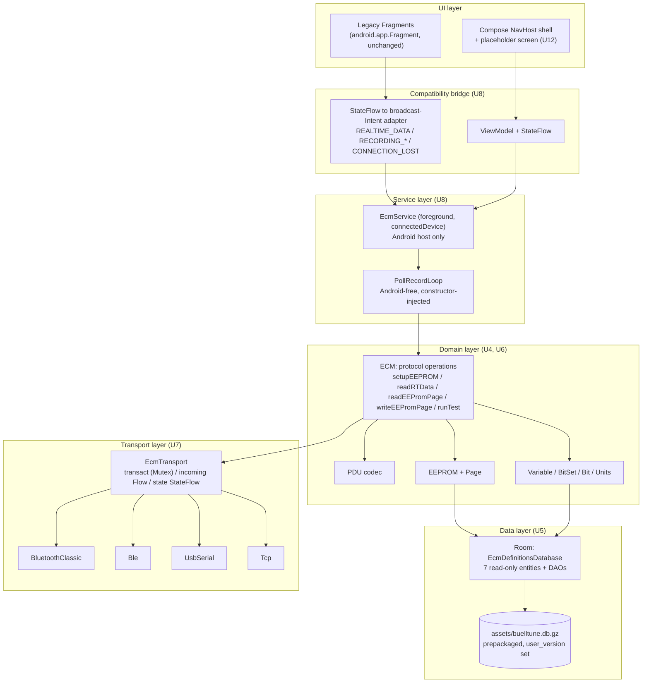
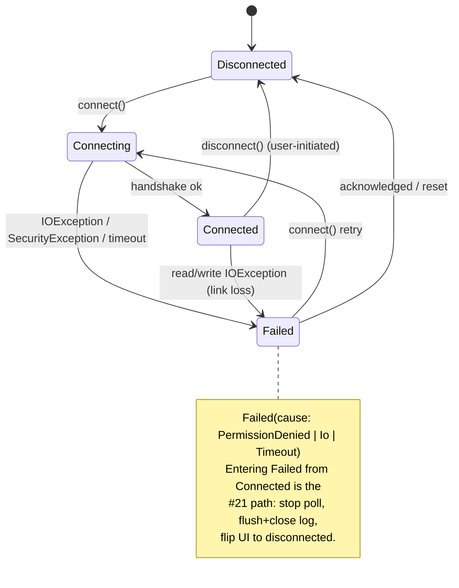

# BuellTune Kotlin Foundation & Compliance - Plan

## Goal Capsule

- **Objective:** rebrand EcmDroid as BuellTune under a new package (`biz.logicminds.buelltune`) and repository (`logicminds/buelltune`), establish a Kotlin foundation — domain layer ported to Kotlin, the four ECM transports unified behind one coroutine/Flow interface, the reference database moved to Room, Play Store compliance restored, and a headless test framework (including an `ecmsim`-backed harness) so an agent can verify the work without physical hardware — while resolving the reported compatibility bugs blocking real riders (#12, #8) and porting the just-landed connection-loss fix (#21, commit `f3337a1`) onto the new architecture.
- **Product authority:** the brainstorm dialogue (2026-08-30) is the product authority for this slice. The full multi-screen modernization is surrounding context, not active scope — see How This Work Fits Together.
- **Open blockers:** none. Remaining unknowns are execution-time and listed under Deferred to Implementation.

---

## Product Contract

### Summary

Rebrand EcmDroid as BuellTune — new package (`biz.logicminds.buelltune`), new repository (`logicminds/buelltune`), no obligation to stay mergeable with `upstream` (ecmdroid/ecmdroid) — and use the rename as the vehicle for a Kotlin foundation: port the domain/protocol layer (`PDU`, `ECM`, `EEPROM`, `BitSet`, `Variable`, `Bin2MslConverter`), unify Bluetooth Classic, BLE, USB-serial, and TCP/IP behind one coroutine/Flow transport interface, move the bundled reference database to Room, and restore Play Store compliance (`targetSdk`, a real foreground service). Resolve the two open compatibility bugs blocking real riders — the Android 14 EEPROM-load crash (#12) and the Android 12 Bluetooth permission/reconnect failure (#8) — and carry the connection-loss detection behavior that commit `f3337a1` landed for Bluetooth Classic (#21) forward into the unified transport. The legacy Fragment UI keeps running unchanged on a bridge; no screen migrates to Compose in this slice.

### Problem Frame

EcmDroid is a 14-year-old, ~8,700 LOC, volunteer-maintained Android app that Buell riders use to read live ECM data and burn EEPROM tuning changes — a use case where a bug can leave a rider's motorcycle unrunnable ("I don't trust the app to not brick my ECM," #12). The app is no longer listed on Play Store (#20, #14 — 404 on download), and the tracker shows a cluster of real compatibility breaks tied to Android version changes: install blocked on Android 13 (#10), Bluetooth permission/reconnect failures on Android 12 (#8, unresolved despite an attempted PR), and a crash on Android 14 loading a map from anywhere but the app's default path (#12). Issue #21 — the live-connection status icon staying stuck on "connected" after a real disconnect, silently dropping data mid-recording — was fixed on the legacy stack by commit `f3337a1` and must not be lost.

Underneath the reported symptoms, the stack itself is the risk. The app is 100% Java on `compileSdk 34` / `targetSdk 33`, two API levels behind Google Play's submission floor. The UI is entirely pre-AndroidX (`android.app.Fragment`, `android.app.ListFragment`, `android.preference.*`), async work is raw `AsyncTask`, and the data layer is a hand-rolled `SQLiteOpenHelper` with a manual asset copy. The background service that polls the ECM and records logs never calls `startForeground()` at all — it posts a sticky notification and hopes, which is why riders are told to keep the app in the foreground while recording. Every future fix lands on scaffolding that is one Android release away from breaking again.

### Key Decisions

- KD1. **Rebrand to BuellTune as a hard fork, not an in-place rename.** The codebase moves to a new package (`biz.logicminds.buelltune`) and a new git remote (`git@github.com:logicminds/buelltune.git`), with no obligation to stay mergeable with `upstream` (ecmdroid/ecmdroid). *(session-settled: user-directed — chosen over renaming in place within the existing `org.ecmdroid`/`logicminds/ecmdroid` fork: removes upstream-compatibility constraints and gives this slice full freedom over naming, package structure, and branding. Governs R1.)*
- KD2. **Scope is the foundation slice, not the full rewrite.** The broader modernization (all screens, legacy cleanup) is split out as future, undecided work. *(session-settled: user-directed — chosen over scoping the entire multi-screen rewrite as one roadmap, or a single-screen proof-of-concept: keeps this artifact to one deliverable increment.)*
- KD3. **The foundation is widened to include transport unification and Room now**, not deferred to a later slice. *(session-settled: user-directed — chosen over a narrower foundation that ports only the domain layer: avoids reworking the transport/data layer once screen-migration slices begin, accepting a slower first release. Governs R6, R7, R8.)*
- KD4. **Bugs are fixed once, in the new layer, not via a separate interim patch.** #12 and #8 are resolved at the root in the new service/transport/domain code; #21 — already fixed on the legacy stack by commit `f3337a1` — is preserved and ported into the new architecture rather than re-designed. *(session-settled: user-directed — chosen over shipping a fast Java-only compliance patch ahead of the Kotlin work: one unified effort, no parallel-branch maintenance burden for a small volunteer team. Governs R8, R9, R10, R11.)*
- KD5. **Distribution is out of scope.** Success is a compliant, installable, crash-free release build; Play Store relisting and F-Droid packaging (#20) are separate, later decisions. Because `biz.logicminds.buelltune` is a new applicationId, any future Play Store submission is a fresh listing, not a relisting of the delisted `org.ecmdroid` app. *(session-settled: user-directed — chosen over including relisting or F-Droid publishing as a completion criterion.)*
- KD6. **Domain classes are ported near-verbatim, not redesigned.** `PDU`, `ECM`, `EEPROM`, `BitSet`, `Variable`, `Units`, `Bin2MslConverter` carry the reverse-engineered DDFI protocol logic and already have instrumented test coverage; a mechanical Kotlin conversion (into the new package, per KD1) preserves that coverage instead of re-risking protocol correctness. *(session-settled: user-approved. Governs R5.)*
- KD7. **Testing adds a headless JVM layer plus an `ecmsim`-backed TCP integration harness**, on top of the existing device-only `androidTest` suite. `ecmsim` already speaks the real PDU/EEPROM protocol over TCP — the same connection type (`tcp_host`/`tcp_port`, default port 6275) the app's Settings screen already exposes — and needs no protocol changes to simulate a dropped link, since terminating the simulator process or socket is enough. *(session-settled: user-approved. Governs R14, R15, R16, R17.)*
- KD8. **The package rename is a single big-bang commit, not an incremental per-class migration.** All 36 main-source Java files, all 7 test files, the manifest, build config, intent-action strings, database name, notification channel ID, and custom MIME types move to `biz.logicminds.buelltune` before any Kotlin work begins. *(session-settled: user-directed — chosen over R1's original incremental shape (only ported classes move, legacy Java keeps `org.ecmdroid`): a split-package app would persist across every future screen slice and would force the legacy-UI bridge to span two namespaces, in exchange for smaller per-slice diffs. Governs R1.)*
- KD9. **#12 is treated as verify-then-lock, not assumed-broken.** The first verification step reproduces #12 against current `HEAD`; the fix work is conditional on it still reproducing, and the unconditional deliverable is a regression test over the ported load path. *(session-settled: user-directed — chosen over writing an unconditional fix: `CHANGES` v0.99.7 records "Fix loading XPR files (broken since v0.99.5)", and #12 was filed inside that window, so the reported crash is likely already fixed. Governs R9.)*
- KD10. **The service becomes a real `connectedDevice` foreground service for polling as well as recording.** *(session-settled: user-directed — chosen over promoting only during recording: live polling would stay killable when backgrounded, which is the condition riders currently work around by keeping the app on screen. Governs R2, AE4.)*

**Product Contract preservation:** changed — R1, R2, R9. R1 was rewritten from incremental to big-bang rename (KD8, user-directed). R2 was widened from "declare a `foregroundServiceType`" to "become a real foreground service", because research found `EcmDroidService` never calls `startForeground()` at all (KD10). R9 was reframed from unconditional fix to verify-then-regression-lock (KD9, user-directed). KD3's `Governs` list dropped its R12 link — Compose-shell scope derives from KD2, not from the transport/Room widening. All other R/F/AE IDs carry forward unchanged in meaning.

---

### Requirements

**Rebrand & Play Store compliance**

- R1. The package, `namespace`, and `applicationId` are renamed to `biz.logicminds.buelltune` in a single mechanical pass covering every main and test source file, the manifest, Gradle config, `scripts/mklocalversion`, broadcast intent-action strings, the extracted database filename, the notification channel ID, the custom log MIME types, and the developer-facing documentation that names the old package. No source file retains an `org.ecmdroid` package declaration.
- R2. The background ECM-polling/recording service runs as a real foreground service: it declares `android:foregroundServiceType="connectedDevice"`, holds `FOREGROUND_SERVICE` and `FOREGROUND_SERVICE_CONNECTED_DEVICE`, satisfies the `connectedDevice` runtime prerequisite for all four transports, and calls `startForeground()` for both live polling and log recording rather than posting an unmanaged sticky notification.
- R3. `targetSdk` is raised to API 36 (Android 16) and `compileSdk` to match — Google Play requires API 36 for new app updates starting August 31, 2026 (existing-app retention floor is API 35), so this is not a future-dated target but the current submission requirement; `minSdk` stays 26. Every behavior change the jump enforces — receiver-export flags, mandatory edge-to-edge display — is handled, not deferred.
- R4. The release build installs and launches without crashing on the currently shipping Android major version and the two prior major versions, and every legacy screen remains fully readable and operable under mandatory edge-to-edge display.

**Domain & data layer**

- R5. `PDU`, `ECM`, `EEPROM`, `BitSet`/`Bit`, `Variable`, `Units`, `Error`, `Constants`, `ColorMap`, and `Bin2MslConverter` are ported to Kotlin preserving existing behavior **and their JVM-visible class names, nested type names, and method signatures**; the existing test suite (`TestECM`, `TestPDU`, `TestEEPROM`, `TestBitSetProvider`, `TestVariableProvider`, `TestBin2Msl`, `TestUtils`) passes with its assertions unchanged — only package declarations and imports may be edited, as mandated by R1.
- R6. The bundled ECM reference database is served through Room in place of the hand-rolled `SQLiteOpenHelper`/asset-copy flow in `app/src/main/java/org/ecmdroid/DBHelper.java`, preserving existing variable and bitset lookup behavior for all seven tables and the existing synchronous, main-thread-callable provider API the legacy screens depend on.

**Transport layer**

- R7. Bluetooth Classic (SPP), BLE, USB-serial, and TCP/IP are unified behind one coroutine/Flow connection interface, replacing the four separate implementations currently inlined as `connect()` overloads in `ECM.java` (`BluetoothSocket`, the hand-rolled `SerialSocket` BLE wrapper, `usb-serial-for-android` callbacks bridged through `PipedInputStream`, and the plain `java.net.Socket` TCP path). The interface preserves the existing one-outstanding-request-at-a-time discipline; concurrent callers cannot interleave PDUs.
- R8. The unified transport surfaces connection loss from I/O failure (not just user-initiated disconnect) as observable state, matching the detection behavior commit `f3337a1` introduced for Bluetooth Classic and extending it to BLE, USB-serial, and TCP/IP. Permission-denied failures are surfaced as a distinct state from I/O failures.

**Bug resolution**

- R9. Loading an EEPROM file from any user-selected location succeeds without crashing on Android 14+, and a regression test over the ported load path locks that behavior in. Whether new fix code is required is determined by reproducing #12 against current `HEAD` first (KD9).
- R10. A Bluetooth Classic connection establishes and stays connected on Android 12+ without the permission-related failure reported in #8. Every runtime permission request the app makes (`BLUETOOTH_CONNECT`, `POST_NOTIFICATIONS`) has a result continuation that resumes the interrupted action instead of silently aborting it.
- R11. When the active connection is lost during live polling or log recording, the UI reflects the disconnected state and any in-progress recording stops and flushes cleanly, for all four transport types — the behavior `f3337a1` landed for Bluetooth Classic, preserved through R7/R8's unified transport.

**Architecture shell**

- R12. A Compose `NavHost` shell exists, wired to the new Kotlin service/transport/domain layer, with one placeholder screen proving the ViewModel → StateFlow → Compose path end-to-end; it replaces no existing screen.
- R13. The existing Fragment-based UI keeps functioning unmodified in shape, consuming the new service/transport/domain layer through a compatibility bridge, until later slices migrate individual screens to Compose. The only permitted edits to legacy UI files are the service binder type, `ConnectTask`'s transport construction, and inset handling — no `BroadcastReceiver`, no screen logic.

**Testing framework**

- R14. A JVM unit-test source set (`app/src/test/`) exists and runs via `./gradlew test`, covering the ported Kotlin domain layer (PDU framing/parsing, BitSet/Variable scaling, Bin2Msl conversion) and the extracted, Android-free poll/record loop, without any Android device, emulator, or instrumentation.
- R15. The repository provides a repeatable, scripted way to obtain, build, and run `ecmsim`, so an agent working in this repo can start a local ECM simulator without manually locating or building the sibling project.
- R16. An `ecmsim`-backed integration test suite drives the unified transport and the extracted poll/record loop (R7, R8) over TCP against a running simulator, covering connect, version handshake, EEPROM page fetch, EEPROM write command flow, realtime data polling, and active-test triggering, runnable headlessly with no physical ECM, Bluetooth, or USB hardware.
- R17. The `ecmsim`-backed suite includes a connection-loss scenario (terminating the simulator process or its TCP connection mid-session) that exercises R8/R11 automatically, replacing the current manual-only verification path for #21-class regressions.

---

### Key Flows

- F1. Connection lost during live polling or recording
  - **Trigger:** an active transport (Bluetooth Classic, BLE, USB-serial, or TCP/IP) fails an I/O read or write while the background service is polling or recording.
  - **Steps:** the transport surfaces the failure as a disconnected state (R8); the service stops reading, stops and flushes any in-progress recording, and stops treating the ECM as connected; the UI observes the state change and reflects it (connection indicator, live-data toggle disabled).
  - **Outcome:** no silent stale UI state, no partially-written log left open — matches the behavior `f3337a1` already established for Bluetooth Classic.
  - **Covers:** R8, R11

- F2. Runtime permission interrupts a user action
  - **Trigger:** the rider taps "connect over Bluetooth" or "start recording" while `BLUETOOTH_CONNECT` or `POST_NOTIFICATIONS` is not yet granted.
  - **Steps:** the app requests the permission; on grant, the interrupted action resumes automatically; on denial, the app states what was blocked and why rather than failing silently.
  - **Outcome:** no dead-end where the first tap is consumed by the permission dialog and the rider must guess to tap again.
  - **Covers:** R10

---

### Acceptance Examples

- AE1. **Covers R8, R11.** Given the app is recording a log over any of the four transports, when the physical link drops mid-poll, then the connection indicator and live-data toggle flip to disconnected within one poll cycle and the recorded log file is closed with the data captured up to the drop.
- AE2. **Covers R9.** Given a rider has an EEPROM file stored outside the app's default external-files directory, when they open it from the EEPROM screen on Android 14+, then the file loads without a crash.
- AE3. **Covers R10.** Given a paired Bluetooth Classic adapter and an Android 12+ device with `BLUETOOTH_CONNECT` not yet granted, when the rider taps connect and grants the permission, then the paired-device list opens without a second tap and the connection succeeds and remains stable.
- AE4. **Covers R2, R4.** Given the app is installed fresh on the current Android major version, when the rider starts live-data recording and then backgrounds the app, then the service is running in the foreground with a `connectedDevice`-typed notification and recording continues without a missing-foreground-service-type crash.
- AE5. **Covers R16, R17.** Given a locally running `ecmsim` instance for a supported ECM model, when an agent runs the `ecmsim`-backed test suite, then it connects, exercises EEPROM fetch and realtime polling, and — in the connection-loss scenario — observes the same disconnect-and-flush behavior as AE1, entirely from the command line with no device attached.

---

### Success Criteria

- The union of `./gradlew test` and `./gradlew connectedDebugAndroidTest` covers all seven original test classes with unchanged assertions (R5) — no behavior regression from the port itself. Classes move between the two suites as their subjects shed Android dependencies; none is dropped.
- No shared-layer rework is required when the first screen-migration slice starts: transport, Room, and domain APIs (R6, R7) are consumed as-is by the first real Compose screen.
- An agent can verify R7, R8, and R11 end-to-end (transport unification, connection-loss detection, and clean recording stop/flush) by running the `ecmsim`-backed suite (R15-R17) locally, without a paired phone, real ECM, or human-operated device. R10 (Bluetooth Classic permission/reconnect stability), the BLE and USB-serial transports, and the EEPROM burn path still require real hardware per Dependencies below.

---

## High-Level Technical Design

Directional guidance for reviewing the layering and state contract; the prose and per-unit fields are authoritative where they disagree.

### Target layering

### Connection state contract

The single `StateFlow<ConnectionState>` on `EcmTransport` is what R8, R11, F1, and AE1 are written against. `Failed` carries a cause so callers can distinguish a permission denial (#8) from an I/O drop (#21) without exception sniffing.

---

## Key Technical Decisions

- KTD1. **Rename first, in one commit, before any Kotlin lands.** U1 is a pure mechanical rename with no behavior change, so its diff stays reviewable as "moves and string edits only" and every later unit is written once, in the new namespace. *(session-settled: user-directed. Instantiates KD8; governs R1.)*
- KTD2. **Rely on AGP 9's built-in Kotlin; do not apply `kotlin-android`.** AGP 9.0+ carries a runtime dependency on KGP 2.2.10 and enables Kotlin compilation for every module where AGP is applied. Applying `org.jetbrains.kotlin.android` on top fails the build with "Cannot add extension with name 'kotlin'". Consequences that bind later units: `kapt` is incompatible (Room must use KSP), Kotlin source directories are registered through `android.sourceSets{}.kotlin`, and compiler options go in `kotlin { compilerOptions { … } }`, not `android.kotlinOptions{}`. U3 proves the Kotlin, KSP, **and Compose-compiler-plugin** pairings up front rather than discovering a conflict at U12.
- KTD3. **Room consumes the existing bundled SQLite file as a prepackaged database (`createFromAsset`), with three specific accommodations the legacy DDL forces.** The shipped schema is otherwise Room-compatible: all seven tables have a single-column `INTEGER`-affinity primary key, and the MySQL-derived type names map to affinities Room accepts. The accommodations:
  1. **`user_version` must be set in the asset.** The committed file reports `PRAGMA user_version = 0`; Room compares the copied database's version against `@Database(version = N)` where `N >= 1`, so a version-0 asset sends Room down an `onCreate`/migration path against tables that already exist. The asset must be rewritten with `PRAGMA user_version = <N>` as part of U1's rename, and `README.db` must carry that step forward.
  2. **Ten numeric-looking columns are `varchar` and must be typed `String?` in the entities.** `rtoffsets.scale`, `translate`, `low`, `high` are `varchar(16)`; `ulow`, `uhigh` are `varchar(8)`; `eeoffsets.scale`, `translate`, `axisscale`, `axistranslate` are `varchar(16)`. `DatabaseVariableProvider.convert()` reads them with `cursor.getDouble()` today (line 241), relying on SQLite's silent TEXT→REAL coercion. Declaring them `Double` makes Room expect REAL affinity and fail validation with "Expected REAL found TEXT"; declaring them `String` matches the file, with parsing moved into the DAO-to-`Variable` mapping layer. They must be **nullable** `String?`: `PRAGMA table_info` reports `notnull = 0` for all ten, and Room compares the `notNull` flag as well as affinity, so a non-null Kotlin `String` fails validation the same way a `Double` would. The general rule this instance illustrates: check affinity *and* nullability for every ported column against `PRAGMA table_info`, not just the ten named here.
  3. **`allowMainThreadQueries()` is required.** The definitions lookups are synchronous and run on the UI thread — `DataChannelAdapter` constructs a provider at line 57 and `ECM.getRuntimeValue()` queries during adapter refresh; `EEPROM.get()`/`size2id()` run inside Fragment callbacks. The per-provider `HashMap` caches miss on first access for every variable, so the first render of every screen queries. R13 forbids restructuring the Fragments to make these asynchronous, and this is a read-only definitions database, so main-thread access is permitted deliberately and removed when the screens migrate.

  *Escape hatch:* if prepackaged-schema validation still resists after these three, regenerate the asset by letting Room create the schema from entities and bulk-copying rows from the legacy file — a one-time offline conversion, not runtime work. Governs R6.
- KTD4. **The legacy UI bridge re-emits the existing broadcast Intents from the new service; no Fragment's receiver or screen logic is edited.** The new service collects its own `StateFlow`s and calls `sendBroadcast()` with the same four action strings the Fragments already register for. The permitted legacy edits in this slice are exactly four, each mechanical and none touching screen logic: the service binder type (U8, because the `ServiceConnection` casts `EcmDroidBinder`), `ConnectTask`'s transport construction (U7), window-inset handling (U2), and removal of `MainActivity`'s now-dead `DBHelper` field and constructor call (U5). This keeps the bridge genuinely throwaway — deleting it is a later slice's cleanup, not a refactor. *Alternative rejected:* rewriting each Fragment against `Flow`/`repeatOnLifecycle`, which is screen-migration work KD2 puts out of scope. Governs R13.
- KTD5. **Dependency wiring stays manual — a single `AppContainer` held by the `Application`, with constructor injection below it.** No Hilt/Dagger. The graph is small (database, transport factory, ECM facade, service), the project has never used DI, and Hilt would add an annotation-processing round trip on top of a build already changing AGP-Kotlin mode, `targetSdk`, and adding KSP for Room. **The existing static `getInstance(Context)` accessors survive as thin facades delegating to the container**, because they are consumed as field initializers in nine legacy UI files (`DataChannelFragment:63-64`, `SetupFragment:58-59`, `EEPROMFragment:72`, `LogFragment:79`, `ActiveTestsFragment:57`, `MainFragment:45`, `TroubleCodeFragment:44`, `MainActivity:101`, `DataChannelAdapter:57`) plus `BurnTask:46`, `FetchTask:37`, and the service — and KTD4 forbids editing them. Deleting the facades is the screen-migration slices' work. *Alternative rejected:* Hilt — better ergonomics once dozens of ViewModels exist, which is those slices' problem, not this one.
- KTD6. **`ecmsim` is pinned as a git submodule and built with its own Maven wrapper from a Gradle task.** `ecmsim` is a Java 21 Maven project that shades to a single `target/ecmsim.jar` with main class `org.ecmdroid.sim.Main`; it publishes no artifact to Maven Central and has no releases to download. A submodule pins an exact commit and `./mvnw -q package` needs no globally installed Maven. *Alternatives rejected:* vendoring a prebuilt jar (opaque binary in VCS, no provenance) and a curl-based fetch script (nothing stable to fetch). Governs R15.
- KTD7. **The `ecmsim` suite is a JVM test source set driving the transport, `ECM`, and the extracted poll/record loop over TCP, not an instrumented test — which requires one deliberate seam.** `TcpTransport` is a plain `java.net.Socket` and `PollRecordLoop` (U8) is Android-free by construction, but `ECM` is **not**: `setupEEPROM()` calls `EEPROM.get(id, Context)` (`ECM.java:448`), which today builds a `DBHelper` and after U5 goes to Room's `createFromAsset()` — both need `Context.getAssets()`, which a plain JVM test cannot supply. Since `setupEEPROM` is the first thing R16's own scenarios exercise, the definitions lookup must therefore sit behind an interface (`VariableProvider`/`BitSetProvider` are already abstract classes; `EEPROM.get`/`size2id` need the same treatment) with two implementations: the Room-backed one `AppContainer` wires for the app and `androidTest`, and a plain JDBC-SQLite one reading the same `.db` file off the test classpath for the JVM harness. `ECM` takes the interface, never a `Context`. Anything that genuinely needs `Context` — Room itself, the `Service` host, `sendBroadcast` — stays in `androidTest`. Governs R16, R17.
- KTD8. **Ported classes keep their exact JVM-visible names and signatures; Kotlin file names may differ, class names may not.** `PDU`, `ECM`, `EEPROM`, `Error`, `Bit`, `BitSet`, `Variable`, `Units`, `Constants` and the nested `ECM.Type`, `ECM.Protocol`, `PDU.Function`, `Variable.DataType`, `EEPROM.Page`, `Error.ErrorType` are referenced from 12+ surviving Java files (seven Fragments, `MainActivity`, `BurnTask`, `FetchTask`, `Bit`, plus the tests). A class rename is not expressible through `@JvmName`, so renaming would break every one of them and violate R5, R13, and KTD4. Kotlin `object` members and top-level functions consumed from Java carry `@JvmStatic`/`@JvmField` so `Foo.bar()` stays `Foo.bar()` rather than becoming `Foo.INSTANCE.bar()`.
- KTD9. **`Constants` is ported last and mechanically.** It is 857 lines of pure string literals with no logic and is referenced from nearly every file; converting it early creates a rename-conflict surface across the whole tree for zero benefit.
- KTD10. **The foreground service declares `CHANGE_NETWORK_STATE` to cover TCP-only sessions.** `connectedDevice` requires at least one of: a granted `BLUETOOTH_CONNECT`/`SCAN`/`ADVERTISE`/`UWB_RANGING` runtime permission, a successful `UsbManager.requestPermission()`, or a manifest-declared `CHANGE_NETWORK_STATE`/`CHANGE_WIFI_STATE`/`NFC`/`TRANSMIT_IR`. A TCP-only session (the `ecmsim` path, and riders using a WiFi bridge) satisfies none of the first two, so `CHANGE_NETWORK_STATE` must be declared or `startForeground()` throws. *(Instantiates KD10; governs R2, AE4.)*
- KTD11. **`ECM`'s protocol methods stay blocking, and the transport exposes a `Mutex`-guarded `transact()` that owns framing and resynchronization.** Two constraints force this:
  - **Java callers.** `MainActivity.ConnectTask.doInBackground` (lines 452-477), `FetchTask`, `BurnTask` (lines 78-101), and the poll loop all call `ECM` synchronously from background threads. Java cannot invoke a Kotlin `suspend` function without a `Continuation`, so making `ECM`'s methods `suspend` would break all of them, and KTD4 forbids editing them. `ECM` therefore keeps its blocking signatures and bridges into the transport with `runBlocking` on `Dispatchers.IO` for the duration of this slice; the screen-migration slices make it `suspend` when their callers can accept it.
  - **Mutual exclusion on the wire.** Today `ECM.sendPDU` is `synchronized` and performs a strict request→response round trip; `receivePDU` reads a 6-byte header then `len + 1` bytes within a 1000 ms budget and drains `in.available()` to resynchronize after a failure. `BurnTask` loops `writeEEPromPage()` while the poll loop may still issue `readRTData()`, and only that monitor keeps them from interleaving. A bare `write(bytes)` plus an uncorrelated `incoming: Flow<ByteArray>` would let a mis-paired response satisfy `readEEPromPage`'s length check and land wrong bytes in a page buffer that is then burned to the ECM. The interface therefore exposes `suspend fun transact(request: PDU): PDU` guarded by a `Mutex`, with the framing, timeout, and resync-drain logic ported verbatim. The raw `incoming` flow stays internal to each implementation. Governs R7.
  - **The `Mutex` is not reentrant, so cleanup runs outside the lock.** Java's `synchronized` is reentrant: today `sendPDU` holds the monitor and its `IOException` handler calls `handleConnectionLost()`, itself `synchronized` on the same object, without blocking. `kotlinx.coroutines.sync.Mutex` has no such property — a coroutine that already holds the lock and tries to re-acquire it suspends forever. Porting that call chain verbatim into `transact()` would hang every real link-loss event, including the mid-burn drop this plan calls its highest-severity risk. The rule for the transport layer: `mutex.withLock { … }` covers the write, the framed read, and the resync drain only; the `IOException` propagates out of the locked scope, and the `Failed(Io)` state transition plus socket/stream release happen in the caller's scope after the lock is released. No operation invoked from inside the locked scope may call back into another `EcmTransport` member.

---

## Implementation Units

### U1. Big-bang rename to `biz.logicminds.buelltune`

**Goal:** every source file, build setting, package-derived string, and developer doc moves to the new namespace in one mechanical commit, with no behavior change.

**Requirements:** R1. Instantiates KD1, KD8, KTD1.

**Dependencies:** none.

**Files:**
- All 36 main-source Java files under `app/src/main/java/org/ecmdroid/**` → `app/src/main/java/biz/logicminds/buelltune/**` (20 root: `Bit.java`, `BitSet.java`, `BitSetProvider.java`, `ColorMap.java`, `Constants.java`, `DBHelper.java`, `DataChannelAdapter.java`, `DatabaseBitSetProvider.java`, `DatabaseVariableProvider.java`, `ECM.java`, `EEPROM.java`, `EEPROMAdapter.java`, `EcmDroidApp.java`, `EcmDroidService.java`, `Error.java`, `PDU.java`, `Units.java`, `Utils.java`, `Variable.java`, `VariableProvider.java`; 3 `activities/`; 9 `fragments/`; 3 `task/`; 1 `util/`)
- All 7 test files under `app/src/androidTest/java/org/ecmdroid/` → `app/src/androidTest/java/biz/logicminds/buelltune/`
- `app/src/main/java/de/kai_morich/simple_bluetooth_le_terminal/SerialSocket.java`, `DevicesFragment.java` — imports of `org.ecmdroid.Constants` and `org.ecmdroid.R` only; the vendored package itself stays put
- `app/build.gradle.kts` (`applicationId`, `namespace`), `settings.gradle.kts` (`rootProject.name`)
- `scripts/mklocalversion` — the generated `package org.ecmdroid;` in the `VCS` interface template
- `app/src/main/AndroidManifest.xml` — component `android:name` attributes are relative (`.EcmDroidApp`, `.activities.MainActivity`), so they need no edit; verify rather than rewrite
- `app/src/main/java/.../EcmDroidService.java` lines 42-45 — the four broadcast action strings
- `app/src/main/java/.../DBHelper.java` line 43 — `DB_NAME`
- `app/src/main/java/.../EcmDroidService.java` line 269 — notification channel ID
- `app/src/main/java/.../fragments/LogFragment.java` lines 242, 330 — the two custom MIME types
- `app/src/main/assets/ecmdroid.db.gz` → `buelltune.db.gz`, with `PRAGMA user_version` set (see approach 3)
- `AGENTS.md`, `CLAUDE.md`, `docs/DEVELOPER_GUIDE.md`, `README.db`, `README.md` — package names, `org.ecmdroid.VCS.LOCAL_VERSION`, `org/ecmdroid/` tree diagrams, and the DB asset path

**Approach:**
1. Move `app/src/main/java/org/ecmdroid/` and `app/src/androidTest/java/org/ecmdroid/` with `git mv`, then rewrite `package`/`import` statements. Prefer an IDE package refactor or `lsp rename_file`. **Package statements only — no class is renamed** (KTD8).
2. Rename the DB asset and `DB_NAME` in the same commit. `DBHelper.setupDB()` opens `assets.open(DB_NAME + ".db")` while the checked-in asset is `<name>.db.gz` — this works because aapt strips the `.gz` extension and stores the asset decompressed. Renaming one without the other silently breaks first launch.
3. While the asset is being renamed, set `PRAGMA user_version = 1` on it (decompress, set, recompress) so U5's Room `createFromAsset` has a valid version to compare against. The committed file is at 0 today. Record the step in `README.db` so the next database refresh does not drop it.
4. `Constants.INTENT_ACTION_DISCONNECT` and the USB grant intent in `MainActivity.findCOMDevice()` are both derived from `BuildConfig.APPLICATION_ID` and need no manual edit — verify, do not rewrite.
5. `scripts/mklocalversion` is documented in `AGENTS.md` and `docs/DEVELOPER_GUIDE.md` as running at build time, but nothing in `app/build.gradle.kts` invokes it and no source references `VCS.LOCAL_VERSION`. Decide explicitly: either wire it into the build or delete the script and the doc claims. Renaming a dead code path and leaving the docs asserting it is live is the one outcome to avoid.
6. Leave display strings alone. `<string name="ecmdroid">EcmDroid</string>`, the launcher label, and `docs/USER_GUIDE.md`'s product-name references are visual-rebrand work, explicitly deferred in Scope Boundaries.

**Patterns to follow:** the existing package layout (`activities/`, `fragments/`, `task/`, `util/`) is preserved verbatim under the new root; this unit changes names, not structure.

**Test scenarios:**
- Covers R1. `./gradlew assembleDebug` succeeds and no file under `app/src/` declares `package org.ecmdroid`.
- Covers R1. `./gradlew connectedDebugAndroidTest` passes with all 7 test classes green, assertions unedited.
- Covers R1. A fresh install extracts the reference database and the app reaches the main screen — proves the `DB_NAME`/asset rename stayed consistent.
- Covers R1, KTD3. `PRAGMA user_version` on the renamed asset reads 1, and the legacy `DBHelper` path still installs it (the change must be inert until U5).
- Covers R1. Starting a log recording still produces a `.bin` file and the "recording started" UI state — proves the broadcast action-string rename is consistent across sender and all receivers.

**Verification:** debug APK installs on a device/emulator, connects to a running `ecmsim` over TCP, and records a log — the same smoke path as before the rename, with the app now identified as `biz.logicminds.buelltune`.

---

### U2. Play Store compliance: API 36, real foreground service, permission continuations, edge-to-edge

**Goal:** the app targets the current Play submission level, its background service is a legitimate `connectedDevice` foreground service, no runtime permission request dead-ends, and every legacy screen survives the behavior changes the API jump enforces.

**Requirements:** R2, R3, R4, R10 (permission-continuation half), AE3, AE4, F2. Instantiates KD10, KTD10.

**Dependencies:** U1.

**Files:**
- `app/build.gradle.kts` — **both** `compileSdk` assignments (one at line 25 inside `defaultConfig`, one at line 51 in the `android` block) and `targetSdk`; delete the stray duplicate rather than leaving two sources of truth
- `app/src/main/AndroidManifest.xml` — new permissions, `android:foregroundServiceType` on the service
- `app/src/main/java/biz/logicminds/buelltune/EcmDroidService.java` — `showNotification()` (lines 261-281), `startRecording()`, `startReading()`, `stopRecording()`, `stopReading()`
- `app/src/main/java/biz/logicminds/buelltune/activities/MainActivity.java` — `showDevices()` (lines 281-308), new `onRequestPermissionsResult`, content-frame inset handling
- `app/src/main/java/biz/logicminds/buelltune/fragments/LogFragment.java` — `POST_NOTIFICATIONS` request path (lines 204-210)
- `app/src/main/java/de/kai_morich/simple_bluetooth_le_terminal/SerialSocket.java` line 176 — the one unflagged `registerReceiver`
- `app/src/main/res/layout/activity_main.xml`, `app_bar_main.xml`, `content.xml` — inset-driven padding

**Approach:**
1. Raise `compileSdk` and `targetSdk` to 36; leave `minSdk` at 26.
2. **Fix the unflagged receiver before anything else.** `SerialSocket.connect()` calls `context.registerReceiver(disconnectBroadcastReceiver, new IntentFilter(Constants.INTENT_ACTION_DISCONNECT))` with the two-argument overload. `INTENT_ACTION_DISCONNECT` is app-defined, not a protected system broadcast, so at `targetSdk` 34+ this throws `SecurityException: One of RECEIVER_EXPORTED or RECEIVER_NOT_EXPORTED should be specified` — BLE connect crashes on first use. Pass `Context.RECEIVER_NOT_EXPORTED`. Every other `registerReceiver` in the app is already flagged (`LogFragment:167-169`, `DataChannelFragment:125,170,172`, `MainActivity:183`); `DevicesFragment:139` is exempt because its filter carries only protected Bluetooth actions. This is a surgical edit to a vendored file — annotate it as a local fork note.
3. Manifest: add `FOREGROUND_SERVICE`, `FOREGROUND_SERVICE_CONNECTED_DEVICE`, and `CHANGE_NETWORK_STATE`; add `android:foregroundServiceType="connectedDevice"` to the service element. `CHANGE_NETWORK_STATE` is the prerequisite a TCP-only session satisfies (KTD10).
4. Replace `nm.notify(RECORDING_ID, notification)` + `Notification.FLAG_NO_CLEAR` with `startForeground(RECORDING_ID, notification, FOREGROUND_SERVICE_TYPE_CONNECTED_DEVICE)`, entered when polling or recording starts and exited with `stopForeground()` when both stop.
5. **Handle mandatory edge-to-edge.** Crossing `targetSdk` 35 makes edge-to-edge display non-opt-out, so all seven `android.app.Fragment` screens rendered into `MainActivity`'s `content_frame` draw under the status and navigation bars. Apply insets at the activity chrome — content frame, app bar, and drawer — rather than per Fragment, so R13's "no screen logic edited" holds.
6. Give `MainActivity` an `onRequestPermissionsResult` that re-invokes `showDevices()` on grant, and a denial message naming what was blocked. Today `showDevices()` requests `BLUETOOTH_CONNECT` and `return`s with no continuation, so the rider's first tap is silently swallowed. Mirror the fix for `LogFragment`'s `POST_NOTIFICATIONS` request, which has the identical dead-end.
7. Keep the notification's content intent pointing at the log screen; riders use it to get back to a running recording.

**Patterns to follow:** `DevicesFragment.onRequestPermissionsResult` (in the vendored BLE package) already implements the grant-then-resume pattern — mirror its shape rather than inventing one.

**Test scenarios:**
- Covers R3, AE4, R2. Start recording on an API 34+ device, background the app for two minutes, return: recording is still running, the log has grown, and no `ForegroundServiceStartNotAllowedException`/`SecurityException` appeared in logcat.
- Covers R3. Initiate a BLE connect on an API 34+ device: `SerialSocket.connect()` completes without `SecurityException` — the receiver-flag regression, which no other scenario would catch.
- Covers R2, KTD10. Connect over TCP only (no Bluetooth adapter bonded, no USB device) and start polling: `startForeground()` succeeds — proves `CHANGE_NETWORK_STATE` satisfies the `connectedDevice` prerequisite when no BT/USB permission is in play.
- Covers R4. On an API 35+ device, walk all seven legacy screens: no content is occluded by the status or navigation bar, and the drawer and app bar remain tappable.
- Covers AE3, F2. Revoke `BLUETOOTH_CONNECT` (`adb shell pm revoke`), tap connect, grant at the prompt: the paired-device dialog appears without a second tap.
- Covers F2. Same flow, deny at the prompt: the app shows a message naming the blocked action; no silent no-op, no crash.
- Covers R3, R4. `./gradlew assembleRelease` succeeds at `targetSdk 36`, and the resulting APK installs and launches on the current Android major version and the two prior ones.

**Verification:** live recording survives backgrounding, BLE connect works at API 36, every legacy screen is fully visible, and a permission-denied path produces a visible explanation instead of a dead button.

---

### U3. Enable Kotlin, prove the plugin stack, add the JVM test source set

**Goal:** Kotlin, KSP, and the Compose compiler plugin all compile under AGP's built-in Kotlin, and `./gradlew test` runs a real JVM suite with working fixtures.

**Requirements:** R14 (infrastructure half). Instantiates KTD2.

**Dependencies:** U1.

**Files:**
- `app/build.gradle.kts` — `kotlin { compilerOptions { … } }`, `testOptions { unitTests { isReturnDefaultValues = true } }`, `buildFeatures { compose = true }`, source-set registration
- `gradle/libs.versions.toml` — KSP plugin, Room, coroutines, Compose BOM and compiler-plugin aliases
- `app/src/sharedTest/java/biz/logicminds/buelltune/TestUtils.java` — moved from `androidTest` into a directory registered on **both** test source sets
- `app/src/test/java/biz/logicminds/buelltune/` — new source set; `TestPDU` moves here
- `app/src/androidTest/java/biz/logicminds/buelltune/TestPDU.java` — removed (moved, not copied)

**Approach:**
1. Do **not** add `org.jetbrains.kotlin.android`. AGP 9.2.1 already provides Kotlin via KGP 2.2.10 (KTD2). Add a trivial Kotlin file and confirm it compiles before touching anything else.
2. Prove all three plugin pairings in this unit, not later: a Kotlin file, a KSP-processed stub, and a five-line `@Composable` with `buildFeatures.compose = true`. U12 is the last unit and must not be where a Compose-compiler/built-in-Kotlin conflict first surfaces.
3. Raise `sourceCompatibility`/`targetCompatibility` and Kotlin `jvmTarget` together to the same level; leaving Java at 1.8 while Kotlin defaults higher produces a confusing inlining mismatch.
4. **Set `testOptions.unitTests.isReturnDefaultValues = true`.** `TestPDU.testSetRequest` and `testFunctions` call `android.util.Log.d` (import at line 20; calls at lines 47 and 84). On the JVM unit-test classpath the `android.jar` stubs throw `RuntimeException("Stub!")`, so two of five methods fail without this. The alternative — adding Robolectric — is heavier than this slice needs.
5. **`TestUtils` must be shared by source directory, not by resource pointing.** `app/src/test` cannot see `app/src/androidTest`'s Java classes; they are separate compilation units. Move `TestUtils.java` to a `app/src/sharedTest/java` directory registered on both `test` and `androidTest` source sets. Separately, point the `test` source set's resources at the existing `app/src/androidTest/resources/` so the 1.5 MB `BUEIB_log.bin` is not duplicated. Both steps are needed; either alone leaves a broken suite.
6. Seed the JVM source set by moving `TestPDU` (pure protocol, JUnit4 only, no `Context`) into it. That proves the wiring end-to-end before U4 lands anything to test. Record the move: after this unit the instrumented suite is six classes, the JVM suite one.

**Execution note:** this unit is build plumbing — prove it with `./gradlew test` actually executing and reporting, not with new assertions.

**Test scenarios:**
- Covers R14. `./gradlew test` executes all five of `TestPDU`'s methods and reports them green — including the two that call `Log.d`; deliberately breaking one assertion turns the task red.
- Covers R14. Fixture loading works from the JVM suite via the shared `TestUtils` (`readBinaryLog()` returns non-empty bytes) and no fixture file is duplicated in the repo.
- Covers R14. `./gradlew connectedDebugAndroidTest` still passes for the remaining six classes, using the same shared `TestUtils`.
- Covers KTD2. `./gradlew assembleDebug` succeeds with a Kotlin file, a KSP-processed stub, and a `@Composable` all present.

**Verification:** `./gradlew test` and `./gradlew connectedDebugAndroidTest` both green, with no fixture file duplicated and all three plugin pairings proven.

---

### U4. Port the pure-Java domain classes to Kotlin

**Goal:** `PDU`, `Bit`, `BitSet`, `Variable`, `Units`, `Error`, `ColorMap`, `Bin2MslConverter`, and `Constants` become Kotlin with identical behavior and identical Java-visible names and signatures.

**Requirements:** R5. Instantiates KD6, KTD8, KTD9.

**Dependencies:** U3.

**Files:**
- `app/src/main/java/biz/logicminds/buelltune/PDU.java` → `PDU.kt`, keeping `class PDU` and `PDU.Function` (~270 lines)
- `Bit.java` → `Bit.kt` (~128 lines), `BitSet.java` → `BitSet.kt` (~135 lines, `Iterable<Bit>`)
- `Variable.java` → `Variable.kt`, keeping `class Variable` and `Variable.DataType` (~437 lines)
- `Units.java` → `Units.kt` (~30 lines), `Error.java` → `Error.kt` keeping `class Error` and `Error.ErrorType` (~50 lines), `ColorMap.java` → `ColorMap.kt` (~45 lines)
- `util/Bin2MslConverter.java` → `util/Bin2MslConverter.kt` (~461 lines)
- `Constants.java` → `Constants.kt` (~857 lines, last per KTD9)
- `app/src/test/java/biz/logicminds/buelltune/` — `TestBin2Msl` moves here; new edge-case tests

**Approach:**
1. Order: `Units`, `Error`, `ColorMap` (trivial) → `Bit`, `BitSet` → `PDU` → `Variable` → `Bin2MslConverter` → `Constants`. Compile and run both suites after each class.
2. **Class and nested-type names are preserved exactly** (KTD8). `Error` stays `Error` (referenced by `TroubleCodeFragment:31-32,42-43,137,146` and `TestECM:20,51`), `PDU` stays `PDU` (`TestPDU:37,49,62` constructs it directly), `Variable.DataType` and `PDU.Function` keep their nesting. Kotlin file names may follow Kotlin convention; the classes may not be renamed.
3. Preserve signed-byte semantics exactly. Every `& 0xff` mask, `1 shl bitNr`, and negative-offset wrap (`if (offset < 0) data.size + offset else offset`) in `Bit`, `BitSet`, `Variable`, and `PDU` is load-bearing protocol behavior — transcribe, do not "clean up".
4. `PDU` keeps its mutable protocol state (`ECM_ID`, `GET_VERSION`, `GET_RT`, `GET_CSTATE`, reset by `setProtocol`) in a `companion object` with `@JvmStatic` factories, so `ECM.java` and the tests keep compiling unchanged.
5. `ParseException` stays a thrown exception, not a `Result` — the existing tests assert on throwing behavior, and R5 forbids changing assertions.
6. `Bin2MslConverter` extends the deprecated `java.util.Observable` and no caller uses the observer channel for anything but progress. Replace the inheritance with a nullable progress callback (`(Int) -> Unit`); keep `convert(InputStream, OutputStream)` byte-identical in output. Its `android.util.Log` calls are the only Android coupling — route them through a small logging seam so the class becomes JVM-testable.
7. `ColorMap` uses `android.graphics.Color.argb`, which is pure arithmetic packing — inline the packing so the class is Android-free. Three lines, and it removes the last barrier to JVM-testing the palette.
8. `Variable` implements `Cloneable` but nothing calls `clone()` — drop it rather than porting `Cloneable` semantics. Confirm with an `lsp references` pass before removing.

**Test scenarios:**
- Covers R5. `TestPDU`'s five methods pass unchanged in the JVM suite against `PDU.kt`.
- Covers R5, R14. `TestBin2Msl` moves to the JVM suite and its converted output is byte-identical to the committed `BUE2D_log.msl` reference.
- Covers R5. `TestVariableProvider`'s scaling/formatting assertions (`testRTParsing`, `testAxis`, `testTable`) pass unchanged against `Variable.kt`.
- Covers R5. `TestBitSetProvider.testFlags1` passes unchanged against `BitSet.kt`/`Bit.kt`.
- New JVM edge coverage for byte semantics that have no current test: negative offset wrap in `Bit.refreshValue`, a `BitSet` whose mask spans bit 7 (the sign bit), and a `PDU` parse of a frame with a deliberately corrupted checksum.
- Covers KTD8. Every surviving Java call site (`ECM.java`, `TroubleCodeFragment`, `BurnTask`, `FetchTask`, `MainActivity`, the six other Fragments) compiles with no edit beyond U1's import rewrite — proves both the `@JvmStatic` surface and the preserved class names.

**Verification:** both suites green after each class lands; the app still connects to `ecmsim` and displays live data.

---

### U5. Move the reference database to Room

**Goal:** the seven-table bundled reference database is served by Room, replacing `DBHelper`'s manual asset copy and version check, without changing the synchronous provider API the legacy screens call.

**Requirements:** R6. Instantiates KD3, KTD3.

**Dependencies:** U3, U1 (for the `user_version`-corrected asset).

**Files:**
- New `app/src/main/java/biz/logicminds/buelltune/data/` — `EcmDefinitionsDatabase.kt`, seven entities, DAOs
- `app/src/main/java/biz/logicminds/buelltune/DBHelper.java` — deleted
- `app/src/main/java/biz/logicminds/buelltune/EcmDroidApp.java` — remove the `setupDB()` call
- `app/src/main/java/biz/logicminds/buelltune/activities/MainActivity.java` — remove the now-dead `DBHelper` import, field (line 99), and `new DBHelper(this)` call (line 176); this is a permitted legacy edit per KTD4
- New JDBC-SQLite implementation of the definitions interface for the JVM harness, per KTD7 (consumed by U10)
- `app/src/main/java/biz/logicminds/buelltune/DatabaseVariableProvider.java`, `DatabaseBitSetProvider.java` — re-pointed at DAOs
- `app/src/main/java/biz/logicminds/buelltune/EEPROM.java` — its two SQL queries re-pointed at DAOs
- `app/build.gradle.kts`, `gradle/libs.versions.toml` — Room + KSP
- `README.db` — the regeneration pipeline, including the `user_version` step
- `app/src/androidTest/java/biz/logicminds/buelltune/` — a new schema-validation test

**Approach:**
1. Define one entity per shipped table, matching the committed DDL exactly. All seven have a single-column primary key (`uniqueid`, and `UniqueID` on `adxbits`); declare the four existing indices with their exact existing names (`eeoffsets_idx_eeoffs_cat_offs`, `rtoffsets_idx_rtoffs_cat_offs`, `rtoffsets_idx_rtoffs_varn_offs`, `names_idx_names_varname`). Do **not** declare `defaultValue` on entity columns — Room skips default comparison when the entity declares none, avoiding false mismatches against the legacy `DEFAULT NULL` / `DEFAULT ''` DDL.
2. **Type the ten numeric-looking `varchar` columns as nullable `String?`** and parse in the mapping layer, per KTD3(2). These are `rtoffsets.scale/translate/low/high/ulow/uhigh` and `eeoffsets.scale/translate/axisscale/axistranslate`, which `DatabaseVariableProvider.convert()` currently reads via `cursor.getDouble()` (line 241) on TEXT-affinity storage and which all report `notnull = 0`. Before declaring any entity, diff its columns against `PRAGMA table_info` for affinity and nullability together.
3. Open with `Room.databaseBuilder(...).createFromAsset("buelltune.db")` — the asset filename without `.gz`, matching aapt's extension-stripping behavior `DBHelper` already relies on — plus `allowMainThreadQueries()` per KTD3(3). `@Database(version = 1)` must match the `user_version` U1 wrote into the asset. No migrations: this is a read-only file, and a content refresh means shipping a new asset with a bumped version.
4. Port the eight existing raw SQL statements to DAO methods preserving their exact semantics — the `secret = 0` filters, the `UPPER(...)` ordering in `getRtVariableNames`, the `ORDER BY offset DESC LIMIT 1` in `getNearestEEPROMVariable`, and the `rtoffsets`/`eeoffsets` table switch driven by `DataSource` in `DatabaseBitSetProvider`. The dynamic `bitname<N>` column selection in `getName(varname, bit)` has no typed DAO equivalent — select the row once and index the eight columns in Kotlin.
5. **Alias every column in the ported joins.** The existing queries select whole tables side by side (`SELECT rtoffsets.*, names.*, eeprom.type as ecm_type …`, `DatabaseVariableProvider.java:99` and the `eeoffsets` equivalent at 133). `rtoffsets` and `names` both define `uniqueid`, `secret`, and `varname`; `eeoffsets` and `names` both define `uniqueid` and `varname`. `convert()` calls `cursor.getColumnIndex("uniqueid")` (line 215), which resolves to the **first** match — the offsets table, not `names`. Room maps result columns by name and behaves differently on ambiguous columns, so each ported query must alias explicitly (`rtoffsets.uniqueid AS uniqueid`, `names.origname AS origname`, …) to reproduce first-match resolution.
6. Express the multi-table comma joins as explicit `JOIN`s only where the result set is provably identical.
7. Keep the existing `HashMap` caches in the provider classes. They exist because these lookups run on every poll cycle; Room does not replace them.
8. If prepackaged-schema validation still fails after steps 1-3, take KTD3's escape hatch: generate the asset from Room's own schema offline and commit it, updating `README.db`.
9. Deleting `DBHelper` breaks `MainActivity`, which independently declares a `DBHelper` field and calls `new DBHelper(this)` to install the database. Room's `createFromAsset` now owns that job, so both lines are dead — remove them along with the import.

**Patterns to follow:** `DatabaseVariableProvider`'s existing cache-then-query shape is the contract to preserve — DAO calls slot in where `rawQuery` was, and the cache stays in front.

**Test scenarios:**
- Covers R6, KTD3. A schema-validation test opens the Room database against the shipped asset and reads one row from each of the seven tables. This is the test that catches a prepackaged-schema or `user_version` mismatch, which otherwise surfaces only as a first-launch crash on a rider's phone.
- Covers R6. `TestVariableProvider`'s ten methods pass unchanged against the DAO-backed provider — including `testRtVariableNames` (ordering), `testEEPROMVariable`, `testNameLookup` (the dynamic bit-name column path), `testAxis`, and `testTable`.
- Covers R6, step 5. A `Variable` fetched through the ported join carries the same `id`, `name`, and `offset` as the legacy query returned for the same input — the assertion that catches duplicate-column misbinding.
- Covers R6, step 2. `scale`/`translate` values parse to the same doubles the legacy `cursor.getDouble()` produced, including a row where `scale` is a decimal string.
- Covers R6. `TestBitSetProvider` passes unchanged, exercising the `rtoffsets`-vs-`eeoffsets` switch.
- Covers R6. `TestEEPROM.testVersion` passes unchanged — page layout for `BUEIB310 10-11-03` still resolves to 7 pages with the same start offsets.
- Covers R6. Row counts per table match the committed asset (`eeprom` 19, `pages` 145, `eeoffsets` 5096, `rtoffsets` 1785, `names` 850, `bits` 94, `adxbits` 248) — a cheap guard against shipping a truncated or wrong asset.
- Covers R6, KTD3(3). Opening the DataChannels screen performs its first provider lookup on the main thread without `IllegalStateException`.

**Verification:** all definition-driven screens (Setup, DataChannels, EEPROM editor) render the same values as before against a connected `ecmsim`, and first launch on a clean device succeeds.

---

### U6. Port `ECM`, `EEPROM`, and the providers to Kotlin, and introduce the `AppContainer`

**Goal:** the remaining domain classes become Kotlin with protocol operations separated from transport concerns, and dependency wiring moves into an `AppContainer` without breaking a single legacy call site.

**Requirements:** R5, R6. Instantiates KD6, KTD5, KTD8.

**Dependencies:** U4, U5.

**Files:**
- `app/src/main/java/biz/logicminds/buelltune/ECM.java` (~859 lines) → `ECM.kt`, keeping `class ECM`, `ECM.Type`, `ECM.Protocol` — protocol and state only; the four `connect()` overloads move out in U7
- `EEPROM.java` (~310 lines) → `EEPROM.kt`, keeping `class EEPROM` and the inner `EEPROM.Page`
- `VariableProvider.java`, `BitSetProvider.java`, `DatabaseVariableProvider.java`, `DatabaseBitSetProvider.java` → Kotlin
- New `app/src/main/java/biz/logicminds/buelltune/AppContainer.kt`
- `app/src/main/java/biz/logicminds/buelltune/EcmDroidApp.java` — instantiate and expose the container
- `Utils.java` → `Utils.kt`, kept as a **single** Kotlin `object` with `@JvmStatic` members. Do not split it: `MainActivity:167` calls `Utils.getAppVersion(this)`, `PrefsActivity:99` calls `Utils.createOptionsMenu(this, menu)`, and `ProgressDialogTask:47` calls `Utils.freezeOrientation(context)` — splitting would change the call shape in three legacy files, one of which (`ProgressDialogTask`) Scope Boundaries explicitly defers. Keeping one object costs nothing and keeps U6 inside KTD4's edit budget. `hexdump`/`toHex`/`isEmptyString` become JVM-testable regardless, since the Android-touching members are only *called* from Android code, not depended on by the pure ones.
- `app/src/test/java/biz/logicminds/buelltune/` — new JVM tests for the now-Android-free helpers

**Approach:**
1. Identify the protocol/transport seam in `ECM` but do not cut it yet: `sendPDU`/`receivePDU`/`setupEEPROM`/`readVersion`/`getCurrentState`/`runTest`/`readEEPromPage`/`writeEEPromPage`/`readRTData` are protocol; the four `connect()` overloads, `disconnect()`, and the `in`/`out`/`socket` fields are transport. U6 ports all of it to Kotlin as-is and marks the seam. Replacing the stream fields with an injected `EcmTransport` is U7's job — the interface does not exist until then, and U7 depends on U6, not the reverse.
2. **Create `AppContainer` and keep the static accessors as facades.** `AppContainer` owns the Room database, the providers, the transport factory, and the `ECM` instance, and is constructed in `EcmDroidApp.onCreate()`. `ECM.getInstance(Context)`, `VariableProvider.getInstance(Context)`, `BitSetProvider.getInstance(Context)`, and the static `EEPROM.get`/`size2id` **survive as thin delegating facades**, because they are consumed as field initializers in nine legacy UI files plus `BurnTask`, `FetchTask`, and the service, and KTD4/R13 forbid editing those. What goes away is the `@SuppressLint("StaticFieldLeak")` context-leaking singleton state, not the call shape.
3. Preserve `readEEPromPage`'s 16-byte chunking and `writeEEPromPage`'s page-0 special case verbatim — these are ECM firmware constraints, not style choices.
4. Preserve `BurnTask`'s pre-burn guard: it compares `readVersion()` against the stored EEPROM id before the first write. That guard is the only thing standing between a mismatched map and a bricked ECM; it must survive the port byte-for-byte.
5. Preserve the `handleConnectionLost()` behavior from commit `f3337a1`: a private method that logs and calls `disconnect()`, invoked from `sendPDU`'s `IOException` handler. It emits nothing itself — the `CONNECTION_LOST` broadcast is sent by the service after it observes `!isConnected()`. Keep that division; U8 re-expresses the service half as a `StateFlow`.
6. `EEPROM.Page` is a Java inner class holding an outer reference via `getParent()`. Kotlin's `inner class` preserves that; do not convert it to a nested class without re-pointing `getParent()`.
7. Preserve the negative-offset wrap and `data.length + offset` arithmetic in `EEPROM` byte access.
8. Take `ECM`'s definitions dependency as an interface rather than a `Context`, per KTD7. `setupEEPROM()` currently calls the static `EEPROM.get(ret, context)`; route it through the injected provider so the JVM harness can supply a non-Android implementation. The static `EEPROM.get(String, Context)` facade stays for the legacy callers and delegates to the same interface via `AppContainer`.

**Test scenarios:**
- Covers R5. `TestECM`'s `testErrorParsing`, `testSerialNo`, `testMfgDate` pass unchanged.
- Covers R5. `TestEEPROM.testVersion` passes unchanged — 7 pages, starts `0x0`, `0x100`, `0x200`, `0x29e`, `0x39e`, `0x49e`, type `DDFI2`.
- Covers R5, R8. An `IOException` raised from a stubbed transport during `readRTData` leaves `isConnected()` false and the transport released — the `f3337a1` contract at this layer. The observable-state emission is U8's scenario, not this one.
- Covers R5. `readEEPromPage` against a stub issues the same sequence of `PDU.getRequest(page, offset, len)` calls with 16-byte chunking as the Java version.
- Covers R5. `writeEEPromPage` on page 0 writes only the selective fields; on other pages it writes the full page.
- Covers R5, step 4. `BurnTask`'s version guard aborts before the first write when `readVersion()` does not match the loaded EEPROM id.
- Covers KTD5. All nine legacy field-initializer call sites compile with no edit — proves the facades kept their signatures.
- Covers R14. `hexdump`/`toHex` gain JVM tests (currently covered only incidentally).

**Verification:** the full instrumented suite passes with unchanged assertions, and a live `ecmsim` session performs a full EEPROM fetch.

---

### U7. Unified transport: interface, TCP, and Bluetooth Classic

**Goal:** the `EcmTransport` interface, its state contract, the framing codec, and the two implementations that can be verified without a hardware smoke test. BLE (U13) and USB-serial (U14) implement the same interface behind this one.

**Requirements:** R7, R8. Instantiates KD3, KD4, KTD11.

**Dependencies:** U4 (for `PDU`), U6 (for the protocol/transport seam).

**Files:**
- New `app/src/main/java/biz/logicminds/buelltune/transport/` — `EcmTransport.kt`, `ConnectionState.kt`, `PduFraming.kt`, `TcpTransport.kt`, `BluetoothClassicTransport.kt`, `TransportFactory.kt` (`BleTransport.kt` lands in U13, `UsbSerialTransport.kt` in U14)
- `app/src/main/java/biz/logicminds/buelltune/ECM.kt` — consumes the interface; the four `connect()` overloads are deleted from it
- `app/src/main/java/de/kai_morich/simple_bluetooth_le_terminal/SerialSocket.java` — unchanged beyond U2's receiver-flag fix; wrapped, not rewritten
- `app/src/main/java/biz/logicminds/buelltune/activities/MainActivity.java` — `ConnectTask` re-pointed at the factory (the one permitted edit, per KTD4)
- `app/src/test/java/biz/logicminds/buelltune/transport/` — JVM tests for `TcpTransport`, the framing codec, and the state machine

**Approach:**
1. Interface shape, per KTD11: `suspend fun connect()`, **`suspend fun transact(request: PDU): PDU` guarded by a `Mutex`**, `val state: StateFlow<ConnectionState>`, `suspend fun disconnect()`. The raw byte flow stays internal to each implementation; `transact` owns framing, the 1000 ms response budget, and the post-failure `available()` drain that resynchronizes the stream — all ported verbatim from `ECM.receivePDU`/`ECM.read`. One outstanding PDU at a time is a hard contract: it is what stops `BurnTask`'s page writes from interleaving with the poll loop's `readRTData` and landing a mis-paired response in a page buffer that is then burned to the ECM.
2. `ECM`'s protocol methods stay blocking and bridge in with `runBlocking` on `Dispatchers.IO` (KTD11), so `ConnectTask`, `FetchTask`, `BurnTask`, and the poll loop keep compiling untouched.
3. `ConnectionState` is a sealed hierarchy — `Disconnected`, `Connecting`, `Connected`, `Failed(cause)` — with `cause` distinguishing `PermissionDenied`, `Io`, and `Timeout` (see the state diagram). The permission-denied case is what makes #8 diagnosable instead of arriving as a generic `IOException`.
4. Give each implementation a **typed** connection factory so a fake can be injected — not one generic "stream/socket factory". The four transports do not share a connection primitive, and after U13/U14 delete the `Piped*` bridges, BLE and USB have no stream at all: Bluetooth Classic takes a `suspend () -> BluetoothSocket`, TCP a `suspend () -> Socket`, and BLE/USB take listener-registration factories that plug into their `callbackFlow` wrapping (fakeable by supplying a fake `SerialListener` / `SerialInputOutputManager.Listener`). What the four genuinely share, and what the fake-driven contract suite actually covers, is the state machine and the framing codec — not I/O timing, which is why U13/U14 still carry hardware smoke checks.
5. Bluetooth Classic: keep the RFCOMM UUID `00001101-0000-1000-8000-00805F9B34FB`; wrap blocking stream I/O in `Dispatchers.IO`. Catch `SecurityException` separately from `IOException` and map it to `Failed(PermissionDenied)` — on Android 12+ a missing `BLUETOOTH_CONNECT` throws `SecurityException` here, which is the #8 signature.
6. Connection-loss cleanup runs outside `mutex.withLock`, per KTD11's non-reentrancy rule. This is the single easiest way to turn every link drop into a hang.
7. TCP: `java.net.Socket` with the existing 5000 ms connect timeout, no Android dependency — the implementation the `ecmsim` JVM suite exercises (KTD7).
8. Both implementations emit `Failed(Io)` on read/write failure while `Connected`, and U13/U14 must do the same. That single transition is what R8, R11, F1, and AE1 are written against, and it is where `f3337a1`'s Bluetooth-only behavior becomes universal.
9. Keep protocol selection (`STOCK` vs `FACTORY_RACE`, and the 9600 vs 19200 baud difference USB-serial will need) at the factory, where the four paths currently each set it. The factory gains its BLE and USB branches in U13/U14.

**Execution note:** write the framing codec and `TcpTransport` state-machine tests first — the framing logic is pure byte manipulation and TCP has no Android surface, so both can be driven from JVM tests immediately and pin the contract the other three must satisfy.

**Test scenarios:**
- Covers R7, KTD11. Framing codec: a length-prefixed PDU split across three arbitrary chunk boundaries reassembles into one correct `PDU`; a frame with a bad checksum is rejected; a partial frame followed by a drain resynchronizes to the next valid frame.
- Covers R7, KTD11. Two coroutines call `transact()` concurrently against a fake that echoes a distinguishable response per request: each caller receives the response to its own request, and the requests reach the fake serialized. This is the burn-path safety assertion.
- Covers R7, R8. `TcpTransport` against a local `ServerSocket`: `connect()` transitions `Disconnected → Connecting → Connected`; `transact()` round-trips.
- Covers R8, F1. Server closes the socket mid-`transact`: state transitions `Connected → Failed(Io)` within the response budget, and the call fails rather than hanging.
- Covers R8. Connect to a closed port: `Failed(Timeout)` or `Failed(Io)`, never a hang past the 5000 ms connect timeout.
- Covers R8, R10. `BluetoothClassicTransport` with an injected factory that throws `SecurityException`: `Failed(PermissionDenied)`, distinguishable from an I/O failure. On-device denial verification needs `adb shell pm revoke`, since instrumentation runners grant declared permissions by default.
- Covers R7. User-initiated `disconnect()` reaches `Disconnected`, not `Failed` — the distinction the UI needs to avoid showing a spurious error.
- Covers R7, step 4. `TcpTransport` and `BluetoothClassicTransport` both pass the shared fake-driven state-contract suite through their typed factories. The same suite is what U13 and U14 must satisfy.

**Verification:** the app connects and polls over TCP (`ecmsim`) and over a real Bluetooth Classic adapter; killing `ecmsim` mid-poll produces `Failed(Io)` rather than a hang.

---

### U8. Kotlin service layer with an Android-free loop, StateFlow, and the legacy broadcast bridge

**Goal:** the polling/recording logic becomes a testable Android-free class hosted by a Kotlin foreground service, while the untouched legacy Fragments keep working through a broadcast-emitting bridge.

**Requirements:** R11, R13, R14, R2 (foreground behavior carried onto the new service), F1, AE1. Instantiates KD4, KTD4, KTD7.

**Dependencies:** U6, U7.

**Files:**
- New `app/src/main/java/biz/logicminds/buelltune/service/PollRecordLoop.kt` — Android-free: constructor-injected `ECM`, a `RecordingSink` interface, a clock, and a coroutine scope; no `Context`
- `app/src/main/java/biz/logicminds/buelltune/EcmDroidService.java` → `service/EcmService.kt` — hosts the loop, owns `startForeground`, the binder, and the notification
- New `app/src/main/java/biz/logicminds/buelltune/service/LegacyBroadcastBridge.kt`
- `app/src/main/java/biz/logicminds/buelltune/activities/MainActivity.java`, `fragments/DataChannelFragment.java`, `fragments/LogFragment.java` — binder type only; receivers untouched
- `app/src/main/AndroidManifest.xml` — service class name
- `app/src/test/java/biz/logicminds/buelltune/service/` — JVM tests for `PollRecordLoop`
- `app/src/androidTest/java/biz/logicminds/buelltune/service/` — instrumented test for broadcast emission

**Approach:**
1. **Extract `PollRecordLoop` as the unit of behavior.** It owns the poll cadence, the recording lifecycle, and the connection-loss reaction, and depends on nothing from `android.*`. `EcmService` becomes a thin host: lifecycle, `startForeground`, notification, binder. This split is what makes R14's "JVM tests of the poll/record loop" writable at all — a test cannot instantiate an `android.app.Service`, and adding Robolectric to reach one would be a heavier dependency than the extraction.
2. Replace `ReaderThread` (a `Thread` with `synchronized`/`wait`/`notify`) with a coroutine on `Dispatchers.IO` driven by the configured poll interval. Cancellation replaces the `running` flag and the `shutdown()`/`join()` dance.
3. Expose `StateFlow<ConnectionState>`, `StateFlow<RecordingState>`, and a `Flow<ByteArray>` of runtime data from the loop; the service re-exposes them and keeps the binder for the legacy Fragments' `ServiceConnection`.
4. `LegacyBroadcastBridge` collects those flows and calls `sendBroadcast()` with the four existing action strings (`…Service.realtimedataevent`, `…Service.recording_started`, `…Service.recording_stopped`, `…Service.connectionlost`), preserving the current no-extras payload shape. Per KTD4, not one Fragment receiver changes. This class is `Context`-bound, so its test is instrumented.
5. **Preserve the recording format exactly:** a 5-byte ECM ID header, then per record a big-endian `int` of `(millisSinceStart / 10)` followed by **the full PDU byte array returned by `readRTData()` — SOH header, length byte, EOH/SOT, payload, and trailing checksum included**. Variable offsets and `Bin2MslConverter` are calibrated against that full-PDU layout; logging the extracted payload instead would silently invalidate every existing `.bin` log and the committed `BUE2D_log.msl` reference.
6. On `ConnectionState.Failed`, stop polling, stop recording, and flush-and-close the sink before emitting the state change — the ordering matters, since AE1 requires the file to contain everything captured up to the drop. Wrap the flush/close in its own `try`/`catch`: a rider recording to removable storage can hit a detached volume or a revoked SAF grant at the same moment the link drops, and AE1's "within one poll cycle" guarantee must hold even then. Emit the disconnected transitions unconditionally; surface a sink failure as a separate, secondary signal.
7. Carry U2's `startForeground()` behavior onto the new service unchanged.

**Test scenarios:**
- Covers AE1, R11, R14. JVM: fake transport emits frames, recording starts, transport flips to `Failed(Io)`: polling stops within one interval, recording state goes to stopped, the sink is flushed and closed, and every frame emitted before the failure is present in the output.
- Covers R11, R14. JVM: the same scenario with recording *not* active — connection state still flips and no sink operations occur.
- Covers R11, R14. JVM: log bytes are format-identical to the Java implementation for a fixed input frame sequence, including the full-PDU record body — compare against a golden byte array derived from the existing `BUEIB_log.bin` header/record shape.
- Covers R11, R14. JVM: user-initiated stop flushes and closes the sink the same way an error-driven stop does.
- Covers R13. Instrumented: each of the four broadcasts fires with the exact action string the legacy Fragments register for, in response to the corresponding state change.
- Covers R13. Instrumented: the existing `DataChannelFragment` and `LogFragment` receivers observe the same UI transitions they did before the port, with their code unedited.
- Covers R2. Instrumented: the service enters the foreground on poll or record start and leaves it when both stop.
- Covers AE1, R11. JVM: the sink throws on `close()` while the transport is flipping to `Failed(Io)`: the disconnected state transitions still fire, and the sink error surfaces separately rather than swallowing the state change.

**Verification:** with the legacy UI untouched, a full session against `ecmsim` — connect, poll, record, kill the simulator — reproduces AE1 on-device.

---

### U9. `ecmsim` harness

**Goal:** one command in this repo builds and runs a pinned ECM simulator.

**Requirements:** R15. Instantiates KD7, KTD6.

**Dependencies:** U1.

**Files:**
- `.gitmodules`, `third_party/ecmsim/` — pinned submodule of `github.com/ecmdroid/ecmsim`
- `app/build.gradle.kts` or a new `gradle/ecmsim.gradle.kts` — build/run/stop tasks
- `README.md` — a short "running the simulator" section
- `AGENTS.md`, `docs/DEVELOPER_GUIDE.md` — add the harness commands

**Approach:**
1. Add the submodule pinned to a specific commit. `ecmsim` is a Maven project (`maven.compiler.source` 21) that shades to `target/ecmsim.jar` with main class `org.ecmdroid.sim.Main`; its bundled `mvnw` means no globally installed Maven is required.
2. A Gradle task builds it (`./mvnw -q package`, skipped when the jar is newer than the sources) and another launches it: `java -jar third_party/ecmsim/target/ecmsim.jar <model> --port <port> [--xpr <file>] [--log <file>]`.
3. Default the harness to a non-default port so a developer's manually running simulator on 6275 does not collide with a test run.
4. Feed it the existing fixtures: `--xpr app/src/androidTest/resources/BUEIB.eeprom` and `--log app/src/androidTest/resources/BUEIB_log.bin`. `ecmsim`'s `--xpr` reads a raw EEPROM dump, which is exactly what these fixtures are — this closes the fixture-compatibility question the brainstorm left open.
5. Document the JDK-21 requirement; the Android build already needs JDK 17+, so this only matters for a developer pinned to exactly 17.

**Execution note:** mostly tooling — verify by running the simulator and connecting the app to it, not with unit assertions.

**Test scenarios:**
- Covers R15. From a clean clone with `--recurse-submodules`, the build task produces `target/ecmsim.jar`.
- Covers R15. The run task starts the simulator and it logs "Waiting for incoming connection on port N".
- Covers R15. `--list` enumerates supported ECM models, including the `BUEIB` model the fixtures target.
- Covers R15. The debug app configured for TCP on that port connects and reads a version string.

**Verification:** a fresh clone reaches a running simulator with one Gradle command and no manual Maven or repo hunting.

---

### U10. `ecmsim`-backed integration suite

**Goal:** an agent verifies transport, protocol, poll/record, and connection-loss behavior from the command line with no hardware.

**Requirements:** R16, R17, AE5. Instantiates KD7, KTD7.

**Dependencies:** U8, U9.

**Files:**
- New `app/src/test/java/biz/logicminds/buelltune/integration/` — harness lifecycle helper + the suite
- `app/build.gradle.kts` — a dedicated Gradle task/test tag so the suite can be run or skipped independently
- `AGENTS.md`, `docs/DEVELOPER_GUIDE.md` — document the command

**Approach:**
1. A JUnit rule/extension starts the simulator on a free port before the suite and terminates it after; each test gets a fresh connection, since `ecmsim` serves one connection at a time in a loop.
2. Drive `TcpTransport`, `ECM`, and `PollRecordLoop` directly. `TcpTransport` and `PollRecordLoop` are Android-free by construction; `ECM` is only Android-free because U6 gave it an injected definitions provider (KTD7) — the harness supplies the JDBC-SQLite implementation reading the same `.db` file from the test classpath, never a `Context`. Wiring the harness through the real Room-backed `AppContainer` instead will fail at `setupEEPROM()`. The `Service` host and the broadcast bridge are out of reach by design; U8's instrumented scenarios cover those.
3. Cover the protocol surface end to end: version handshake, EEPROM page fetch across the full page list, an EEPROM write command, realtime data polling across several frames, and an active-test trigger (`ecmsim` recognizes the page-32 virtual-page write as a device test).
4. Scope the EEPROM-write assertion honestly: `ecmsim`'s `CMD_SET` handler ACKs without persisting, so the test asserts the request/ACK exchange and the page-0 selective-write shape, not read-back — and it cannot verify partial-burn behavior on real hardware at all. Note this inline so a future reader does not mistake it for a coverage gap to "fix", and see the burn-path risk below.
5. Connection-loss (R17): with polling and recording active, terminate the simulator process (and separately, close the socket) and assert the AE1 outcome — state flips to `Failed(Io)`, polling stops, the sink is flushed and closed with all pre-drop frames intact. Run both variants; a killed process and a closed socket surface differently at the socket layer.
6. Keep the suite off the default `test` task if simulator startup is slow enough to hurt the inner loop; it must remain a single documented command.

**Test scenarios:**
- Covers R16. Connect and read the version string; the ECM model resolves to the expected type.
- Covers R16. Fetch every EEPROM page for the model and assert the assembled byte count matches the definition-database page layout.
- Covers R16. Issue an EEPROM write and assert the ACK exchange and the page-0 selective-write request shape.
- Covers R16. Poll runtime data across at least five frames and assert each decodes to a plausible `Variable` set (RPM within range, no parse exception).
- Covers R16. Trigger an active test and assert the simulator acknowledges the device-test command.
- Covers R17, AE1. Kill the simulator process mid-recording: state `Failed(Io)`, polling stopped, sink flushed and closed, pre-drop frames all present.
- Covers R17. Close the TCP connection without killing the process: identical observable outcome.
- Covers R16, KTD11. A checksum-corrupted frame from the simulator produces a rejection that surfaces as an error and resynchronizes, not a hang.

**Verification:** one documented command runs the whole suite green from a clean clone with no device attached.

---

### U11. Verify and lock the reported bugs

**Goal:** each reported bug is either reproduced and fixed, or shown resolved and locked with the strongest test its code path allows — no issue closed on assumption, and no regression lock overstated.

**Requirements:** R9, R10, AE2, AE3. Instantiates KD9.

**Dependencies:** U2, U8 for the fixes and regression tests. The reproduction-and-report step (approach 1, 4) depends on nothing — it runs against current `HEAD` and should be done first, in parallel with the rest of the plan.

**Files:**
- `app/src/main/java/biz/logicminds/buelltune/fragments/EEPROMFragment.java` — `loadFile()`/`onActivityResult` load path (lines 304-341), only if #12 reproduces
- `app/src/androidTest/java/biz/logicminds/buelltune/` — regression tests
- Issue comments on `ecmdroid/ecmdroid` #12, #8, #10, #7 recording the outcome

**Approach:**
1. **#12** (Android 14 EEPROM load from a non-default path): reproduce against current `HEAD` on an Android 14+ device before writing any fix, and post the result to the tracker as soon as it is known — this step needs no part of the foundation, and riders reading the issue should not wait for eleven units of Kotlin work to learn whether their crash still exists. Evidence says it is already fixed — `CHANGES` v0.99.7 records "Fix loading XPR files (broken since v0.99.5)", #12 was filed 2024-05-22 inside that window, and today's load path is entirely SAF-based (`ACTION_OPEN_DOCUMENT` → `openFileDescriptor(uri, "r")` → `openInputStream`) with no raw `java.io.File` or `getExternalFilesDir()` user-file access left. If it still reproduces, fix at the identified path; either way ship the regression test.
2. **Scope the #12 regression lock accurately.** The crash surface is `EEPROMFragment.onActivityResult` — `openFileDescriptor`, `pfd.getStatSize()`, `openInputStream`, then the private `loadEEPROM(size, stream)` → `EEPROM.size2id()`, whose catch blocks currently only log. A test calling the static `EEPROM.load(Context, id, InputStream)` exercises none of the SAF handling and would have passed both before and after the regression window KD9 cites. Write the instrumented test against the real `ACTION_OPEN_DOCUMENT` flow — Espresso-Intents stubbing the picker result with a foreign `content://` URI, or a seeded test `DocumentsProvider`. If that proves impractical, state plainly in the issue comment that the automated lock covers the parse half only and the SAF half stays a manual check; do not describe a parse test as covering #12.
3. **#8** (Android 12 Bluetooth): U2 fixed the permission dead-end and U7 made `SecurityException` a distinct `Failed(PermissionDenied)` state. Verify on an Android 12+ device with a real Classic adapter, covering both first-run (permission not yet granted, via `adb shell pm revoke`) and steady-state reconnect.
4. **#10** (Android 13 install blocked, 2023) and **#7** (SAF file push, 2021): install a current build on Android 13 and exercise the file-push path. Like #12, the reproduction half runs against `HEAD` and reports immediately; only fix work waits on U2. Both predate the v0.99.5 SAF switch and the API-33 target; the expectation is that they are resolved. Close with evidence or fold the residue into this slice.
5. Comment each issue with the app version tested, the device/API level, and the result. The tracker is the only shared memory this project has.

**Test scenarios:**
- Covers R9, AE2. Instrumented: with the document picker stubbed to return a `content://` URI outside the app's own storage, the EEPROM screen's load flow parses the file to the expected page layout and shows no crash — the full SAF path, not just the parser.
- Covers R9. Load a truncated/oversized EEPROM file: a clear error surfaces, not a crash — `EEPROM.size2id()` is the size-to-model lookup that must fail cleanly, and its current catch-and-log behavior is what makes a silent failure possible.
- Covers R10, AE3. Instrumented with `adb shell pm revoke` beforehand: with `BLUETOOTH_CONNECT` denied then granted, the paired-device dialog appears without a second tap.
- Covers R10. Manual, hardware-required: connect over a real Classic adapter on Android 12+, hold the connection through a recording session, confirm no permission-driven disconnect.
- Covers R4. Install and launch on Android 13 (#10) and exercise the log/EEPROM save path (#7).

**Verification:** every one of #12, #8, #10, #7 has a dated tracker comment stating tested version, device, API level, outcome, and — where automation could not reach the reported path — which half stays manual.

---

### U12. Compose shell

**Goal:** a Compose `NavHost` exists and one placeholder screen proves the ViewModel → StateFlow → Compose path against the real service.

**Requirements:** R12. Instantiates KD2 (scope boundary), KTD2 (plugin pairing, already proven in U3).

**Dependencies:** U8.

**Files:**
- `app/build.gradle.kts`, `gradle/libs.versions.toml` — Compose BOM and dependencies (the plugin and `buildFeatures.compose` landed in U3)
- New `app/src/main/java/biz/logicminds/buelltune/ui/` — `BuellTuneNavHost.kt`, `ConnectionStatusScreen.kt`, `ConnectionStatusViewModel.kt`
- `app/src/main/AndroidManifest.xml` — a new debug-reachable activity hosting the shell. It does not replace `MainActivity`, and it is a separate activity rather than a menu entry inside `MainActivity` precisely because KTD4 forbids editing `MainActivity`'s screen logic.
- `app/src/androidTest/java/biz/logicminds/buelltune/ui/` — one Compose UI test

**Approach:**
1. The Compose compiler plugin and `buildFeatures.compose = true` were already proven in U3, so this unit adds only the BOM, dependencies, and code.
2. The placeholder screen renders live connection state and the current RPM from the service's `StateFlow` via a ViewModel. Pick something that changes continuously — a static screen proves nothing about the reactive path.
3. Reach it from a debug-only entry point — a launcher alias on the debug variant. R12 explicitly forbids replacing an existing screen, and KTD4 forbids adding a menu item to `MainActivity`.
4. Establish the conventions the migration slices will inherit: where ViewModels live, how the `AppContainer` is reached from Compose, and how `StateFlow` is collected lifecycle-safely.

**Test scenarios:**
- Covers R12. Compose UI test: the screen renders "disconnected" initially, then shows connected state and a non-zero RPM after the fake service emits — proves the full ViewModel → StateFlow → recomposition path.
- Covers R12. Backgrounding and returning does not leak a collector or stop updates.
- Covers R12. `./gradlew assembleRelease` still succeeds with Compose enabled and the APK installs.
- Covers R12, R13. The legacy `MainActivity` flow is unaffected — the instrumented suite still passes.

**Verification:** the placeholder screen tracks a live `ecmsim` session's RPM in real time, and no existing screen changed.

---

### U13. BLE transport

**Goal:** `BleTransport` satisfies the U7 state contract over the vendored `SerialSocket`, with the `Piped*` bridge gone.

**Requirements:** R7, R8. Instantiates KD3, KTD11.

**Dependencies:** U7.

**Files:**
- New `app/src/main/java/biz/logicminds/buelltune/transport/BleTransport.kt`
- `app/src/main/java/biz/logicminds/buelltune/transport/TransportFactory.kt` — BLE branch
- `app/src/main/java/de/kai_morich/simple_bluetooth_le_terminal/SerialSocket.java` — unchanged beyond U2's receiver-flag fix; wrapped, not rewritten
- `app/src/test/java/biz/logicminds/buelltune/transport/` — the shared contract suite, parameterized for BLE via a fake `SerialListener`

**Approach:**
1. Wrap `SerialSocket`'s `SerialListener` callbacks with `callbackFlow`, feeding the same framing codec U7 built.
2. Delete the `PipedInputStream`/`PipedOutputStream` bridge. It exists only to adapt callbacks to blocking streams, and it is the component that stalls on a dropped link — `f3337a1` had to close the piped stream explicitly to unstick a stalled read. Deleting it is the point of this unit; it is also why the unit is separated, since the timing change can only be judged on hardware.
3. Keep the 1000 ms PDU response budget unchanged. If the hardware smoke check shows the callback path needs a different budget, change it deliberately and record why — do not tune it silently.

**Execution note:** land this only when a real BLE adapter is available to smoke-test against. A green contract suite does not clear this unit.

**Test scenarios:**
- Covers R7. `BleTransport` passes U7's shared fake-driven state-contract suite via an injected fake listener.
- Covers R8. The fake listener reports `onSerialIoError`: state flips to `Failed(Io)` and the in-flight `transact()` fails rather than hanging — the exact stall the `Piped*` bridge used to cause.
- Covers R7, hardware. A real BLE adapter completes connect, version handshake, a full EEPROM page fetch, and 60 s of continuous polling with no timeout regression against the pre-port build.

**Verification:** a real BLE session matches the pre-port build's behavior, and pulling the adapter's power mid-poll produces `Failed(Io)` within one poll cycle.

---

### U14. USB-serial transport

**Goal:** `UsbSerialTransport` satisfies the U7 state contract over `usb-serial-for-android`, with the second `Piped*` bridge gone.

**Requirements:** R7, R8. Instantiates KD3, KTD11.

**Dependencies:** U7.

**Files:**
- New `app/src/main/java/biz/logicminds/buelltune/transport/UsbSerialTransport.kt`
- `app/src/main/java/biz/logicminds/buelltune/transport/TransportFactory.kt` — USB branch, including the 9600-vs-19200 baud selection
- `app/src/test/java/biz/logicminds/buelltune/transport/` — the shared contract suite, parameterized for USB via a fake `SerialInputOutputManager.Listener`

**Approach:**
1. `usb-serial-for-android` 3.9.0 already provides `SerialInputOutputManager`; wrap its listener with `callbackFlow` and feed U7's framing codec.
2. Drop the second `Piped*` bridge. Keep the 2000 ms write timeout.
3. Keep the `UsbManager.requestPermission()` flow in `MainActivity.findCOMDevice()` where it is — it is also what satisfies the `connectedDevice` foreground-service prerequisite (KTD10) for USB sessions.

**Execution note:** land this only when a real USB-serial adapter is available to smoke-test against.

**Test scenarios:**
- Covers R7. `UsbSerialTransport` passes U7's shared fake-driven state-contract suite via an injected fake listener.
- Covers R8. The fake listener reports `onRunError`: state flips to `Failed(Io)` and the in-flight `transact()` fails rather than hanging.
- Covers R7, hardware. A real FTDI or CP210x adapter from `device_filter.xml` completes connect, version handshake, EEPROM page fetch, and 60 s of continuous polling with no timeout regression.

**Verification:** a real USB-serial session matches the pre-port build's behavior, and unplugging the adapter mid-poll produces `Failed(Io)` within one poll cycle.

---

## Verification Contract

Gates, in the order an implementer should run them:

1. `./gradlew assembleDebug` — compiles.
2. `./gradlew test` — JVM suite: ported domain layer (U4, U6), framing codec and transport state machine (U7, U13, U14), `PollRecordLoop` (U8).
3. `./gradlew <ecmsimIntegrationTest>` — the `ecmsim`-backed suite (U10), including both connection-loss variants.
4. `./gradlew connectedDebugAndroidTest` — the instrumented suite: Room schema validation (U5), the DB-backed provider tests, broadcast-bridge emission (U8), the #12 SAF regression (U11), and the Compose shell (U12).
5. `./gradlew lint` — no new errors.
6. `./gradlew assembleRelease` — installs and launches on the current Android major version and the two prior ones (R4).
7. Hardware-only, manual: Bluetooth Classic connect and hold on Android 12+ (R10, AE3); a BLE smoke session (U13) and a USB-serial smoke session (U14), since the `Piped*` removal changes real timing; a full EEPROM burn to a real ECM (the burn-path risk below); background-recording survival (AE4).

Gates 2 and 4 are jointly measured: their union must cover all seven original test classes with unchanged assertions.

## Definition of Done

- No source file declares `package org.ecmdroid`; `applicationId` and `namespace` are `biz.logicminds.buelltune`; the developer docs name the new package.
- No ported class, nested type, or method signature visible from Java was renamed (KTD8).
- `targetSdk` and `compileSdk` are 36 with a single source of truth each; `minSdk` is 26; the receiver-flag and edge-to-edge consequences are handled.
- The service declares and enters `connectedDevice` foreground state for both polling and recording, and every runtime permission request has a result continuation.
- Every class named in R5 is Kotlin, and the union of the two suites passes with unchanged assertions.
- The reference database is served by Room from the prepackaged asset (with `user_version` set); `DBHelper` is deleted; `AppContainer` exists and the legacy static accessors still resolve.
- One `EcmTransport` interface with four implementations (U7, U13, U14) and a `Mutex`-guarded `transact()` whose connection-loss cleanup runs outside the lock; `ECM` holds no transport code and keeps blocking signatures; every implementation emits `Failed(Io)` on link loss.
- `PollRecordLoop` is Android-free and JVM-tested; the service is Kotlin with `StateFlow`; the legacy Fragments run through the broadcast bridge with only the four permitted edits (KTD4).
- `./gradlew test` and the `ecmsim` suite pass from a clean clone with no device attached, and the connection-loss scenario runs automatically.
- A Compose `NavHost` with one live placeholder screen exists and replaces nothing.
- #12, #8, #10, #7 each carry a dated tracker comment with tested version, device, API level, outcome, and any manual-only residue named.
- A full EEPROM burn to real hardware has completed successfully after U7, U13, and U14 landed.

---

## Risks & Mitigations

- **Partial EEPROM burn leaves a bike unrunnable.** This is the highest-severity failure mode in the codebase. `BurnTask.doInBackground` iterates pages calling `writeEEPromPage(pg)` and returns on the first exception (lines 88-101), leaving earlier pages burned and later pages stale; since `f3337a1`, any `IOException` in that loop also calls `handleConnectionLost()` → `disconnect()`, so a mid-burn link drop now tears the connection down between pages. U6 rewrites `writeEEPromPage` and U7 replaces the transport underneath it, changing both failure timing and error types — and `ecmsim` cannot verify any of it, because its `CMD_SET` handler ACKs without persisting. Mitigations: preserve `BurnTask`'s pre-burn `readVersion()`-matches-EEPROM-id guard byte-for-byte (U6 approach 4); enforce the one-outstanding-PDU contract so a mis-paired response cannot land in a page buffer (KTD11); and treat a successful full burn to real hardware as a Definition-of-Done item, not an optional check.
- **Room prepackaged-schema validation fails against the legacy DDL.** Surfaces as a first-launch crash, the worst possible place. Three concrete causes are already identified and addressed in KTD3 (`user_version = 0`, TEXT-affinity numeric columns, main-thread queries); the residual risk is a fourth. Mitigated by U5's schema-validation test failing in the suite rather than on a rider's phone, and by KTD3's regenerate-the-asset escape hatch.
- **The Kotlin port silently changes protocol byte handling.** Signed-byte arithmetic, `& 0xff` masking, and negative-offset wrapping appear throughout `Bit`, `BitSet`, `Variable`, and `PDU`; a plausible-looking "cleanup" can corrupt an EEPROM write. Mitigated by KD6's near-verbatim rule, by porting one class at a time with both suites green in between, and by the new edge-case tests in U4.
- **Removing the `Piped*` bridges changes BLE/USB timing.** Those bridges impose buffering the protocol timeouts were tuned around; `f3337a1` had to explicitly close a piped stream to unstick a stalled BLE read. `ecmsim` covers only TCP, so this is judgeable on hardware alone. Mitigated structurally: BLE and USB are separate units (U13, U14) behind the already-verifiable U7, so a timing regression in either blocks only its own unit instead of stalling U8 and everything after it — the same risk-isolation discipline KTD1 applies to the rename. The 1000 ms PDU and 2000 ms USB write timeouts stay unchanged unless a hardware check forces a documented change.
- **The big-bang rename collides with in-flight work.** A 43-file move conflicts with everything. Mitigated by KTD1's rule that U1 lands first, alone, with no behavior change in the same commit.
- **`targetSdk 36` surfaces a behavior change no unit anticipated.** Three API levels land at once. Two are already named and owned (receiver-export flags, mandatory edge-to-edge); the risk is a third. Mitigated by U2 landing early and by R4's three-version install-and-launch check across all seven legacy screens.
- **The applicationId change orphans user preferences.** A new `applicationId` means a fresh install, so the persisted storage-location tree URI and every other preference is gone. Mitigated by documenting it: the rider re-selects a storage directory once. EEPROM and log files themselves are safe — they already live in user-chosen SAF locations.
- **No hosted CI.** Every gate is a local command someone has to remember to run. Out of scope per Scope Boundaries, but it means the Verification Contract is the only enforcement mechanism this slice has.
- **`ecmsim` is governed by the org this project is forking away from.** The entire hardware-free verification story (R14-R17) depends on `github.com/ecmdroid/ecmsim`, a sibling repo under the same `ecmdroid` org that KD1 explicitly declares no obligation to stay compatible with. Mitigated in the near term by the pinned submodule commit, which keeps today's suite working even if upstream stalls or disappears. Accepted longer term: any BuellTune-specific simulator need — a new ECM model, a protocol behavior `ecmsim` does not model — means forking `ecmsim`, not assuming upstream cooperation.

---

## Scope Boundaries

**Deferred for later:**

- Migrating any individual screen (Setup, DataChannels, EEPROM editor, TroubleCodes, ActiveTests, Log, TorqueValues) to Compose.
- Deleting legacy `Fragment`/`Preference`/`AsyncTask` code — unsafe to remove while any screen still depends on it.
- Visual rebrand: app icon, launcher name, in-app "EcmDroid" string references, `docs/USER_GUIDE.md`'s product naming, and other BuellTune branding/UI-copy work beyond the applicationId/package rename (R1). **Partially superseded 2026-09-01** — see Scope Amendment below; the launcher label and About-screen naming/fork-attribution slice is picked up now (`buelltune-xzm`). The app icon and `docs/USER_GUIDE.md` product-naming pass remain deferred.
- Play Store relisting and F-Droid publishing (#20).
- Hosted CI (e.g. GitHub Actions) running the new JVM/`ecmsim` suites automatically — this plan makes the tests runnable, not necessarily wired into a pipeline.
- Issues #13, #4, #3, #24 — unrelated to compatibility/compliance and out of scope for this slice.

**Deferred to follow-up work:**

- Making `ECM`'s protocol methods `suspend` and deleting the `runBlocking` bridge — blocked on the legacy `AsyncTask` callers, which belong to the screen-migration slices (KTD11).
- Deleting the static `getInstance(Context)` facades once no legacy field initializer calls them (KTD5).
- Removing `allowMainThreadQueries()` once the screens consume the definitions database asynchronously (KTD3).
- Parameterizing the remaining raw SQL string concatenation inherited from `DatabaseVariableProvider` where U5's DAO port does not already eliminate it.
- Consolidating the ~12 scattered preference keys (across `Constants`, `strings.xml`, activity-private prefs, and hardcoded literals) into one typed accessor.
- Migrating `FetchTask`/`BurnTask` off `AsyncTask` — they are UI-coupled and belong with the EEPROM screen's migration slice.

### Scope Amendment — 2026-09-01: display name and About-screen fork attribution

User-directed follow-up, tracked as `buelltune-xzm`. Picks up the first slice of the "Visual rebrand" item deferred above — display name and legal/attribution text only, not the app icon or `docs/USER_GUIDE.md`'s product-naming pass, which stay deferred.

- R18 (new). The app's user-visible display name — launcher label (`@string/app_name`), nav-drawer header, and the About screen's title/heading — reads "BuellTune", not "EcmDroid". The About screen (`app/src/main/assets/about.html`) credits the current BuellTune maintainer, credits the prior EcmDroid developers (Michel Marti and the other original copyright holders already listed there), and states in its own text that BuellTune is a hard fork of EcmDroid (KD1) — not affiliated with or endorsed by the upstream `ecmdroid/ecmdroid` project. Michel Marti's original GPLv3 copyright notice is preserved, not replaced, per License §5(a): a modified work must carry prominent notices stating it was modified and giving a relevant date, without erasing the prior notices it is required to keep intact.
- Files: `app/src/main/res/values/strings.xml` (`app_name`; the redundant `ecmdroid` string is folded into `app_name` rather than kept as a second literal of the same value), `app/src/main/res/layout/nav_header_main.xml` (points at `@string/app_name` instead of the now-removed `ecmdroid` string), `app/src/main/assets/about.html`.
- Verification: `./gradlew assembleDebug` compiles; the About screen (`AboutActivity` → `about.html`) and the nav-drawer header render the new text on-device/emulator.

<!-- ce-section: work-relationships -->
## How This Work Fits Together

This plan owns the BuellTune rebrand plus Kotlin/Compose foundation, compliance, and testing-framework slice. It targets the new `logicminds/buelltune` remote; `logicminds/ecmdroid` (origin) and `ecmdroid/ecmdroid` (upstream) remain the historical EcmDroid project and are not this plan's target, though they remain the source of the code being ported and the issue history motivating it. The broader modernization below is today's understanding of the surrounding work, not a committed roadmap — a later plan may revise, split, merge, or discard any of it.

- Per-screen Compose migration (Setup, DataChannels, EEPROM editor, TroubleCodes, ActiveTests, Log, TorqueValues)
  - Depends on this plan's transport/domain/Room layer and Compose shell (R7, R12)
  - Can proceed independently of each other once this plan lands
  - Shares the `ecmsim`-backed harness (R15-R17) as their own verification path
  - Owns the deferred cleanups this slice's bridges create: `suspend` protocol methods, facade deletion, `allowMainThreadQueries()` removal
- Legacy Fragment/Preference/AsyncTask removal
  - Depends on every screen above being migrated
- Visual rebrand (icon, launcher name, in-app copy, user guide)
  - Can proceed independently of this plan, once or in parallel with it
- Play Store relisting / F-Droid publishing (#20)
  - Depends on this plan's compliance work (R2-R4), but is a distribution-channel decision, not engineering scope
  - Still to decide: who owns Play Console / F-Droid packaging access for the new `biz.logicminds.buelltune` listing
- Hosted CI wiring the new test suites into GitHub Actions
  - Depends on this plan's JVM and `ecmsim`-backed suites (R14-R17) existing first
  - Can proceed independently once this plan lands

---

## Dependencies / Assumptions

- `ecmsim` (github.com/ecmdroid/ecmsim) is a separate sibling repository: a Java 21 Maven project that shades to `target/ecmsim.jar`, speaks the real PDU/EEPROM protocol over TCP (default port 6275), and accepts `--xpr`/`--log` fixture files. This plan assumes it can be submoduled and built with its own `mvnw` without modifying `ecmsim` itself.
- `ecmsim` validates against its own independently-maintained reimplementation of the PDU/EEPROM framing — it ships separate `org.ecmdroid.PDU`/`EEPROM` sources rather than depending on this project's classes. The `ecmsim`-backed suite's guarantees (R16, R17, AE5) are therefore bounded by the simulator's fidelity to real ECM behavior, not by an independently confirmed match to firmware. This is the same caveat U10 already applies to the burn-write path, generalized.
- Hardware is required for four things `ecmsim` cannot reach: Bluetooth Classic permission/reconnect stability (R10), BLE transport timing, USB-serial transport timing, and the EEPROM burn path. `ecmsim` exercises the protocol layer over TCP and ACKs writes without persisting them.
- A JDK 21 is available for the `ecmsim` build; the Android build itself needs JDK 17+.
- `minSdk` stays 26; nothing in this slice requires raising it.
- No Play Console or F-Droid packaging access is available to this slice's owner, which is why distribution (KD5) sits outside this plan.
- The applicationId change (R1) means any existing `org.ecmdroid` install cannot be updated in place. EEPROM/log files already live in user-chosen SAF locations, so file loss is not expected, but app-private `SharedPreferences` (connection type, TCP host/port, storage-location tree URI, burn settings) will not carry over and the rider re-selects them once. The storage-location tree URI in particular must be re-granted, since persisted URI permissions are per-package.
- aapt's `.gz`-stripping asset behavior continues under AGP 9 — `DBHelper` already depends on it today, and U5 keeps depending on it via `createFromAsset`. U5's schema-validation test is what catches it if that ever changes.
- `scripts/mklocalversion` is currently a dead path: the docs claim it runs at build time, but no Gradle task invokes it and no source references `VCS.LOCAL_VERSION`. U1 resolves this either way.

## Deferred to Implementation

- Whether #12 still reproduces on Android 14+ against current `HEAD`, and therefore whether R9 needs fix code beyond its regression test (U11 resolves this first).
- Whether the #12 SAF regression test is practical via Espresso-Intents stubbing or a test `DocumentsProvider`; if neither, which half stays manual (U11 approach 2).
- Whether Room's prepackaged-schema validation accepts the shipped DDL after KTD3's accommodations, or requires the asset-regeneration escape hatch (U5 resolves this). The escape hatch has not itself been dry-run against the legacy DDL.
- Exact Kotlin/Compose/Room/KSP versions for `gradle/libs.versions.toml` — pin at implementation time against the AGP 9.2.1 / KGP 2.2.10 pairing.
- Whether `scripts/mklocalversion` gets wired into the build or deleted (U1 approach 5).
- Whether the `ecmsim` suite runs on the default `test` task or a separate one, depending on measured simulator startup cost (U10).

## Sources / Research

- Issues consulted: [#7](https://github.com/ecmdroid/ecmdroid/issues/7), [#8](https://github.com/ecmdroid/ecmdroid/issues/8), [#10](https://github.com/ecmdroid/ecmdroid/issues/10), [#12](https://github.com/ecmdroid/ecmdroid/issues/12), [#14](https://github.com/ecmdroid/ecmdroid/issues/14), [#20](https://github.com/ecmdroid/ecmdroid/issues/20), [#21](https://github.com/ecmdroid/ecmdroid/issues/21).
- Commit `f3337a1` ("Fix stale connection status on Bluetooth link loss (#21)") — ground truth for the connection-loss contract in R8/R11/F1/AE1. Added the private `ECM.handleConnectionLost()` (line 365), called from `sendPDU`'s `IOException` handler (line 397); it logs and calls `disconnect()` and emits nothing itself — the `CONNECTION_LOST` broadcast is sent by `EcmDroidService.ReaderThread` (lines 221-229) after it observes `!isConnected()`. That division is what U6 and U8 preserve separately.
- `CHANGES` — release history. v0.99.5 (2024/04/21) switched EEPROM/log storage to the Storage Access Framework and set `targetSdk` to Android 13; **v0.99.7 (2025/03/09) "Fix loading XPR files (broken since v0.99.5)"** — the evidence behind KD9's verify-first treatment of #12; v0.99.8 (2026/02/14) added USB-serial support.
- [Target API level requirements for Google Play apps](https://developer.android.com/google/play/requirements/target-sdk) — new app updates require API 36 (Android 16) starting August 31, 2026; existing apps must hold API 35+ to remain available to new users. Resolves R3.
- [Foreground service types](https://developer.android.com/develop/background-work/services/fgs/service-types) — `connectedDevice` requires `FOREGROUND_SERVICE_CONNECTED_DEVICE` plus at least one of: a granted `BLUETOOTH_CONNECT`/`BLUETOOTH_SCAN`/`BLUETOOTH_ADVERTISE`/`UWB_RANGING` runtime permission, a successful `UsbManager.requestPermission()`, or a manifest-declared `CHANGE_NETWORK_STATE`/`CHANGE_WIFI_STATE`/`CHANGE_WIFI_MULTICAST_STATE`/`NFC`/`TRANSMIT_IR`. Resolves KTD10's TCP-only gap.
- [Migrate to built-in Kotlin](https://developer.android.com/build/migrate-to-built-in-kotlin) — AGP 9.0+ enables Kotlin without `kotlin-android` and depends on KGP 2.2.10; `kapt` is incompatible (use KSP or `com.android.legacy-kapt`); source dirs go through `android.sourceSets{}.kotlin`; `android.kotlinOptions{}` → `kotlin { compilerOptions { … } }`. Resolves KTD2.
- Bundled database read directly from `app/src/main/assets/ecmdroid.db.gz` (262,074 bytes gzipped; 904,192 expanded): 7 tables — `eeprom` (19 rows), `pages` (145), `eeoffsets` (5096), `rtoffsets` (1785), `names` (850), `bits` (94), `adxbits` (248); every table has a single-column `uniqueid`/`UniqueID` primary key; 4 named indices. **`PRAGMA user_version` is 0** — the fact behind KTD3(1). Numeric-valued `varchar` columns (`rtoffsets.scale/translate/low/high/ulow/uhigh`, `eeoffsets.scale/translate/axisscale/axistranslate`) read via `cursor.getDouble()` at `DatabaseVariableProvider.java:241` — the fact behind KTD3(2).
- `DBHelper.java:40,43,53-78` — `DB_VERSION = 201504242`, `DB_NAME = "ecmdroid"`, and `assets.open(DB_NAME + ".db")` against a checked-in `.db.gz` asset with no `GZIPInputStream` anywhere; works because aapt strips the `.gz` extension and stores assets decompressed ([aapt `.gz` behavior](https://stackoverflow.com/questions/4666098/why-does-android-aapt-remove-gz-file-extension-of-assets)). Constrains U1's asset rename and U5's `createFromAsset` path.
- `EcmDroidService.java:42-45,131-134,261-290` — the four broadcast action strings; the 5-byte ECM ID header written at 134; `logPacket` writing a big-endian `int` of `millis/10` followed by the full PDU from `readRTData()` at 288-289; `showNotification()` posting via `nm.notify()` with `Notification.FLAG_NO_CLEAR` at 279-280 with `startForeground()` never called anywhere and `FOREGROUND_SERVICE` not declared. Evidence behind R2's widening, KD10, and U8 approach 5.
- `MainActivity.java:285-291` — requests `BLUETOOTH_CONNECT` then `return`s with no `onRequestPermissionsResult`; `LogFragment.java:204-210` has the identical dead-end for `POST_NOTIFICATIONS`. Evidence behind R10's continuation requirement and F2.
- `de/kai_morich/simple_bluetooth_le_terminal/SerialSocket.java:176` — `context.registerReceiver(disconnectBroadcastReceiver, new IntentFilter(Constants.INTENT_ACTION_DISCONNECT))`, the two-argument overload, on an app-defined action. Every other `registerReceiver` in the app is already flagged (`LogFragment:167-169`, `DataChannelFragment:125,170,172`, `MainActivity:183`). Evidence behind U2 approach 2.
- `app/build.gradle.kts:25,53` — `compileSdk = 34` assigned twice, once inside `defaultConfig` and once in the `android` block. Evidence behind U2's both-assignments note.
- `EEPROMFragment.java:296-341`, `LogFragment.java:228-249,317-353`, `PrefsActivity.java:65-89` — all user-file I/O is SAF-based (`ACTION_OPEN_DOCUMENT`, `ACTION_CREATE_DOCUMENT`, `ACTION_OPEN_DOCUMENT_TREE` + `DocumentFile` + `openFileDescriptor`); no raw `java.io.File` or `getExternalFilesDir()` user-file path remains. The private `loadEEPROM`/`size2id` path with log-only catch blocks is the #12 crash surface U11 must actually cover.
- `ECM.java` — four `connect()` overloads at lines 153 (Bluetooth Classic, RFCOMM UUID `00001101-…`), 181 (USB-serial, `PipedOutputStream` bridge, 2000 ms write timeout), 228 (BLE via `SerialSocket`, second `Piped*` bridge), 308 (TCP, `java.net.Socket`, 5000 ms connect timeout); `synchronized sendPDU()` at 380 with a 1000 ms budget; `receivePDU()` at 407-440 reading a 6-byte header then `len + 1` bytes and draining `available()` to resync. The seam U7 replaces and the mutual exclusion KTD11 preserves.
- `BurnTask.java:46,88-101`, `FetchTask.java:37` — the burn loop that returns on first exception leaving pages half-written, and the pre-burn `readVersion()` guard. Evidence behind the partial-burn risk and U6 approach 4.
- Legacy singleton consumption as field initializers: `DataChannelFragment:63-64`, `SetupFragment:58-59`, `EEPROMFragment:72`, `LogFragment:79`, `ActiveTestsFragment:57`, `MainFragment:45`, `TroubleCodeFragment:44`, `MainActivity:101`, `DataChannelAdapter:57`, plus `BurnTask:46`, `FetchTask:37`, `EcmDroidService:73,199`, and the static `EEPROM.get`/`size2id` at `EEPROM.java:100,169`. Evidence behind KTD5's surviving facades.
- Java references to ported type names: `Error` in `TroubleCodeFragment:31-32,42-43,137,146` and `TestECM:20,51`; `ECM.Type`/`ECM.Protocol` across 12 files including seven Fragments, `Bit.java`, `EEPROM.java`, `BurnTask`, `FetchTask`, `MainActivity`; `PDU` constructed directly in `TestPDU:37,49,62`. Evidence behind KTD8's no-class-rename rule.
- `TestPDU.java:20,51,85` — imports and calls `android.util.Log.d`, which throws `RuntimeException("Stub!")` on the JVM unit-test classpath. Evidence behind U3's `isReturnDefaultValues` requirement.
- `github.com/ecmdroid/ecmsim` — `pom.xml` (Java 21, maven-shade to `target/ecmsim.jar`, main class `org.ecmdroid.sim.Main`), `Main.java` (picocli CLI: `<ecm-model> [--port|-p] [--xpr|-x] [--log|-l] [--debug] [--list]`, default port 6275, one connection at a time; `CMD_SET` ACKs without persisting), `ecmsim.sh`. Resolves KTD6 and bounds R16's coverage.
- `app/src/androidTest/resources/` — fixtures available to the harness: `BUEIB.eeprom` (1.2 KB), `BUE2D.eeprom` (3.7 KB), `RT_BUEIB242.bin` (107 B), `BUEIB_log.bin` (1.5 MB), `BUE2D_log.bin` (292 KB), `BUE2D_log.msl` (78 KB reference output). `ecmsim`'s `--xpr` reads a raw EEPROM dump, so these feed it directly.
- `app/build.gradle.kts`, `gradle/libs.versions.toml`, `settings.gradle.kts`, `scripts/mklocalversion`, `AGENTS.md`, `CLAUDE.md`, `docs/DEVELOPER_GUIDE.md`, `README.md`, `README.db` — current `compileSdk 34` / `targetSdk 33` / `minSdk 26`, Java 1.8, AGP 9.2.1, Gradle 9.4.1, `usb-serial-for-android` 3.9.0, no `app/src/test/` source set, and every documentation reference to `org.ecmdroid`. The complete U1 rename inventory: 36 main-source Java files, 7 test files, 5 docs.
- `git remote -v` — `origin` (`logicminds/ecmdroid`), `upstream` (`ecmdroid/ecmdroid`), and `new` (`git@github.com:logicminds/buelltune.git`) — this plan's rebrand target.
- Legacy API usage confirmed by direct read: `android.app.Fragment`/`FragmentManager` and `android.app.ListFragment` (`MainActivity.java`, `SetupFragment.java`, `DataChannelFragment.java`, `EEPROMFragment.java`, `LogFragment.java`, `TroubleCodeFragment.java`, `ActiveTestsFragment.java`, `de.kai_morich.simple_bluetooth_le_terminal.DevicesFragment`), `android.preference.*` (`PrefsActivity.java`, `SetupFragment.java`, `TorqueValuesFragment.java`), `AsyncTask`-based `ProgressDialogTask`/`FetchTask`/`BurnTask`, and `SQLiteOpenHelper` in `DBHelper.java`.
