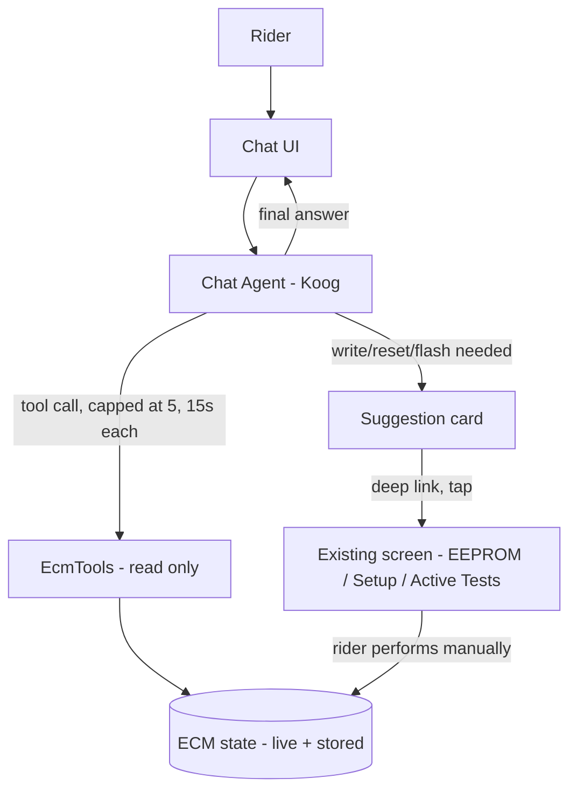
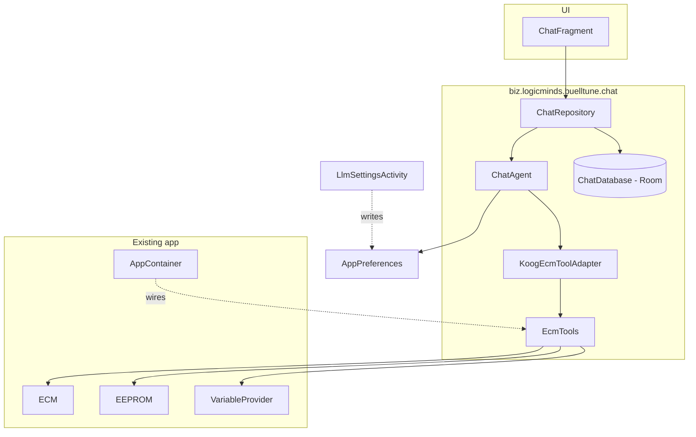

# BuellTune Read-Only ECM Chat - Plan

## Goal Capsule

- **Objective:** add a read-only, ECM-grounded LLM chat tab to BuellTune that lets riders ask Buell tuning/diagnostic questions answered against their bike's actual live and stored state, while keeping every write, reset, and flash path human-gated behind the app's existing screens.
- **Product authority:** this brainstorm dialogue (2026-09-03) is the product authority for this feature. No `STRATEGY.md` exists in the repo to cross-reference.
- **Open blockers:** none. The Koog-on-Android viability spike and the exact Settings/persistence shapes are execution-time items under Dependencies/Assumptions and Outstanding Questions, not blockers on planning.

---

## Product Contract

### Summary

A new Chat drawer tab backed by Koog (`ai.koog:koog-agents`), letting the rider pick from several configured LLM providers per conversation (Anthropic, OpenAI, Google, DeepSeek, OpenRouter, Ollama, Bedrock). Conversations persist as a named, browsable list. Any question about current engine state triggers a fresh read-only ECM tool call rather than trusting older data from a past conversation. Any write, reset, or flash the LLM suggests surfaces as a card that deep-links to the existing screen where the rider performs it manually — the model itself never gets a tool that can touch the ECM.

### Problem Frame

Buell DDFI riders diagnosing or tuning their bike today have to manually cross-reference live data (AFV, TPD, error codes) against domain knowledge scattered across forums and their own experience — what a given AFV reading means, whether a TPS value is in range, which screen to use to fix it. A wrong read on that data has real consequences on a system that can brick an ECM. A chat assistant that can see the bike's actual current and stored state, rather than answer from generic EFI knowledge, removes the manual cross-referencing step and reduces the chance of a rider acting on a misread value — as long as it can never take the risky action itself.

### Key Decisions

- KD1. **Chat is built on Koog (`ai.koog:koog-agents`) rather than a hand-rolled OkHttp/JSON client.** *(session-settled: user-directed — chosen over a minimal hand-rolled client after the cost was surfaced: adopting Koog requires bumping the app's Kotlin toolchain from 2.2.10 to 2.3.10+, along with the paired KSP/Compose-compiler versions, and Koog's own docs list Android among claimed-but-not-canonically-listed supported targets. Traded for built-in multi-provider BYOK and a tool-calling agent loop. Governs R9, R10, R13.)*
- KD2. **EcmTools registers as native Koog `Tool` objects; no MCP layer.** Koog's MCP integration is a client for connecting to external MCP servers, not a mechanism for exposing tools written in the same process, and EcmTools has exactly one consumer today. Governs R8.
- KD3. **Write/reset/flash suggestions deep-link to the existing drawer screen rather than staying text-only.** *(session-settled: user-directed — chosen for negligible cost since navigation never pre-fills a value or triggers an action, leaving the human-gated safety boundary untouched. Governs R2.)*
- KD4. **Multiple LLM providers are configurable and usable from v1**, not "Anthropic first, others added later." *(session-settled: user-directed — chosen over launching with one hardcoded provider, made low-cost by KD1's choice of Koog. Kimi/Moonshot is reached through the OpenRouter path rather than a dedicated client, since Koog does not name it as a first-class provider. Governs R9, R11.)*
- KD5. **Provider/model is chosen per conversation at creation, not as one global active-provider setting.** *(session-settled: user-directed — chosen over a single global provider setting so the rider can run different questions against different models without changing a shared setting first. Governs R10.)*
- KD6. **Chat history persists as a named, switchable list of conversations rather than one continuous log.** *(session-settled: user-directed — chosen over a single ever-growing thread: matches "state can change between chats" and bounds any one conversation's context growth. Governs R15.)*
- KD7. **Reopening a past conversation drops its tool call/result payloads from what's replayed to the model; only text turns carry forward.** *(session-settled: user-directed — chosen over replaying full history and relying on a system-prompt instruction to re-fetch: guarantees fresh ECM state on any state-dependent question structurally rather than trusting model compliance, and caps context growth across resumed sessions. Governs R16, R17.)*

---

### Requirements

**Safety boundary (non-negotiable)**

- R1. The chat feature never exposes any ECM-write capability to the LLM — no `burnEEPROM`, TPS/AFV reset, or active-test trigger reachable as a tool, under any provider or model.
- R2. When the LLM concludes a write, reset, or flash is warranted, the chat shows a suggestion card naming the action; tapping it deep-links to the exact existing drawer screen where the rider performs it manually. The app never pre-fills a value or triggers the action itself.

**ECM tool layer (`EcmTools`)**

- R3. `EcmTools` exposes exactly six read-only tools: `get_ecm_info`, `list_live_variables`, `read_live_data(variables)`, `read_error_codes`, `get_eeprom_parameter(name)`, `get_fuel_map_region(cylinder, rpmRange, tpsRange)`.
- R4. Tool handlers run on `Dispatchers.IO` and read from the existing polling snapshot rather than issuing new ECM transactions, since `transact()` is mutex-serialized and a poll loop may already be running.
- R5. `read_live_data` takes an explicit variable-name list and never returns the full runtime-variable catalog in one call; `list_live_variables` lets the model discover valid names first.
- R6. Every tool result is compact JSON scaled to human-readable values with units, never raw bytes.
- R7. When the ECM isn't connected, a tool call returns a structured "not connected" result instead of throwing or blocking; the LLM still answers generically and tells the rider to connect.
- R8. `EcmTools` is a plain Kotlin facade over `ECM`/`EEPROM`/`VariableProvider` with no dependency on Koog, unit-testable standalone; a thin adapter layer registers its six methods as native Koog `Tool` objects.

**LLM provider & agentic loop**

- R9. The chat agent is built on Koog; the rider can configure credentials for multiple providers (Anthropic, OpenAI, Google, DeepSeek, OpenRouter, Ollama, Bedrock) in Settings, each stored via `SharedPreferences` and never shipped in the APK.
- R10. Starting a new conversation lets the rider choose which configured provider/model it uses, defaulting to whichever was used last; a conversation's provider/model is fixed for its lifetime (KD5).
- R11. Ollama is configured with a base URL to a rider-reachable server rather than an API key; no inference runs on-device.
- R12. The agentic loop caps at 5 tool iterations per turn with a 15s per-tool-call timeout; each in-flight tool call shows a "Reading ECM: `<tool name>`" indicator in the chat UI.
- R13. Responses stream to the UI via Koog's streaming API; a non-streaming fallback is acceptable if streaming isn't wired for v1.
- R14. If no provider is configured, the Chat screen shows a setup prompt instead of a conversation view.

**Conversation persistence & staleness**

- R15. Conversations persist locally (consistent with the app's existing Room usage) as a named, browsable list the rider can create, switch between, and delete.
- R16. Within an active conversation, tool call/result history stays in context normally for follow-up questions.
- R17. Reopening a past conversation replays only its user/assistant text turns to the model; prior tool_use/tool_result payloads are not resent as context, so any question depending on current ECM state forces a fresh tool call rather than reusing stale data. Persisted messages still retain their original tool calls/results for on-screen display.

**Chat UI**

- R18. A new `ChatFragment` (Kotlin) is registered in the drawer nav (`res/menu/main_drawer.xml`) following the existing fragment-per-tab pattern.
- R19. The screen shows a message list (user/assistant bubbles), text input, send button, and per-tool-call activity indicators.
- R20. Five predefined prompt chips sit above the input — Health check, Check my TPS zero, Why is my AFV high/low?, Explain my error codes, Pre-ride check — each starting a new conversation with a template prompt that the LLM fills in via tools.

**Domain knowledge (system prompt)**

- R21. The system prompt is seeded with DDFI-2 domain facts: AFV semantics (100% = no correction, >100% = ECM adding fuel/lean, learns only in the Closed-Loop-Learn steady-cruise region), fuel map cell units (58 µs injector pulse width, 0-255 range), TPD in degrees (~5-6° at idle after a proper reset) versus percent scales, and separate front/rear fuel/ignition maps with the stock O2 sensor monitoring the rear header only while corrections apply to both cylinders.
- R22. The system prompt always directs the rider to perform writes, resets, and flashes manually via the existing screens, and never tells the rider to skip pre-flash backups.

**Testing**

- R23. JVM unit tests cover `EcmTools` using the existing `JdbcEcmDefinitionsProvider`-based fixtures, following the `Test<Component>` naming convention with no mocking framework.
- R24. An ecmsim-backed integration test (alongside the existing `app/src/test/.../integration/` suite) exercises every `EcmTools` tool handler against the simulator and asserts values from the BUEIB fixtures, including the not-connected path.
- R25. The agentic loop, provider/model selection, and Koog-tool registration are tested with a fake LLM/tool-call sequence; tests never call a real provider API.
- R26. `./gradlew test`, `./gradlew lint`, and `./gradlew assembleDebug` all pass.

**Docs**

- R27. `docs/DEVELOPER_GUIDE.md` gains a new section documenting the chat architecture and tool layer.

---

### Actors

- A1. **Rider** — the app's user; asks questions, taps prompt chips, reads suggestion cards, and is the only one who can perform a write/reset/flash.
- A2. **Chat Agent** — the Koog-orchestrated LLM session; answers questions and calls `EcmTools` within the iteration cap.
- A3. **EcmTools** — the read-only bridge between the Chat Agent and the ECM's live/stored state; the safety boundary lives here.
- A4. **LLM Provider** — the rider-configured external service (Anthropic, OpenAI, Google, DeepSeek, OpenRouter, Ollama, Bedrock) that runs the model.

### Key Flows

- F1. **Grounded live-data question**
  - **Trigger:** rider asks something requiring current ECM state (e.g. "what's my AFV and RPM").
  - **Steps:** Chat Agent calls one or more `EcmTools` reads, each shown as a "Reading ECM: `<tool>`" indicator; Chat Agent composes a final text answer from the results.
  - **Outcome:** answer reflects the ECM's actual current values with units.
  - **Covers:** R3, R4, R5, R6, R7, R12, R19

- F2. **Write/reset suggestion**
  - **Trigger:** Chat Agent concludes a write, reset, or flash is warranted.
  - **Steps:** chat shows a suggestion card naming the action; rider taps it; app deep-links to the exact existing screen.
  - **Outcome:** the rider performs the action manually; the app never touches the ECM from chat.
  - **Covers:** R1, R2

- F3. **Conversation resume after ECM state may have changed**
  - **Trigger:** rider reopens a past conversation and asks a follow-up.
  - **Steps:** only that conversation's prior user/assistant text replays to the model (R17); any state-dependent follow-up triggers a fresh `EcmTools` call rather than reusing an old tool result.
  - **Outcome:** answers about "now" are never based on a stale snapshot from a previous session.
  - **Covers:** R16, R17

- F4. **No provider configured**
  - **Trigger:** rider opens Chat with no LLM provider credentials set.
  - **Steps:** screen shows a setup prompt instead of the conversation view.
  - **Covers:** R14

### Acceptance Examples

- AE1. **Covers R3, R5, R6, F1.** Given ecmsim (BUEIB fixture) is connected, when the rider asks "what's my AFV and RPM," then the Chat Agent calls `read_live_data(["AFV","RPM"])` and the final answer contains the simulator's actual values with units.
- AE2. **Covers R7, F1.** Given no ECM is connected, when the rider asks the same question, then the tool call returns a structured not-connected result, no exception is thrown, and the Chat Agent answers generically while telling the rider to connect.
- AE3. **Covers R1, R2, F2.** Given the Chat Agent's answer implies a TPS reset is warranted, when the rider taps the resulting suggestion card, then the app opens the Setup screen and no reset is performed automatically.
- AE4. **Covers R14.** Given no LLM provider is configured in Settings, when the rider opens Chat, then the setup prompt is shown, not a conversation.
- AE5. **Covers R17, F3.** Given a past conversation whose earlier turn called `read_live_data`, when the rider reopens it and asks the same live-data question again, then a fresh tool call is made rather than the earlier result being reused.
- AE6. **Covers R20.** Given the rider taps the "Health check" chip, then a new conversation starts and the Chat Agent calls `get_ecm_info`, `read_error_codes`, and `read_live_data` for AFV/battery/CLT within the 5-iteration cap, each shown with its own "Reading ECM: `<tool>`" indicator.

### Success Criteria

- An agent can verify AE1, AE2, and AE5 end-to-end using ecmsim, with no physical ECM and no real LLM provider API key (fake tool-call sequence for the loop, ecmsim for the ECM side).
- No code path registers a tool capable of writing to the ECM — verifiable by inspecting the `EcmTools`-to-Koog-`Tool` adapter (KD2, R8) without needing to audit the whole codebase.

### Scope Boundaries

- Deferred for later: switching a conversation's provider/model mid-conversation — Koog itself supports this, but v1 starts a new conversation instead.
- Deferred for later: on-device/local inference — Ollama requires a LAN-reachable server.
- Outside this feature's identity: any ECM write, reset, active-test trigger, or flash path reachable from chat, at any point — this is the permanent safety boundary, not a v1-vs-later distinction.
- Not in scope: changes to the vendored `de.kai_morich.simple_bluetooth_le_terminal` package.

### Dependencies / Assumptions

- Adopting Koog requires Kotlin 2.3.10+ as a floor (`gradle/libs.versions.toml:3`); the exact bump target beyond that floor is KTD10's decision, not re-litigated here.
- Koog-on-Android viability is now confirmed, not assumed: `ai.koog:koog-agents` publishes an `agents-core-android` Kotlin-Multiplatform `androidTarget()` artifact on Maven Central, requires Kotlin 2.3.10+, and (as of Koog 1.0) supports `minSdk` 23+, below this app's `minSdk` 26; its Ktor-based HTTP client auto-discovers OkHttp on Android with existing D8/R8 compatibility testing (KTD1).
- `PollRecordLoop`'s poll coroutine only runs while a screen has called `startReading()` or a recording is active (`app/src/main/java/biz/logicminds/buelltune/service/PollRecordLoop.kt:278-283`) — it is not a continuously warm background poll — so `EcmTools` cannot rely on subscribing to `runtimeData` for a guaranteed-fresh snapshot; it calls `ECM.readRTData()` directly instead, safe to do concurrently with any active poll session because `transact()` is mutex-serialized (KTD3).
- Assumes Kimi/Moonshot access goes through the OpenRouter path (a native Koog provider that already lists Moonshot/Kimi models) rather than a dedicated Koog client, since Koog does not name Moonshot/Kimi as a first-class provider.
- This branch was rebased onto `origin/main` after the original brainstorm/planning pass, landing `AppPreferences.kt` (a single typed `SharedPreferences` accessor replacing ~12 previously-scattered reads/writes) and a repoint of `ECM`/`VariableProvider`/`EEPROM` test/service lookups onto `AppContainer.from(context)` instead of the old static `getInstance(Context)` facades. Both are now the established conventions this plan's Settings (KTD6) and DI (KTD4) decisions follow; `gradle/libs.versions.toml`'s `agp`/`kotlin`/`ksp`/`composeCompiler` lines (2-4, 53) were untouched by the rebase.

### Outstanding Questions

**Deferred to Implementation** (not blocking — normal execution-time discovery):
- Exact Koog provider-executor construction call per provider (Anthropic/OpenAI/Google/DeepSeek/OpenRouter/Ollama/Bedrock) and the exact streaming-call API shape — read `docs.koog.ai`'s `PromptExecutor`/`AIAgent` reference during U5 rather than guessing the surface here.
- Exact default model id(s) offered per provider in the new-conversation picker (U9).

**Resolve Before Planning:** none. The Koog-on-Android viability question is resolved (see Dependencies/Assumptions) with confirming evidence, not deferred.

### Sources / Research

- `app/src/main/java/biz/logicminds/buelltune/service/PollRecordLoop.kt:150,158` — `runtimeData: Flow<ByteArray>` and `state: StateFlow<ConnectionState>`; no pre-decoded snapshot exists today.
- `app/src/main/java/biz/logicminds/buelltune/ECM.kt:350` — `getErrors(type: ErrorType): Collection<Error>?`.
- `app/src/main/java/biz/logicminds/buelltune/Error.kt:23,27-29` — `Error` class with `code`, `description`, `type: ErrorType` (`CURRENT`/`RECENT`/`STORED`).
- `app/src/main/java/biz/logicminds/buelltune/EEPROM.kt:49,56,182` — `getBytes()`, `getPages()`, companion `get(name, context)`.
- `app/src/main/java/biz/logicminds/buelltune/VariableProvider.kt:25,37,44,48` — `getRtVariable`, `getEEPROMVariable`, `getNearestEEPROMVariable`.
- `app/src/main/java/biz/logicminds/buelltune/EcmDefinitionsProvider.kt:36,42,45` — `getEeprom(ecmId)`, `size2id(length)`, Room-backed implementation.
- `app/src/main/java/biz/logicminds/buelltune/AppPreferences.kt:50-143` — established single typed `SharedPreferences` accessor object; new LLM-provider fields extend it (KTD6).
- `app/src/main/AndroidManifest.xml:10` — `INTERNET` permission already declared.
- `app/src/main/res/menu/main_drawer.xml:4-31` — 10 existing drawer entries, `checkableBehavior="single"`.
- `app/src/test/java/biz/logicminds/buelltune/integration/EcmSimProtocolIntegrationTest.kt:56,59-61,80-84` — existing ecmsim-backed JVM integration test pattern (`@Category(EcmSimIntegrationSuite::class)`, `@ClassRule EcmSimRule("BUEIB")`, JDBC-backed `ECM` construction).
- `docs/DEVELOPER_GUIDE.md:8-22` — current 15 top-level sections; the new chat-architecture section is additive.
- `app/src/main/java/biz/logicminds/buelltune/Constants.kt:49,61,79,82,96,460` — `ABat`, `AFV`, `ATPS`, `Bat`, `CLT`, `KO2TPD` variable-name constants.
- `gradle/libs.versions.toml:2-4,53` — current `agp = "9.2.1"`, `kotlin = "2.2.10"`, `ksp = "2.3.11"`; no OkHttp/Gson/Moshi entries.
- [JetBrains/koog](https://github.com/JetBrains/koog) — v1.2.0, Apache-2.0, JetBrains-incubator; README "Supported targets" lists JVM, JS, WasmJS, iOS (Android claimed elsewhere, not in that line); requires Kotlin 2.3.10+; [MCP docs](https://docs.koog.ai/model-context-protocol/) describe `McpToolRegistryProvider` as a client for external MCP servers.
- Moonshot/Kimi's API is OpenAI-compatible (`https://api.moonshot.ai/v1`) and already served through OpenRouter, which is a native Koog provider.
- `app/src/main/java/biz/logicminds/buelltune/service/PollRecordLoop.kt:161-219,278-283` — `reading`/`isRecording()`-gated poll coroutine; not continuously warm.
- `app/src/main/java/biz/logicminds/buelltune/AppContainer.kt:40-59` — process-wide manual DI container pattern `ChatDatabase`/`EcmTools` follow.
- `app/src/main/java/biz/logicminds/buelltune/ECM.kt:66-95,323-333` — `Protocol` enum, `readRTData()`, `isConnected()` signatures.
- `app/src/main/java/biz/logicminds/buelltune/data/EcmDefinitionsDatabase.kt:44-92` — prepackaged read-only `createFromAsset` Room database; wrong shape for mutable conversation data (KTD5).
- BUEIB fixture's `rtoffsets` table confirms a `TPD` ("Throttle Position Degrees") runtime variable exists in the bundled DB though no `Constants.kt` constant names it — `list_live_variables` (R5) is why `EcmTools` doesn't need every useful name hardcoded.
- Koog-on-Android confirmation: [JetBrains/koog README](https://github.com/JetBrains/koog) ("Deploy agents across JVM, JS, WasmJS, Android, and iOS targets"), `agents-core-android` on [Maven Central](https://central.sonatype.com/artifact/ai.koog/agents-core-android), Koog 1.0 changelog (minSdk lowered to 23, May 2026 release).
- `app/src/main/java/biz/logicminds/buelltune/activities/MainActivity.java:94,311,313,329` — `MainActivity extends AppCompatActivity` (has `getSupportFragmentManager()` available today); `switchToFragment(int id)` confirmed `private`, uses legacy `getFragmentManager()`/`android.app.Fragment` for all 10 existing screens (KTD9).
- `docs/ROADMAP.md:20-25` — "Legacy Fragment/Preference/AsyncTask removal" already tracks `android.app.Fragment`/`android.preference.*` for eventual deletion, deferred until every screen migrates; this feature avoids adding to that surface rather than waiting for that migration (KTD4, KTD6).
- Rebase-landed commits grounding KTD4/KTD6: `c15f3e2` (`AppPreferences.kt` consolidation), `3225f18` (`AppContainer.from(context)` repoint off static `getInstance(Context)` facades).
- AGP/Kotlin/Compose currency (KTD10): [AGP 9.4.0 release notes](https://developer.android.com/build/releases/agp-9-4-0-release-notes) (Sept 2026); [Kotlin 2.4.0](https://blog.jetbrains.com/kotlin/2026/06/kotlin-2-4-0-released/) (June 2026) and 2.4.10 (July 2026); [Jetpack Compose August '26 release](https://android-developers.googleblog.com/2026/08/jetpack-compose-august-2026-release.html) (Compose 1.12).

---

## Planning Contract

### Key Technical Decisions

- KTD1. **Add `ai.koog:koog-agents` to `gradle/libs.versions.toml`.** Koog viability is confirmed, not merely assumed: it publishes an Android-target artifact (`ai.koog:agents-core-android`, Kotlin Multiplatform `androidTarget()`, not JVM-only), requires Kotlin 2.3.10+ as a floor, and supports `minSdk` 23+ as of Koog 1.0 — below this app's `minSdk` 26. Its Ktor-based HTTP client auto-discovers OkHttp on Android with existing D8/R8 compatibility testing. KTD10 owns the exact toolchain-bump target beyond that 2.3.10+ floor. *(session-settled: instantiates Product KD1 — user-directed — chosen over a hand-rolled OkHttp/JSON client after the Kotlin-bump cost was surfaced; the Android-viability risk flagged at brainstorm time is resolved by this research, not left open. Governs R9, R10, R13.)*
- KTD2. **`EcmTools` registers as native Koog `Tool` objects via a thin adapter; no MCP client/server layer.** Koog's MCP support is a client for calling external MCP servers — irrelevant when the tool implementation lives in the same process as its only consumer. *(session-settled: instantiates Product KD2. Governs R8.)*
- KTD3. **`read_live_data` (and `get_ecm_info`'s live half) call `ECM.readRTData()` directly, once per tool call, rather than subscribing to `PollRecordLoop.runtimeData`.** `PollRecordLoop`'s poll coroutine (`app/src/main/java/biz/logicminds/buelltune/service/PollRecordLoop.kt:278-283`) only runs while `reading || isRecording()` is true, so there is no guarantee a fresh snapshot exists when chat isn't also driving a live-data screen. `ECM.readRTData()` (`ECM.kt:323`) is safe to call concurrently with an active poll loop because the underlying transport `transact()` is mutex-serialized (AGENTS.md) — a tool call queues behind any in-flight poll cycle instead of corrupting it. This supersedes the brainstorm-stage assumption that a warm snapshot already existed. Governs R4.
- KTD4. **New package `biz.logicminds.buelltune.chat`** holds `EcmTools`, the Koog tool adapter, `ChatAgent`/`ChatAgentFactory`, `ChatRepository`, and `ChatDatabase`/entities/DAOs — parallel to the existing `service`/`transport`/`data` domain subpackages, each exposed through a new `AppContainer` lazy val (`AppContainer.kt:40-59`) matching its existing `ecm`/`variableProvider`/`database` wiring, reinforced by the rebased-in repoint of `EcmService`/tests onto `AppContainer.from(context)` instead of static facades. `ChatFragment` stays under the existing `fragments/` package but extends `androidx.fragment.app.Fragment`, not the deprecated `android.app.Fragment` every other screen currently uses (KTD9's hosting mechanism). Governs R8, R18. *(session-settled: user-directed — chosen over matching the legacy `Fragment` base class other screens use, per this session's "assume we will upgrade to non-deprecated APIs" direction.)*
- KTD5. **A new, separate, mutable Room database (`ChatDatabase`) holds conversation/message persistence — not a new table on `EcmDefinitionsDatabase`.** `EcmDefinitionsDatabase` (`app/src/main/java/biz/logicminds/buelltune/data/EcmDefinitionsDatabase.kt:44-92`) is a prepackaged, `createFromAsset`, `allowMainThreadQueries`, no-migration reference database — the wrong shape for rider-generated, growing, coroutine-queried data. `ConversationEntity(id, title, providerId, modelId, createdAt)` and `ChatMessageEntity(id, conversationId, role, content, toolCallsJson, createdAt)` are the two tables; `providerId`/`modelId` are set once at creation and never updated. *(session-settled: instantiates Product KD5, KD6. Governs R10, R15.)*
- KTD6. **LLM provider credentials are configured through a new `LlmSettingsActivity` (`androidx.appcompat.app.AppCompatActivity` hosting an `androidx.preference.PreferenceFragmentCompat`, `res/xml/llm_prefs.xml`) — not new entries in the legacy `PrefsActivity`/`res/xml/app_prefs.xml`/`android.preference.EditTextPreference`.** `android.preference.*` is exactly the API surface `docs/ROADMAP.md`'s "Legacy Fragment/Preference/AsyncTask removal" already tracks for eventual deletion; adding more fields to it would grow, not shrink, that surface. `PreferenceFragmentCompat` persists to the same `PreferenceManager.getDefaultSharedPreferences` store `app_prefs.xml` uses, so no second storage mechanism is introduced — only a modern authoring widget. One field per provider credential (Anthropic/OpenAI/Google/DeepSeek/OpenRouter API keys, Ollama base URL, Bedrock access-key/secret-key/region), masked via `EditTextPreference`'s password input type. Reads go through `AppPreferences.kt` (existing single-typed-accessor object, extended with these fields, matching its established `@JvmStatic fun xxx(context): String?` shape) plus a `configuredProviders(context): List<ProviderId>` composition function — not a new standalone reader class. *(session-settled: user-directed — chosen over adding to `PrefsActivity`/`app_prefs.xml`, per this session's "assume we will upgrade to non-deprecated APIs" direction. Instantiates Product KD4. Governs R9, R11, R14.)*
- KTD7. **`ChatRepository` builds the model-bound message list for a resumed conversation from `ChatMessageEntity.role`/`content` only — `toolCallsJson` is read for on-screen rendering but never sent back to the provider.** This is the mechanism behind Product R17: a fresh `EcmTools` call is structurally required for any state-dependent follow-up because no prior tool result ever re-enters the model's context after a conversation is reopened. *(session-settled: instantiates Product KD7. Governs R16, R17.)*
- KTD8. **Write/reset/flash suggestions are derived by `ChatAgent` parsing a constrained marker in the model's own final text**, not a tool call — suggesting an action is part of the answer, not an effect the model produces against a system. The system prompt (R21/R22) instructs the model to end such an answer with a fenced line `[[SUGGEST:<drawer-item-id>|<short action label>]]` (e.g. `[[SUGGEST:nav_setup|Reset TPS zero]]`, `drawer-item-id` values matching `res/menu/main_drawer.xml`'s existing ids); `ChatAgent` strips the marker from the displayed text and turns it into a `SuggestionCard(screen, label)`. An unrecognized `drawer-item-id` degrades to plain text with no card. *(session-settled: instantiates Product KD3. Governs R2.)*
- KTD9. **`MainActivity.switchToFragment(int id)` gains a `nav_chat` case that hosts `ChatFragment` through `getSupportFragmentManager()`** (available today since `MainActivity extends AppCompatActivity`, `MainActivity.java:94`) rather than the legacy `getFragmentManager()` every other case uses (`MainActivity.java:311,313,329`). Confirmed `private` (`MainActivity.java:311`) — widened (to `public`, or a small public wrapper) so a suggestion card (KTD8) can invoke it from `ChatFragment`. Because a legacy `android.app.FragmentManager` transaction and an `androidx.fragment.app.FragmentManager` transaction cannot share one `content_frame` swap, the new case (and the existing cases, on return-to-legacy) must explicitly remove whichever manager's fragment currently occupies `content_frame` before adding the other's. Governs R2, R18.
- KTD10. **Toolchain modernization is broader than Koog's minimum floor**: `agp`, `kotlin` (+ paired `ksp`), and `composeBom` all bump to their latest stable releases at implementation time, not just Kotlin 2.3.10+. As of this research, `agp=9.2.1` trails AGP 9.4.0 (Sept 2026); `kotlin=2.2.10` trails the 2.4.x line (2.4.0 June 2026, 2.4.10 July 2026); `composeBom=2026.02.01` trails at least three newer stable BOM lines (April/June/August 2026, the last shipping Compose 1.12). Exact patch versions are resolved at implementation time (U1), not pinned here, since they move faster than this plan's shelf life. *(session-settled: user-directed — chosen over a Koog-minimum-only bump, per this session's "assume Kotlin, Compose and AGP would also be updated to newer releases" direction.)*

### High-Level Technical Design

`ChatFragment` never calls `EcmTools`, `ChatAgent`, or any LLM provider directly — every request passes through `ChatRepository`, which is the one seam that enforces KTD7's replay rule and persists both sides of every turn.

### Risks & Dependencies

- The exact Koog provider-executor construction API (per-provider `PromptExecutor` factory calls, streaming call shape) is not verified against Koog source in this plan — U5 explicitly defers that lookup to `docs.koog.ai` at implementation time rather than guessing the surface here.
- This app has no explicit `org.jetbrains.kotlin.android` plugin in `app/build.gradle.kts` or root `build.gradle.kts` — Kotlin compilation is controlled entirely through AGP 9's built-in Kotlin support. Confirm exactly how the `kotlin` version-catalog alias feeds that built-in support before bumping it (KTD10/U1); the mechanism differs from pre-AGP-9 projects.
- Mixing a legacy `android.app.FragmentManager` transaction with an `androidx.fragment.app.FragmentManager` transaction on the same `content_frame` (KTD9) is a real coexistence risk if the explicit prior-manager teardown is missed — verify by manually navigating chat → every other tab → chat again during U9's smoke test, not just chat in isolation.
- Bedrock credentials (access key/secret/region) are materially more complex than a single API key; scope stays at three flat preference fields (KTD6), no AWS credential-chain support.

---

## Implementation Units

### Unit Index

| U-ID | Title | Files touched | Depends on |
|---|---|---|---|
| U1 | Toolchain bump + Koog dependency | `gradle/libs.versions.toml`, `app/build.gradle.kts` | — |
| U2 | `EcmTools` facade | `chat/EcmTools.kt` | U1 |
| U3 | `EcmTools` unit tests | `app/src/test/.../TestEcmTools.kt` | U2 |
| U4 | `EcmTools` ecmsim integration test | `app/src/test/.../integration/EcmToolsIntegrationTest.kt` | U2 |
| U5 | Koog tool adapter + agentic loop | `chat/KoogEcmToolAdapter.kt`, `ChatAgentFactory.kt`, `ChatAgent.kt`, `SuggestionCard.kt` | U1, U2 |
| U6 | Fake-LLM agentic-loop tests | `app/src/test/.../chat/TestChatAgent.kt` | U5 |
| U7 | Conversation persistence | `chat/ChatEntities.kt`, `ChatDaos.kt`, `ChatDatabase.kt`, `ChatRepository.kt` | U5 |
| U8 | LLM settings screen | `LlmSettingsActivity.kt`, `res/xml/llm_prefs.xml`, `AppPreferences.kt` | U1 |
| U9 | `ChatFragment` UI | `fragments/ChatFragment.kt`, `res/layout/chat.xml`, `MainActivity.java`, `main_drawer.xml`, `strings.xml` | U1, U7, U8 |
| U10 | Prompt chips + system prompt | `chat/SystemPrompt.kt`, `ChatFragment.kt`, `strings.xml` | U9 |
| U11 | Developer guide docs | `docs/DEVELOPER_GUIDE.md` | U2-U10 |

### U1. Toolchain bump + Koog dependency

- **Goal:** bump the Android/Kotlin toolchain to current-latest stable releases (AGP, Kotlin, KSP, Compose BOM — KTD10, not just Koog's floor), add `ai.koog:koog-agents`, `androidx.preference:preference-ktx` (U8), and `androidx.recyclerview:recyclerview` (U9) to the version catalog, with zero behavior change to existing code.
- **Requirements:** R9, R10, R13 (KTD1)
- **Files:** `gradle/libs.versions.toml`, `app/build.gradle.kts`
- **Approach:** bump the `kotlin` version alias to the latest 2.3.x release Koog's README names as its minimum (2.3.10+); confirm the `ksp` plugin version still resolves against that Kotlin release rather than assuming it needs its own bump (KSP is versioned independently of Kotlin post-KSP2). `composeCompiler` already tracks `kotlin` via `version.ref`, no separate edit needed. Add a `koog` version plus an `ai.koog:koog-agents` library entry to `[versions]`/`[libraries]`, and `implementation(libs.koog.agents)` to `app/build.gradle.kts`. No first-party source changes in this unit.
- **Test Scenarios:** none (pure build-config change).
- **Verification:** `./gradlew assembleDebug` and `./gradlew test` both succeed with no source changes beyond the catalog/build-script edit.

### U2. `EcmTools` facade

- **Goal:** implement the six read-only tools as a plain, Koog-independent Kotlin class.
- **Requirements:** R1, R3, R4, R5, R6, R7, R8 (KTD3, KTD4)
- **Files:** `app/src/main/java/biz/logicminds/buelltune/chat/EcmTools.kt` (new)
- **Approach:** `class EcmTools(private val ecm: ECM, private val variableProvider: VariableProvider, private val definitionsProvider: EcmDefinitionsProvider)`; six `suspend fun` entry points running on `Dispatchers.IO`, each starting with `if (!ecm.isConnected()) return ToolResult.notConnected()` (R7). `get_ecm_info` reports `ecm.getEEPROM()?.id`, `ecm.getVersion()`, the connected `Protocol`, and the connected `EcmTransport` subtype name. `list_live_variables` lists runtime-variable name+unit pairs via `variableProvider`/`definitionsProvider` (mirrors `DatabaseVariableProvider.kt:38-158`'s DAO calls), no values. `read_live_data(variables)` calls `ecm.readRTData()` once (KTD3), then for each requested name resolves the `Variable` via `variableProvider.getRtVariable(ecmId, name)` and calls `Variable.refreshValue(bytes)` (`Variable.kt:145-193`); an unknown name reports a per-item error rather than aborting the call. `read_error_codes` calls `ecm.getErrors(ErrorType.CURRENT)` and `ecm.getErrors(ErrorType.STORED)` (`ECM.kt:350`), mapping `Error.code`/`description` to plain JSON. `get_eeprom_parameter(name)` checks `ecm.getEEPROM()?.isEepromRead() == true` first — an EEPROM never fetched by the rider reports a distinct "not yet read" result, not conflated with "not connected" — then resolves via `variableProvider.getEEPROMVariable` and `Variable.refreshValue`. `get_fuel_map_region(cylinder, rpmRange, tpsRange)` resolves the named front/rear fuel-map `Variable` (its `rows`/`cols` fields), slices the requested index ranges, and returns a compact 2-D cell-value array (raw pulse-width units; the 58µs conversion is explained by the system prompt, U10, not computed in the tool result). All six results serialize through one `ToolResult` sealed type (`Ok`/`NotConnected`/`Error`) via `kotlinx.serialization` (added by U1), shared by the Koog adapter (U5) and the unit tests (U3).
- **Test Scenarios:** see U3/U4.
- **Verification:** compiles standalone; exercised by U3/U4.

### U3. `EcmTools` unit tests

- **Goal:** prove scaling/not-connected/not-EEPROM-read behavior without a live simulator.
- **Requirements:** R23
- **Files:** `app/src/test/java/biz/logicminds/buelltune/TestEcmTools.kt` (new)
- **Approach:** construct `ECM` via its plain constructor with `JdbcVariableProvider`/`JdbcBitSetProvider`/`JdbcEcmDefinitionsProvider` (same JDBC-provider pattern as `EcmSimProtocolIntegrationTest.newEcm()`, `app/src/test/.../integration/EcmSimProtocolIntegrationTest.kt:62-66`) — not `TestECM.java`'s `AppContainer.from(context)` path, which needs an Android `Context` and only runs under `androidTest`. Load fixture bytes via `TestUtils.readEEPROM()`/`readRTData()` (`app/src/sharedTest/java/biz/logicminds/buelltune/TestUtils.java`, plain Java, no Android dependency, shared into `app/src/test` by `app/build.gradle.kts`'s `sourceSets.test` config), set them directly on the constructed `ECM`/`EEPROM`, then construct `EcmTools` against it — no real transport, no `androidTest`, no simulator.
- **Test Scenarios:**
  - `readLiveData_knownVariable_returnsScaledValueWithUnit`
  - `readLiveData_unknownVariable_returnsPerItemErrorNotException`
  - `readErrorCodes_matchesFixtureCurrentAndStoredCodes`
  - `getEepromParameter_beforeFetch_returnsNotYetReadResult`
  - `getEepromParameter_afterFetch_returnsScaledValue`
  - `allSixTools_whenNotConnected_returnStructuredNotConnectedResult`
- **Verification:** `./gradlew test`

### U4. `EcmTools` ecmsim integration test

- **Goal:** prove the same six tools against a real simulated ECM over TCP.
- **Requirements:** R24
- **Files:** `app/src/test/java/biz/logicminds/buelltune/integration/EcmToolsIntegrationTest.kt` (new)
- **Approach:** mirror `EcmSimProtocolIntegrationTest`'s structure exactly (`@Category(EcmSimIntegrationSuite::class)`, `@ClassRule EcmSimRule("BUEIB")`, JDBC-provider `newEcm()` helper, `app/src/test/java/biz/logicminds/buelltune/integration/EcmSimProtocolIntegrationTest.kt:46-70`). Connect, `setupEEPROM()`, fetch all pages (reusing the existing fetch-all-pages pattern), then run each `EcmTools` method against the live simulator, asserting against BUEIB's known fixture shape. Add one test constructing `EcmTools` against a never-connected `ECM` for the not-connected path — no simulator needed for that case.
- **Test Scenarios:**
  - `getEcmInfo_reportsBueibIdAndDdfi2Type`
  - `listLiveVariables_returnsNonEmptyCatalogWithUnits`
  - `readLiveData_forRpmAndAfv_returnsPlausibleValues`
  - `readErrorCodes_returnsSimulatorCurrentCodes`
  - `getEepromParameter_afterFetch_returnsScaledEepromValue`
  - `getFuelMapRegion_returnsRequestedCellRange`
  - `allSixTools_whenEcmNeverConnected_returnNotConnectedResult`
- **Verification:** `./gradlew ecmsimIntegrationTest -PecmsimJavaHome=/path/to/jdk21`

### U5. Koog tool adapter + agentic loop

- **Goal:** register `EcmTools` as native Koog tools and drive the capped, timed-out, streaming (or fallback) tool-calling loop per provider.
- **Requirements:** R2, R9, R10, R11, R12, R13, R14 (KTD2, KTD8; depends on KTD6)
- **Files:** `chat/KoogEcmToolAdapter.kt`, `chat/ChatAgentFactory.kt`, `chat/ChatAgent.kt`, `chat/SuggestionCard.kt` (new)
- **Approach:** `KoogEcmToolAdapter` wraps each `EcmTools` suspend function as a Koog `Tool`, reusing R3's tool names/signatures verbatim so the model's own vocabulary matches `list_live_variables`' output. `ChatAgentFactory.create(providerId, modelId, credentials)` resolves a Koog `PromptExecutor` for the chosen provider (read `docs.koog.ai`'s provider-executor reference at implementation time — the exact construction call is deferred, see Risks & Dependencies) and builds one `ChatAgent` bound to that executor, the six registered tools, and `SystemPrompt`'s content (R21/R22, wired by U10). `ChatAgent.send(userText, priorTurns)` runs the loop: on each model tool request, emit a "Reading ECM: `<tool>`" UI event, execute with a 15s `withTimeoutOrNull` (a timeout returns `ToolResult.Error("timed out")` to the model rather than crashing the turn), and stop after 5 tool iterations by returning whatever text the model has produced so far (R12). Prefer Koog's streaming call; fall back to a single non-streaming call plus one final UI chunk if streaming isn't wired in time (R13 allows this explicitly). After the model's final text is in hand, scan it for `[[SUGGEST:...]]` (KTD8), strip it, and return `(displayText, SuggestionCard?)`.
- **Test Scenarios:** see U6.
- **Verification:** compiles against U1's `koog-agents` dependency; exercised by U6.

### U6. Fake-LLM agentic-loop tests

- **Goal:** prove the loop's cap/timeout/suggestion-parsing/fallback behavior without a real provider call.
- **Requirements:** R25
- **Files:** `app/src/test/java/biz/logicminds/buelltune/chat/TestChatAgent.kt` (new), a fake `PromptExecutor` test double in the same package.
- **Approach:** the fake executor scripts a fixed response sequence (two tool calls then a final answer; six tool calls in a row to prove the 5-iteration cap; one tool call that never completes to prove the 15s timeout path; one final answer containing `[[SUGGEST:nav_setup|Reset TPS zero]]` to prove suggestion extraction). Real `EcmTools` runs against the same JVM fixture data as U3 — only the LLM side is faked; no test calls a real provider API (R25).
- **Test Scenarios:**
  - `agent_capsAtFiveToolIterations_returnsPartialAnswerNotInfiniteLoop`
  - `agent_toolCallExceeding15s_returnsTimeoutErrorToModelNotCrash`
  - `agent_suggestionMarkerInFinalText_extractedAsSuggestionCardAndStrippedFromDisplayText`
  - `agent_unrecognizedSuggestionTarget_degradesToPlainTextNoCard`
  - `agent_streamingUnavailable_fallsBackToSingleFinalChunk`
- **Verification:** `./gradlew test`

### U7. Conversation persistence

- **Goal:** store conversations/messages locally; enforce the resume-replay rule structurally.
- **Requirements:** R15, R16, R17 (KTD5, KTD7)
- **Files:** `chat/ChatEntities.kt`, `chat/ChatDaos.kt`, `chat/ChatDatabase.kt`, `chat/ChatRepository.kt` (new)
- **Approach:** `ChatDatabase` is a normal mutable Room database, versioned independently of `EcmDefinitionsDatabase`, exposed through `AppContainer` the same singleton way as `EcmDefinitionsDatabase.getInstance()` (`AppContainer.kt:43`). `ConversationDao`/`ChatMessageDao` return `Flow`-typed queries for the conversation list and one conversation's messages. `ChatRepository.sendMessage(conversationId, text)` persists the user message immediately, calls `ChatAgent.send(text, priorTurns)` where `priorTurns` is built from stored rows using only `role`/`content` (KTD7 — never `toolCallsJson`), then persists the assistant reply (with `toolCallsJson` populated for display) and any `SuggestionCard`.
- **Test Scenarios:**
  - `resumedConversation_repliesOmitPriorToolCallsFromModelContext`
  - `newConversation_persistsProviderAndModelImmutablyAtCreation`
  - `deletingConversation_removesItsMessages`
- **Verification:** `./gradlew test` (Room in-memory test database).

### U8. LLM settings screen

- **Goal:** let the rider enter credentials for each supported provider through a non-deprecated preferences screen; expose which are configured.
- **Requirements:** R9, R11, R14 (KTD6)
- **Files:** `app/src/main/java/biz/logicminds/buelltune/activities/LlmSettingsActivity.kt` (new), `res/xml/llm_prefs.xml` (new), `app/src/main/java/biz/logicminds/buelltune/AppPreferences.kt` (extended)
- **Approach:** `LlmSettingsActivity` is a small `AppCompatActivity` hosting a `PreferenceFragmentCompat` built from `llm_prefs.xml` — one `EditTextPreference` per credential field (`llm_anthropic_key`, `llm_openai_key`, `llm_google_key`, `llm_deepseek_key`, `llm_openrouter_key`, `llm_ollama_base_url`, `llm_bedrock_access_key`, `llm_bedrock_secret_key`, `llm_bedrock_region`), masked via `inputType="textPassword"` on the key fields. Reachable via `Intent` from Chat's setup prompt (R14) and its new-conversation provider picker (R10), the same Activity-launch pattern `main_drawer.xml`'s `nav_settings`/`nav_torque` already use for `PrefsActivity`/`TorqueValuesFragment` — no new drawer entry needed. `AppPreferences.kt` gains one `@JvmStatic fun` per credential field (matching its existing `tcpHost`/`tcpPort`-style shape, same `PreferenceManager.getDefaultSharedPreferences` store `PreferenceFragmentCompat` persists to) plus `configuredProviders(context): List<ProviderId>` for the new-conversation picker (U9) and the R14 setup-prompt gate.
- **Test Scenarios:** none dedicated — `AppPreferences`'s new accessors are thin `SharedPreferences` reads exercised via U9.
- **Verification:** `./gradlew assembleDebug`, `./gradlew lint`

### U9. `ChatFragment` UI

- **Goal:** the Chat drawer tab — conversation list, message view, input, tool-call indicators, setup prompt.
- **Requirements:** R14, R15, R18, R19 (KTD4, KTD9)
- **Files:** `fragments/ChatFragment.kt`, `res/layout/chat.xml` (+ message-bubble/conversation-list-row sub-layouts), `app/src/main/java/biz/logicminds/buelltune/activities/MainActivity.java`, `res/menu/main_drawer.xml`, `res/values/strings.xml`
- **Approach:** new drawer entry `nav_chat` in `main_drawer.xml` (mirrors the 10 existing entries, `app/src/main/res/menu/main_drawer.xml:4-31`). `ChatFragment` extends `androidx.fragment.app.Fragment` (KTD4/KTD9 — not the deprecated `android.app.Fragment` `TroubleCodeFragment` and the other 9 screens use), reached through `MainActivity.switchToFragment()`'s new `nav_chat` case, which adds it via `getSupportFragmentManager()` after removing whichever fragment the legacy `getFragmentManager()` currently holds in `content_frame` (KTD9); leaving chat for a legacy screen reverses the teardown. `onCreateView()` checks `AppPreferences.configuredProviders()` first (R14): empty → setup prompt (message + button launching `LlmSettingsActivity`); non-empty → conversation list (`ChatRepository`'s `Flow`, R15) with a "new conversation" affordance opening the provider/model picker (R10) before creating one. Inside an open conversation: an `androidx.recyclerview.widget.RecyclerView` message list (user/assistant bubble view types), text input + send button, and an activity row bound to U5's "Reading ECM: `<tool>`" events (R12/R19). A rendered `SuggestionCard` is tappable, calling the now-public `MainActivity.switchToFragment()` with the card's embedded drawer-item id.
- **Test Scenarios:** manual/instrumented (no headless tool applies to a native fragment); see Verification Contract.
- **Verification:** `./gradlew assembleDebug`, `./gradlew lint`; manual smoke test against `ecmsimRun`, including navigating chat → every other drawer tab → chat again (Risks & Dependencies' dual-`FragmentManager` risk).

### U10. Prompt chips + domain-knowledge system prompt

- **Goal:** wire the five predefined prompt chips and author the DDFI-2 domain-knowledge system prompt.
- **Requirements:** R20, R21, R22
- **Files:** `chat/SystemPrompt.kt` (new), `fragments/ChatFragment.kt` (chip row), `res/layout/chat.xml`, `res/values/strings.xml`
- **Approach:** `SystemPrompt.CONTENT` carries R21's facts verbatim (AFV semantics, fuel-map 58µs pulse-width units and 0-255 range, TPD-in-degrees ~5-6° idle expectation, front/rear map separation with rear-only O2 monitoring) plus R22's standing instruction and KTD8's `[[SUGGEST:...]]` convention. `ChatAgentFactory` (U5) includes it as the first message of every new conversation. Five Material `Chip` views in a `ChipGroup` above the input, each holding its template prompt string; tapping one starts a new conversation (the R10 picker fires first if no provider is remembered) and immediately sends the template text as the first user turn.
- **Test Scenarios:** manual/instrumented (chip → new conversation → template prompt sent); see Verification Contract. `SystemPrompt.CONTENT`'s fact coverage may optionally get a plain string-contains JVM test.
- **Verification:** `./gradlew assembleDebug`, `./gradlew lint`; manual smoke test.

### U11. Developer guide documentation

- **Goal:** document the chat architecture and tool layer for future maintainers.
- **Requirements:** R27
- **Files:** `docs/DEVELOPER_GUIDE.md`
- **Approach:** append a new `## 16. Chat Architecture and Tool Layer` section (after the existing 15, TOC updated to match — appending rather than renumbering avoids breaking existing anchor links) covering: the `chat/` package layout (KTD4), the `EcmTools`-is-Koog-independent boundary (KTD2, R8), the read-only tool set (R3) and the direct-`readRTData()` decision (KTD3), the agentic loop's cap/timeout/streaming-fallback (R12/R13), the suggestion-card marker convention (KTD8), and the conversation-persistence resume-replay rule (KTD7). Match section 9's prose-plus-file-reference style.
- **Test Scenarios:** none (docs-only).
- **Verification:** none beyond normal review.

---

## Verification Contract

- `./gradlew test` — full JVM unit suite including U3, U6, U7's Room tests; excludes the ecmsim category by default.
- `./gradlew ecmsimIntegrationTest -PecmsimJavaHome=/path/to/jdk21` — U4's live-simulator `EcmTools` coverage (R24), plus the pre-existing protocol/connection-loss suites must still pass unmodified.
- `./gradlew lint` — must pass; the existing `lint-baseline.xml` covers only the vendored BLE package, so no new baseline entries are expected from first-party chat code.
- `./gradlew assembleDebug` — must build with the Koog dependency and Kotlin bump included.
- Manual smoke test (no automated Android UI tool applies to a native fragment): with `./gradlew ecmsimRun` running and a configured provider credential, open the Chat tab, ask "what's my AFV and RPM," confirm the answer contains the simulator's live values (AE1); tap each of the 5 prompt chips and confirm each completes without error (AE6); disconnect ecmsim and confirm the not-connected generic-answer path (AE2); resume a past conversation and confirm a state-dependent follow-up issues a fresh tool call rather than reusing the old answer (AE5); trigger a suggestion card and confirm it opens the correct existing screen without performing the action itself (AE3); navigate from Chat to every other drawer tab and back to Chat, confirming both fragment stacks render correctly (KTD9's dual-`FragmentManager` risk).
- No physical ECM and no real provider API key are required for any required command: U6's fake executor and U3/U4's fixture/simulator data cover the agentic loop and ECM data paths respectively.

---

## Definition of Done

**Global**

- All R1-R27 satisfied; AE1-AE6 reproducible via the Verification Contract.
- `./gradlew test`, `./gradlew lint`, `./gradlew assembleDebug` pass; `./gradlew ecmsimIntegrationTest` passes with a JDK 21+ toolchain available.
- No code path registers a Koog `Tool` (or any other reachable method) that can call `ECM.burnEEPROM()`, a TPS/AFV reset, or an active-test trigger — verified by inspecting `KoogEcmToolAdapter`'s tool registration list (U5) against `EcmTools`' six public methods (U2): the two lists must match exactly.
- `docs/DEVELOPER_GUIDE.md` section 16 exists and accurately describes the shipped architecture (R27).
- No new `android.app.Fragment` or `android.preference.*` usage is introduced by this feature (KTD4/KTD6) — `ChatFragment` and `LlmSettingsActivity` are the only new UI surfaces, and both use their `androidx` equivalents.
- No scaffolding, TODO stubs, or dead-end code from an abandoned approach remains in the `chat/` package or its call sites.

**Per-unit**

- U1: version bump lands with zero non-build-file diff; `assembleDebug`/`test` pass on the bump alone.
- U2/U3/U4: all six `EcmTools` methods have both a fixture-based unit test and an ecmsim integration test covering their connected and not-connected paths.
- U5/U6: iteration cap, per-call timeout, suggestion-marker parsing, and streaming-fallback are each covered by a fake-executor test; no test calls a real provider.
- U7: resumed-conversation replay omits `toolCallsJson` from the model-bound turns, proven by test, not just code review.
- U8: every listed provider has a credential field in `llm_prefs.xml`; `AppPreferences.configuredProviders()` reflects blank/non-blank state correctly.
- U9/U10: manual smoke test confirms the setup prompt, conversation list, message view, tool-call indicators, all 5 chips, and suggestion-card tap-to-navigate all function against `ecmsimRun`.
- U11: new `DEVELOPER_GUIDE.md` section committed alongside the code it documents, not deferred to a follow-up.
