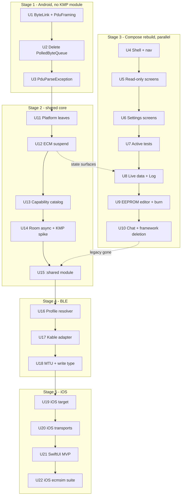

# BuellTune KMP Core Extraction - Plan

## Goal Capsule

- **Objective:** extract BuellTune's ECM engine — protocol, framing, transport, poll/record loop, definitions lookup — into a Kotlin Multiplatform `shared` module, rebuild the Android UI on Compose, and add an iOS SwiftUI app driving a real ECM over BLE and TCP. Android leads because its `ecmsim` harness and build wiring exist today; the same harness is then extended to cover iOS.
- **Product authority:** this brainstorm dialogue (2026-09-05) is the product authority. No `STRATEGY.md` exists in the repo. `docs/ROADMAP.md` carries the per-screen Compose migration and legacy-removal items this plan now absorbs into scope.
- **Authority hierarchy:** Product Contract Key Decisions (KD0–KD10) govern what is built; Key Technical Decisions (KTD1–KTD12) govern how. A KD outranks a KTD. `ecmsimIntegrationTest` staying green outranks both — it is the only automated gate between a protocol regression and bytes written into a real ECM.
- **Stop conditions:** stop and surface a blocker if (a) `ecmsimIntegrationTest` cannot be made green after a unit's changes, (b) Room's bundled SQLite driver cannot open the packaged asset on a non-Android target (KTD9's spike), or (c) a hand-ported BLE profile cannot be verified against real hardware. Do not weaken, skip, or mock an assertion to pass a gate.
- **Execution profile:** one PR per stage. Stage 1 and Stage 3 run in parallel; Stages 2, 4, 5 are strictly ordered after Stage 1. Each unit files and closes a bead (KTD12).
- **Open blockers:** none. This is a fork with no installed base (KD0), so no migration path, deprecation window, or backward-compatibility shim is owed to anyone.

---

## Product Contract

### Summary

BuellTune's engine is already well factored: `EcmTransport` is a pure-Kotlin coroutine interface, `ConnectionState`/`FailureCause` are sealed hierarchies, `PollRecordLoop` is Android-free, and `EcmDefinitionsProvider` already has two implementations (Room and JDBC) proving the abstraction holds. What blocks multiplatform is a single blocking-I/O idiom — `java.io.InputStream`/`OutputStream` with an `available()`-then-`Thread.sleep(10)` poll — that every transport funnels through, plus Android-only leaf dependencies (`android.util.Log`, Room's `Context`, `java.text.DecimalFormat`).

This work replaces that idiom with a suspend byte-link contract, lifts the engine into `commonMain`, models transport availability as runtime data rather than a compile-time `expect/actual` fork, swaps the vendored `de.kai_morich` BLE serial socket for JuulLabs Kable, rebuilds every Android screen on Compose while deleting the deprecated frameworks outright, and adds an iOS target with a native SwiftUI shell. Bluetooth Classic (SPP) and USB-serial stay Android-only by platform constraint, not by design choice.

### Problem Frame

Buell DDFI riders on iOS have no BuellTune at all. The engine that would serve them is sound Kotlin already, but it is welded to the JVM by its I/O layer and to Android by scattered leaf calls. Rewriting that engine in Swift would fork the protocol logic — the part of this app where a bug writes wrong bytes into a real ECM — into two independently drifting implementations. Sharing it is the only option that keeps one tested protocol core.

The Android UI is a parallel liability. Roughly 1,640 LOC sit on `android.app.Fragment`, `android.app.ListFragment`, `android.preference.*`, and `AsyncTask` — all long deprecated, against `targetSdk` 37. Nine of fifteen screens are Java. Because this fork has no installed base, none of that has to be preserved, migrated gracefully, or kept working during transition. It can be deleted and rebuilt.

### Key Decisions

- **KD0. This is a fork with no users. Breaking changes, wholesale rewrites, and aggressive dependency bumps are unconstrained.** *(session-settled: user-directed — "we have no users so we can do whatever is required." No compatibility shims, no deprecation windows, no dual-path code kept alive for migration. Where a rewrite is cleaner than an incremental port, take the rewrite. Governs every other decision here.)*
- **KD1. iOS gets a native SwiftUI shell; Android gets Compose. No Compose Multiplatform.** *(session-settled: user-directed. Rationale is not schedule protection but fit: the two platforms' navigation idioms genuinely differ — Android's drawer over fifteen destinations versus iOS's tab/split navigation over a deliberately smaller set — and the iOS surface is a subset, not a port. Cost accepted: iOS screens are written natively rather than shared. Governs R22–R27.)*
- **KD2. Android leads every stage, for tooling maturity rather than for coverage exclusivity.** `ecmsimIntegrationTest` drives real `TcpTransport`/`ECM`/`PollRecordLoop` against a live simulator with checksum-corruption and connection-loss coverage. `ecmsim` is a TCP server, so an iOS target can reach it too (R32) — what is JVM-bound is only the launcher: `EcmSimProcess` shells out via `ProcessBuilder`, scrapes a readiness log line, and tears the process down. Android leads because that harness, the JDBC definitions provider, and the Gradle wiring all exist today and none of the iOS equivalents do. Governs R30–R34.
- **KD3. The blocking-stream I/O idiom is replaced before any KMP module exists.** The `ByteLink` refactor lands on plain Android, green against `ecmsimIntegrationTest`, so a later failure is attributable to the KMP move rather than to the refactor. Governs R1–R5, R30.
- **KD4. Transport availability is runtime data (a capability catalog), not a compile-time `expect/actual` fork of `TransportFactory`.** An `expect object` cannot carry members present in one `actual` and absent in another, so `expect`-ing the factory forces iOS stubs that throw. The UI needs availability as runtime state regardless (device lists, connection-type settings), so modelling it as data serves both. Governs R6–R9.
- **KD5. `EcmTransport` and `ConnectionState` move to `commonMain` unchanged.** Already pure Kotlin with no platform surface. The engine never names a concrete transport; it receives one. Governs R10.
- **KD6. BLE moves to JuulLabs Kable, and the multi-vendor UART profile resolver is ported by hand into `commonMain`.** Kable supplies `Peripheral`/`observe`/`write`; it does not supply the CC254X / RN4870 / Nordic UART / Telit TIO service resolution `de.kai_morich.SerialSocket` performs. Porting that logic out of GATT callbacks makes it unit-testable for the first time. Governs R13–R17.
- **KD7. Bluetooth Classic (SPP) and USB-serial remain Android-only, permanently.** Apple restricts generic RFCOMM/SPP to MFi-certified hardware, and iOS has no USB-host serial API. A platform constraint, not a scope deferral — these are never coming to iOS. Governs R8, R9.
- **KD8. Timeouts and write-chunk sizes become transport-supplied values, not shared constants.** `RESPONSE_TIMEOUT_MS = 1000` was tuned against 9600-baud SPP; BLE round-trips span connection intervals, and iOS grants a smaller write MTU than Android requests. Governs R4, R15, R16.
- **KD9. The Android UI is rebuilt on Compose and the deprecated frameworks are deleted, not wrapped.** *(session-settled: user-directed — "recreating the views is totally in spec." `android.app.Fragment`, `android.app.ListFragment`, `android.preference.*`, `AsyncTask`, `ProgressDialog`, `GridView`, and the XML layout set are removed from the tree rather than kept alongside Compose equivalents. No dual-path period. Governs R18–R21.)*
- **KD10. Dependencies are modernised as part of this work, not tracked as follow-up.** *(session-settled: user-directed — "updating dependencies is also good." Android-only libraries that block extraction or exist only to serve deleted screens are removed rather than shimmed. Governs R28–R29.)*

---

### Requirements

**Byte-link refactor (stage 1 — Android only, no KMP module)**

- R1. `PduFraming` takes a suspend duplex byte contract (`ByteLink`: `suspend write(ByteArray)`, an incoming `ByteArray` stream, `suspend close()`) in place of `java.io.InputStream`/`OutputStream` parameters.
- R2. `PolledByteQueueInputStream` is deleted. Its `ArrayDeque<Byte>` + `synchronized(lock)` behaviour is exactly a coroutine channel; the replacement is correct by construction rather than by careful review.
- R3. `Thread.sleep`-based polling in `PduFraming.readFully` is replaced by real coroutine suspension under `withTimeout`. The 10ms wake-up loop is removed — it currently wakes every 10ms per PDU on a loop that polls at 50–5000ms intervals.
- R4. The per-PDU response budget becomes a transport-supplied value rather than the shared `RESPONSE_TIMEOUT_MS` constant (KD8).
- R5. `java.text.ParseException` in `PDU`'s constructor is replaced by a project-owned exception type, updated at every `catch` site in the same pass.

**Transport capability model (stages 2–3)**

- R6. A `TransportProvider` contract describes one connection kind: its kind, target discovery, and opening a target into an `EcmTransport`.
- R7. A capability catalog exposes which transport kinds are available on the running platform as observable data the UI can render, log, and test.
- R8. `commonMain` owns the TCP and BLE providers. Bluetooth Classic and USB-serial providers live in `androidMain` and are absent from the iOS composition entirely — not present-and-throwing (KD4, KD7).
- R9. Connection-type settings and device selection read from the catalog rather than a hardcoded list, so an unavailable transport renders as absent rather than as a failed connection attempt.

**Shared core boundary (stage 2)**

- R10. `EcmTransport`, `ConnectionState`, `FailureCause`, `Error`, `BitSetProvider`, and `PollRecordLoop` move to `commonMain` without behavioural change (KD5).
- R11. Android-only leaf dependencies in otherwise-portable files are replaced: `android.util.Log` by an injected logger, `java.text.DecimalFormat` by common formatting, `java.util.Calendar`/`Date` by `kotlinx-datetime`, `System.currentTimeMillis` by an injected clock. `ECM`'s `runBlocking` legacy bridges resolve to `suspend` signatures — the blocking bridges exist only to serve `AsyncTask` callers that KD9 deletes, so they go rather than getting a common equivalent. `Context`-taking static facades on `EEPROM` and `VariableProvider` are removed, not relocated; callers take injected providers.
- R12. ECM definitions lookup runs through the existing `EcmDefinitionsProvider` interface against a common Room path (bundled SQLite driver). The interface does not change — a third implementation slots in beside the Room and JDBC ones already present.
- R12a. Definitions-DB access becomes asynchronous and `allowMainThreadQueries()` is removed. It exists today because the legacy fragments query `DatabaseVariableProvider`/`DatabaseBitSetProvider`/`EEPROM.get` synchronously from UI callbacks and adapter refresh; R18 removes those callers. The flag must not survive into `commonMain` — KMP Room has no main-thread concept, so it would silently become a no-op masking synchronous DAO calls on whatever thread the iOS UI runs on. Tracked as `buelltune-ozg`.

**BLE migration (stage 4 — Android first)**

- R13. The multi-vendor UART profile resolver moves to `commonMain` as pure logic over a discovered service list, covering CC254X, RN4870, and Nordic UART. It is unit-tested standalone, which the current GATT-callback implementation cannot be.
- R14. Telit TIO credit-based flow control is ported as part of R13 rather than dropped. With rewrites unconstrained (KD0) and the resolver becoming testable for the first time, the four-characteristic credit protocol is worth carrying rather than silently losing adapter coverage the fork currently has.
- R15. Write chunk size is read from the live link's negotiated maximum write length, never assumed. Android requests up to 512; iOS typically grants ~185 and never accepts a request.
- R16. EEPROM page writes use an acknowledged write type rather than write-without-response. A dropped chunk in a multi-chunk page write is the one failure mode in this app with physical consequences.
- R17. The Kable swap lands on Android and is verified against real hardware — at minimum one adapter per supported profile family — before any iOS work begins.

**Android UI rebuild (stage 3, parallel with the core work)**

- R18. Every screen is rebuilt as Compose: Main info, DataChannels, EEPROM editor, TroubleCodes, ActiveTests, Log, Setup, TorqueValues, Preferences, LLM Settings, Chat, About, and the navigation host. The debug-only Compose shell is promoted to production and becomes the single UI entry point.
- R19. The deprecated frameworks are deleted from the tree: `android.app.Fragment`, `android.app.ListFragment`, `android.preference.*` (`PreferenceActivity`, `PreferenceFragment`), `AsyncTask`, `ProgressDialog`, `GridView`, and the XML layout set they inflate. No wrapper or compatibility path is kept (KD9).
- R20. `ProgressDialogTask` and its descendants (`FetchTask`, `BurnTask`) plus the inline `AsyncTask` subclasses across TroubleCodes, ActiveTests, EEPROM, Log, and Chat are replaced by coroutines exposing progress as observable state.
- R21. Screen state comes from the shared core's `StateFlow` surfaces directly. `LegacyBroadcastBridge` and the `BroadcastReceiver`-based UI updates it feeds are deleted once no screen consumes them — the bridge exists solely to serve the Java fragments being removed.

**iOS shell (stage 5)**

- R22. iOS ships a SwiftUI app linking the shared KMP framework, with BLE and TCP as its only connection types.
- R23. The iOS MVP covers connect, live data, trouble codes, EEPROM dump, and active tests.
- R24. Explicitly out of the iOS MVP: log recording (Android's foreground-service and Storage Access Framework semantics have no iOS analogue and the conversion path is not portable), Torque Values (a static reference table), and EEPROM burn (R34).
- R25. iOS device selection is scan-and-pick with a persisted peripheral identifier. iOS has no paired-device list and identifies peripherals by an opaque per-app UUID that differs across devices and resets on reinstall.
- R26. Bluetooth permission denial on iOS surfaces through the existing `FailureCause.PermissionDenied` state. The sealed model already covers it; only detection is platform-specific — iOS reports a manager state change, not a thrown `SecurityException`.
- R27. iOS navigation is designed for its own surface rather than mirroring Android's fifteen-destination drawer (KD1).

**Dependency modernisation (throughout)**

- R28. Libraries serving only deleted screens are removed from the build: `drawerlayout`, `recyclerview`, `preference-ktx`, and the AppCompat surface once no screen extends it. `usbserial` stays — it backs a real Android-only transport, not a deleted screen.
- R29. `documentfile` and the Storage Access Framework path stay Android-only and are confined behind an injected sink interface the shared `PollRecordLoop` already expects, rather than reaching into the recording loop.

**Sequencing and verification**

- R30. Stage 1 (byte-link refactor) is verified green against `ecmsimIntegrationTest` before any KMP module exists (KD3).
- R31. Stages 2–4 each keep `ecmsimIntegrationTest` green. It is the only full-stack automated gate the engine has — protocol, framing, transport, and poll loop against a real simulator rather than a mock.
- R32. The integration suite is extended to run against an iOS target. `ecmsim` is a TCP server reachable from the iOS simulator or a device on the same network, so the scenarios port; only process lifecycle does not. `EcmSimProcess`'s `ProcessBuilder` launch, log-scrape readiness wait, and teardown stay JVM-side, driven either as an externally-managed fixture the iOS suite connects to, or via a small control channel. The `TcpTransport` connect/handshake, EEPROM page fetch and write, realtime polling, active-test trigger, checksum-corruption rejection, and both connection-loss scenarios all run on iOS.
- R33. BLE-specific behaviour that `ecmsim` cannot exercise — profile resolution, MTU negotiation, chunked writes, connection-interval latency — is verified against real hardware on both platforms (R17).
- R34. A full EEPROM dump over iOS BLE is the proof gate before enabling EEPROM burn on iOS: it exercises the same many-sequential-round-trip shape as a burn, and a framing or MTU error surfaces as bad bytes on the phone rather than bad bytes in the ECM. The write path stays compiled and tested in `commonMain` throughout — only its iOS surfacing waits.

---

### Scope Boundaries

**In scope:** the engine extraction, the transport capability model, the Kable migration including Telit TIO, the full Android Compose rebuild with deprecated-framework deletion, dependency modernisation, and an iOS SwiftUI app.

**Out of scope:**

- Compose Multiplatform (KD1). Not foreclosed, but not this work.
- Bluetooth Classic and USB-serial on iOS — permanently impossible, not deferred (KD7).
- `Bin2MslConverter` portability. Its conversion algorithm is extractable but tangled with `java.io`, `java.util.Observable`, and logging. It stays Android-only because log recording is Android-only (R24); revisit only if iOS recording is ever scoped.
- Koog / chat on iOS. The `chat/` package is ~1,200 LOC of already-portable Kotlin with `ai.koog.*` isolated to a single adapter file, but Koog's iOS artifact availability at the pinned 1.2.0 is unverified (see Dependencies). Chat stays Android-only for now; the package moving to `commonMain` is a later decision, not a blocker.
- Play Store and F-Droid distribution — already tracked in `docs/ROADMAP.md` as a channel-ownership question, unaffected by this work.

---

### Outstanding Questions

- **Is real hardware available for each supported BLE profile family?** *(deferred — does not block planning or Stages 1–3.)* R17 requires per-profile hardware verification, and R14 keeps Telit TIO in scope. If only one adapter type is on hand, the other profiles ship unverified — acceptable for a no-user fork, but recorded as a known gap in U17 rather than assumed away.
- **Does the `chat/` package move to `commonMain` eventually?** *(deferred — not on the iOS MVP path.)* Largest already-portable body of code in the repo (~1,200 LOC, single Koog import site). Blocked only on verifying Koog's iOS artifacts. Worth resolving before module boundaries harden in U14.

---

## Planning Contract

### Key Technical Decisions

- **KTD1. `ByteLink` is a Kotlin interface in the existing `transport` package, not a new module.** Stage 1 adds no Gradle module (KD3). Shape: `suspend fun write(bytes: ByteArray)`, `val incoming: ReceiveChannel<ByteArray>` (or `Flow<ByteArray>`), `suspend fun close()`. `PduFraming.readFrame(link, timeoutMs)` accumulates from `incoming` under `withTimeout` until framed. Cites R1, R3, R4.
- **KTD2. `TcpTransport` and `BluetoothClassicTransport` get a thin blocking-stream→`ByteLink` adapter; `BleTransport` and `UsbSerialTransport` get a native `Channel`.** The first pair already hold real blocking streams (`TcpTransport.kt:67-68`, `BluetoothClassicTransport.kt:67-68`) and an adapter reading on `Dispatchers.IO` preserves their behaviour exactly. The second pair are callback-driven and currently fake a stream via `PolledByteQueueInputStream` — they get an `UNLIMITED` channel fed directly from the callback, which is what the class was imitating. Cites R1, R2.
- **KTD3. The project-owned exception is `PduParseException : Exception`, declared beside `PDU`.** Blast radius verified exhaustively: exactly one production catch site (`PduFraming.kt:89`, which rethrows as `IOException`), one test catch (`TestByteSemantics.java:109`), and two test `throws` declarations (`TestPDU.java:37,72`). Seven throw sites in `PDU.validate()` (`PDU.kt:83,87,90,93,97,100,105`). No other handler exists anywhere in `main`, `test`, or `androidTest`. Cites R5.
- **KTD4. The Compose rebuild is sequenced by screen cluster, not by screen.** Fifteen screens grouped into six units by shared infrastructure: shell/nav first, then read-only screens, live-data screens, the EEPROM editor, settings screens, and chat plus deletion. This keeps each unit independently shippable and puts the highest-risk screen (EEPROM editor, U9) after the pattern is established on four lower-risk ones. Cites R18, R19.
- **KTD5. `BurnTask`'s pre-burn `readVersion()` guard and page-0 special-case write are preserved byte-for-byte through the coroutine migration.** These are the safety interlock on the one operation in this app that can brick a module. They move from `BurnTask.java` into the burn use-case unchanged in logic and ordering; a burn against `ecmsim` must still round-trip correctly. This constraint is inherited from bead `buelltune-02d`'s acceptance criteria. Cites R20.
- **KTD6. `LegacyBroadcastBridge` is deleted in the same unit that migrates its last consumer, not earlier.** It re-broadcasts `REALTIME_DATA`/`RECORDING_STARTED`/`RECORDING_STOPPED` for `DataChannelFragment` and `LogFragment`; those two screens are the only consumers, so the bridge dies with U8. Cites R21.
- **KTD7. Platform leaves become constructor-injected interfaces, not `expect/actual` declarations.** `Logger`, `Clock`, `NumberFormatter`, `DateFormatter`. `AppContainer` already constructor-injects everything (`AppContainer.kt`), and `PollRecordLoop` already proves the pattern with its `Clock` interface (`PollRecordLoop.kt:61,71,177`). Interfaces keep the classes testable with fakes; `expect/actual` would not. Cites R11.
- **KTD8. The `:shared` module is created last in Stage 2, after every portability blocker is already removed.** Units U11–U14 make the code portable in place, inside `:app`; U15 moves already-portable files into `shared/src/commonMain`. A move is then mechanical and reviewable as a move. Doing it first would mix "why did this break" with "where did this go." Cites R10.
- **KTD9. Room's bundled-SQLite-driver path is spiked before the module split, not after.** `EcmDefinitionsDatabase` uses `createFromAsset("buelltune.db")` against the gzipped asset. Whether that survives on a non-Android KMP target is unverified and is the single highest-uncertainty assumption in the plan. U14 proves or disproves it while the work is still Android-only; a negative result changes the definitions-provider design before the boundary hardens, not after iOS depends on it. Cites R12, R12a.
- **KTD10. Kable is `com.juul.kable:kable-core:0.43.1` from Maven Central.** Supplies `Peripheral`, `observe(characteristic): Flow<ByteArray>`, `write(characteristic, bytes, WriteType)`, `maximumWriteValueLength`, and services discovery. It does not supply profile resolution — that is U16's hand port. Cites R13, R15, R16.
- **KTD11. The Kable swap lands behind the existing `BleSerialSocket` seam.** `BleTransport.kt` already isolates the vendored socket behind that interface with `RealBleSerialSocket` as the production adapter and fakes already used in `BleTransportTest.kt`. A Kable-backed adapter slots into the same seam, so `BleTransport`'s `Mutex`/`StateFlow`/`callbackFlow` body barely changes and the existing contract suite (`EcmTransportContractTest.kt`) still applies. Cites R17.
- **KTD12. Every implementation unit files a bead before work starts and closes it with evidence when it lands.** *(session-settled: user-directed — "create bead tasks during the work stage as well so we can ensure things were completed.")* Title convention matches the existing closed U-numbered beads (`U7: Unified transport -- EcmTransport interface, TCP, Bluetooth Classic`): `U<N>: <short description>`. Each carries the unit's requirements, files, and acceptance criteria; each is claimed with `bd update <id> --claim` and closed with `bd close <id>` naming the verification that proved it. The four existing open beads (`buelltune-02d`, `buelltune-ozg`, `buelltune-olh`, `buelltune-3jn`) are closed by their absorbing units, not re-filed.

### High-Level Technical Design

The engine track and the UI track touch disjoint files. The two dotted edges are the only real couplings: U8 needs `ECM`'s suspend surfaces from U12 to bind live data without the broadcast bridge, and U15's module move is cleanest once U10 has deleted the legacy callers.

### Assumptions

- **Room 2.8.4's bundled SQLite driver works against the packaged `buelltune.db` asset on a non-Android target.** Unverified. KTD9 spikes it in U14. A negative result means the iOS definitions provider follows the `JdbcEcmDefinitionsProvider` shape instead — an already-proven third implementation, not a redesign.
- **Kable 0.43.1 exposes `maximumWriteValueLength` per-peripheral.** Needed by R15. If it does not, U18 reads the value through a platform accessor behind the same seam.
- **The `ecmsim` submodule is checked out and its jar builds with a JDK 21+ `JAVA_HOME`.** `gradle/ecmsim.gradle.kts` requires it; every stage's gate depends on it.

---

## Implementation Units

### Unit Index

| U-ID | Title | Files touched | Depends on |
|---|---|---|---|
| U1 | `ByteLink` contract, `PduFraming` suspend conversion | `transport/PduFraming.kt`, `transport/ByteLink.kt` | — |
| U2 | Delete `PolledByteQueueInputStream`, channel-backed links | `transport/PolledByteQueueInputStream.kt`, all four transports | U1 |
| U3 | `PduParseException` replaces `java.text.ParseException` | `PDU.kt`, `transport/PduFraming.kt`, 2 test files | U2 |
| U4 | Compose shell promoted to production, nav host | `src/debug/…` → `src/main/…`, `MainActivity`, `AndroidManifest.xml` | — |
| U5 | Read-only screens: Main info, About, TorqueValues | `fragments/MainFragment.java`, `activities/AboutActivity.java`, torque screen | U4 |
| U6 | Settings screens: Preferences, LLM Settings, ECM Setup | `activities/PrefsActivity.java`, `LlmSettingsActivity.kt`, `fragments/SetupFragment.java` | U4 |
| U7 | Trouble codes + Active tests | `fragments/TroubleCodeFragment.java`, `fragments/ActiveTestsFragment.java` | U5 |
| U8 | Live data + Log, delete `LegacyBroadcastBridge` | `fragments/DataChannelFragment.java`, `fragments/LogFragment.java`, `service/LegacyBroadcastBridge.kt` | U7, U12 |
| U9 | EEPROM editor, `FetchTask`/`BurnTask` → coroutines | `fragments/EEPROMFragment.java`, `task/*.java` | U8 |
| U10 | Chat re-host, delete deprecated frameworks and deps | `fragments/ChatFragment.kt`, `app/build.gradle.kts`, XML layouts | U9 |
| U11 | Platform leaves → injected interfaces | `ECM.kt`, `Variable.kt`, `EEPROM.kt`, `AppContainer.kt`, new `util/` | U3 |
| U12 | `ECM` suspend, delete `runBlocking` and `Context` facades | `ECM.kt`, `VariableProvider.kt`, `EEPROM.kt` | U11 |
| U13 | `TransportProvider` + capability catalog | new `transport/TransportProvider.kt`, `TransportFactory.kt`, `arrays.xml` | U12 |
| U14 | Room async, remove `allowMainThreadQueries`, KMP spike | `data/EcmDefinitionsDatabase.kt`, `data/*Provider.kt` | U13 |
| U15 | `:shared` KMP module, move `commonMain` | `settings.gradle.kts`, `shared/build.gradle.kts`, moved files | U14, U10 |
| U16 | UART profile resolver → `commonMain`, unit-tested | new `ble/SerialProfile.kt`, from `SerialSocket.java` | U15 |
| U17 | Kable adapter behind `BleSerialSocket` seam | `transport/BleTransport.kt`, `TransportFactory.kt`, `libs.versions.toml` | U16 |
| U18 | MTU-derived chunking, acknowledged write type | Kable adapter, `transport/BleTransport.kt` | U17 |
| U19 | iOS target, framework export | `shared/build.gradle.kts`, Xcode project | U18 |
| U20 | iOS TCP + BLE transports, definitions provider | `shared/src/iosMain/…` | U19 |
| U21 | SwiftUI MVP: connect, live data, DTCs, dump, tests | `iosApp/…` | U20 |
| U22 | iOS `ecmsim` integration suite | `shared/src/iosTest/…`, `gradle/ecmsim.gradle.kts` | U21 |

---

### U1. `ByteLink` contract and `PduFraming` suspend conversion

**Goal:** replace `PduFraming`'s blocking-stream parameters with a suspend duplex contract, and delete the 10ms poll loop.

**Requirements:** R1, R3, R4 · **KTDs:** KTD1, KTD2

**Files:**
- Create `app/src/main/java/biz/logicminds/buelltune/transport/ByteLink.kt`
- Modify `app/src/main/java/biz/logicminds/buelltune/transport/PduFraming.kt` (148 lines; `RESPONSE_TIMEOUT_MS` at :20, `writeFrame` at :64, `readFrame` at :72, `readFully` at :95-127 with `Thread.sleep(10)` at :121 and `available()` at :115,:118,:124, `drain` at :131-137)
- Modify all four transports' `transact()` call sites to supply their own timeout

**Approach:** define `ByteLink` per KTD1. Convert `writeFrame`/`readFrame` to `suspend`, taking `ByteLink` instead of `OutputStream`/`InputStream`. Rewrite `readFully` as accumulation from `incoming` under `withTimeout(timeoutMs)` — the manual budget arithmetic and `Thread.sleep` disappear. `drain` becomes a non-suspending `tryReceive` loop. Keep `RESPONSE_TIMEOUT_MS = 1000` as the default value each transport supplies, so this unit changes the mechanism without changing the tuned number.

**Test scenarios:**
- `readFrame` returns a complete PDU when the link delivers it in one chunk.
- `readFrame` returns a complete PDU when the link delivers it split across three chunks with delays between them (proves accumulation, not one-shot read).
- `readFrame` throws on timeout when the link delivers a partial frame and then nothing.
- `readFrame` under a 1000ms budget completes against a link that answers in 900ms and fails against one that answers in 1100ms (proves the budget is honoured, not approximated).
- `writeFrame` emits the identical byte sequence the current implementation emits for a known PDU (characterization against the existing framing).

**Verification:** `./gradlew test` green; `./gradlew ecmsimIntegrationTest -PecmsimJavaHome=<jdk21>` green (R30).

---

### U2. Delete `PolledByteQueueInputStream`, channel-backed links

**Goal:** remove the synchronized fake-stream class and give every transport a real `ByteLink`.

**Requirements:** R1, R2 · **KTDs:** KTD2

**Files:**
- Delete `app/src/main/java/biz/logicminds/buelltune/transport/PolledByteQueueInputStream.kt` (50 lines)
- Modify `app/src/main/java/biz/logicminds/buelltune/transport/BleTransport.kt` (uses it at :40; `BleOutputStream` adapter at :206-211)
- Modify `app/src/main/java/biz/logicminds/buelltune/transport/UsbSerialTransport.kt` (uses it at :96; `UsbSerialOutputStream` adapter at :200-208)
- Modify `app/src/main/java/biz/logicminds/buelltune/transport/TcpTransport.kt` (streams at :67-68)
- Modify `app/src/main/java/biz/logicminds/buelltune/transport/BluetoothClassicTransport.kt` (streams at :67-68)

**Approach:** per KTD2, two shapes. TCP and Bluetooth Classic get a `StreamByteLink` adapter that reads on `Dispatchers.IO` into the incoming channel and writes straight through — behaviour-preserving. BLE and USB-serial get a `ChannelByteLink` fed directly from their existing `callbackFlow` sources (`BleTransport.kt:162-181`, `UsbSerialTransport.kt:142-157`), deleting both the fake input stream and the two `OutputStream` adapters. Error propagation (`PolledByteQueueInputStream.fail`) becomes channel closure with cause.

**Test scenarios:**
- Each of the four transports passes the existing shared contract suite (`EcmTransportContractTest.kt`) unchanged.
- A BLE callback delivering bytes before `readFrame` is called does not lose them (the old class buffered; the channel must too).
- A transport whose link fails mid-`transact` surfaces `ConnectionState.Failed` with `FailureCause.Io`, not a hang.
- `PolledByteQueueInputStream` no longer exists in the tree.

**Verification:** `./gradlew test`; `./gradlew ecmsimIntegrationTest` green.

---

### U3. `PduParseException` replaces `java.text.ParseException`

**Goal:** remove the JVM-only exception type from the protocol core.

**Requirements:** R5 · **KTDs:** KTD3

**Files:**
- Modify `app/src/main/java/biz/logicminds/buelltune/PDU.kt` (throws at :83, :87, :90, :93, :97, :100, :105)
- Modify `app/src/main/java/biz/logicminds/buelltune/transport/PduFraming.kt` (import at :24, catch at :89)
- Modify `app/src/test/java/biz/logicminds/buelltune/TestByteSemantics.java` (throws at :101, catch at :109, message assert at :110-111)
- Modify `app/src/test/java/biz/logicminds/buelltune/TestPDU.java` (`throws` declarations at :37, :72)

**Approach:** declare `PduParseException(message: String) : Exception(message)` beside `PDU`. Replace all seven throw sites and the single production catch. Preserve the existing exception messages verbatim — `TestByteSemantics` asserts on the checksum message text, and changing it would turn a mechanical rename into a silent test rewrite. This is the complete blast radius per KTD3; no other handler exists.

**Test scenarios:**
- A checksum-corrupted frame throws `PduParseException` with the same message the old code produced.
- Each of the seven validation failures (short frame, bad SOH, bad EOH, bad SOT, bad size, bad EOT, bad checksum) throws `PduParseException`.
- `PduFraming.readFrame` still surfaces a parse failure as `IOException` to its caller (the transport contract is unchanged).
- No `java.text.ParseException` import remains in `main`.

**Verification:** `./gradlew test`; `./gradlew ecmsimIntegrationTest` green — specifically `EcmSimProtocolIntegrationTest`'s checksum-corruption scenario (:200), which exercises this path against a real simulator.

---

### U4. Compose shell promoted to production, nav host

**Goal:** make the debug-only Compose shell the single production UI entry point, with the drawer's fifteen destinations represented.

**Requirements:** R18 · **KTDs:** KTD4

**Files:**
- Move `app/src/debug/java/…` Compose shell (`BuellTuneDebugActivity` 25 LOC, `ConnectionStatusScreen` 67 LOC, ViewModel 54 LOC, NavHost 28 LOC, Theme 63 LOC) into `app/src/main/…`
- Modify `app/src/main/java/biz/logicminds/buelltune/activities/MainActivity.java` (628 LOC) — becomes the Compose host
- Modify `app/src/main/AndroidManifest.xml`
- Reference `app/src/main/res/menu/main_drawer.xml` for the destination set

**Approach:** the debug shell already proves the pattern — Compose over combined `StateFlow`s with a `NavHost` and theme. Promote it, port the drawer structure from `main_drawer.xml` into a Compose navigation drawer, and route every destination to a placeholder that later units replace. Keep `MainActivity`'s edge-to-edge inset handling. `SplashActivity` (53 LOC) is unchanged.

**Test scenarios:**
- Every destination in `main_drawer.xml` is reachable from the Compose drawer.
- The connection-status surface still reflects `ConnectionState` transitions (the behaviour the debug shell already proved).
- Rotation preserves the selected destination.

**Verification:** `./gradlew assembleDebug`; launch and navigate every destination (smoke test, per the harness's UI-verification rule).

---

### U5. Read-only screens: Main info, About, TorqueValues

**Goal:** rebuild the three screens with no async work and no editing.

**Requirements:** R18, R19 · **KTDs:** KTD4

**Files:**
- Modify/delete `app/src/main/java/biz/logicminds/buelltune/fragments/MainFragment.java` (94 LOC, `android.app.Fragment`, layout `main.xml`)
- Modify/delete `app/src/main/java/biz/logicminds/buelltune/activities/AboutActivity.java` (26 LOC, WebView over `assets/about.html`)
- Rebuild the TorqueValues screen (~28 LOC, static reference table)

**Approach:** lowest-risk cluster, establishes the per-screen pattern the later units follow. Main info binds ECM id/version/EEPROM size/protocol selector from injected state. About keeps a Compose `WebView` wrapper or renders the asset directly. TorqueValues is a static table.

**Test scenarios:**
- Main info renders ECM id, version, and EEPROM size when connected, and an explicit disconnected state when not.
- The protocol selector persists its choice across process death.
- TorqueValues renders every row present in the current implementation.

**Verification:** `./gradlew assembleDebug`; visual smoke test of all three screens.

---

### U6. Settings screens: Preferences, LLM Settings, ECM Setup

**Goal:** remove `android.preference.*` entirely.

**Requirements:** R18, R19 · **KTDs:** KTD4

**Files:**
- Delete `app/src/main/java/biz/logicminds/buelltune/activities/PrefsActivity.java` (92 LOC, `android.preference.PreferenceActivity`)
- Modify `app/src/main/java/biz/logicminds/buelltune/activities/LlmSettingsActivity.kt` (300 LOC, `androidx.preference.PreferenceFragmentCompat`, hosts OpenRouter OAuth)
- Delete `app/src/main/java/biz/logicminds/buelltune/fragments/SetupFragment.java` (210 LOC, `android.preference.PreferenceFragment`, inline `RefreshTask` at :86-102)
- Reference `app/src/main/res/xml/app_prefs.xml`, `ecm_setup.xml`

**Approach:** rebuild all three as Compose settings surfaces reading and writing the same `SharedPreferences` keys, so no preference migration is owed. `SetupFragment` dynamically populates from the ECM's EEPROM variable set — that logic moves into a ViewModel exposing the variable list as state, replacing the inline `RefreshTask`. LLM Settings must keep its OAuth flow working.

**Test scenarios:**
- Every key writable through the old `app_prefs.xml` is writable through the new screen and reads back identically.
- ECM Setup lists the same variable set the old screen listed for a connected ECM.
- The OpenRouter OAuth round-trip still completes and persists a key.
- Chat's "configure provider" prompt still routes to LLM Settings and clears once a key is present.

**Verification:** `./gradlew assembleDebug`; smoke test each settings screen including the OAuth flow.

---

### U7. Trouble codes and Active tests

**Goal:** rebuild the two command-issuing screens and remove their inline `AsyncTask` subclasses.

**Requirements:** R18, R19, R20 · **KTDs:** KTD4

**Files:**
- Delete `app/src/main/java/biz/logicminds/buelltune/fragments/TroubleCodeFragment.java` (120 LOC, inline `ProgressDialogTask` at :51-68, layout `troublecodes.xml`)
- Delete `app/src/main/java/biz/logicminds/buelltune/fragments/ActiveTestsFragment.java` (150 LOC, `android.app.ListFragment`, inline `FunctionTask` at :127-146, layout `activetests.xml`)

**Approach:** both are request/response against `ECM` with a modal progress dialog. Replace with ViewModels exposing `StateFlow<UiState>` where in-flight work is a state, not a dialog. Active tests keep their two actions (Start Test, TPS Reset) and the function list. Clearing DTCs is destructive and irreversible — keep a confirmation step.

**Test scenarios:**
- Reading codes populates current and stored lists; an ECM with no codes renders an explicit empty state rather than blank fields.
- Clearing codes requires confirmation and reflects the cleared result.
- Triggering an active test reflects busy state while running and returns to idle after.
- A command issued while disconnected surfaces an error state rather than throwing.

**Verification:** `./gradlew ecmsimIntegrationTest` (the active-test trigger scenario at `EcmSimProtocolIntegrationTest.kt:180` covers the engine path); smoke test both screens.

---

### U8. Live data and Log, delete `LegacyBroadcastBridge`

**Goal:** bind the two streaming screens to `StateFlow` directly and delete the broadcast bridge.

**Requirements:** R18, R19, R21 · **KTDs:** KTD4, KTD6 · **Depends on:** U7, U12

**Files:**
- Delete `app/src/main/java/biz/logicminds/buelltune/fragments/DataChannelFragment.java` (240 LOC, two `BroadcastReceiver`s, layout `datachannels.xml`)
- Delete `app/src/main/java/biz/logicminds/buelltune/fragments/LogFragment.java` (386 LOC)
- Delete `app/src/main/java/biz/logicminds/buelltune/service/LegacyBroadcastBridge.kt`
- Modify `app/src/main/java/biz/logicminds/buelltune/service/EcmService.kt`

**Approach:** `PollRecordLoop` already exposes the state these screens need; the bridge exists only to re-broadcast it as intents for Java fragments. Bind the Compose screens to the loop's `StateFlow`s through the service connection, then delete the bridge and its receivers per KTD6. Log recording keeps its foreground-service semantics and its SAF-backed sink (R29) — the sink interface is unchanged.

**Test scenarios:**
- Live data updates at the configured poll interval and stops when polling is toggled off.
- Connection loss during polling surfaces `Failed(Io)` on screen and stops updates (matches `EcmSimConnectionLossIntegrationTest` behaviour).
- Starting a recording writes to the chosen SAF destination; stopping closes the sink exactly once.
- `LegacyBroadcastBridge` and every `REALTIME_DATA` receiver registration are gone from the tree.

**Verification:** `./gradlew ecmsimIntegrationTest` (connection-loss scenarios); smoke test a live-data session and a recording round-trip.

---

### U9. EEPROM editor, `FetchTask`/`BurnTask` → coroutines

**Goal:** rebuild the highest-risk screen and migrate the fetch/burn tasks without weakening the burn interlock.

**Requirements:** R18, R19, R20 · **KTDs:** KTD4, KTD5 · **Closes bead:** `buelltune-02d`

**Files:**
- Delete `app/src/main/java/biz/logicminds/buelltune/fragments/EEPROMFragment.java` (352 LOC, `GridView` 5-column hex/dec byte editor, `CellEditorDialogFragment`, SAF import/export)
- Delete `app/src/main/java/biz/logicminds/buelltune/task/ProgressDialogTask.java` (59 LOC), `FetchTask.java` (40 LOC), `BurnTask.java` (88 LOC)
- Create burn/fetch use-cases exposing progress as state

**Approach:** per KTD5 the two safety behaviours in `BurnTask.java` — the pre-burn `readVersion()` guard (:57) and the page-0 special-case write (:63-66) — move unchanged in logic and ordering. `EEPROM`'s dirty-page tracking already limits burns to changed pages; that stays. The `GridView` editor becomes a Compose `LazyVerticalGrid`. SAF import/export (`ACTION_CREATE_DOCUMENT`, `ACTION_OPEN_DOCUMENT`) is preserved.

**Test scenarios:**
- A burn against `ecmsim` round-trips: fetch, edit one byte, burn, re-fetch, and the edited byte reads back changed while every other byte is unchanged.
- The pre-burn `readVersion()` guard rejects a burn when the version does not match, before any write is issued.
- The page-0 special case writes the same byte range the old implementation wrote (characterization against the existing behaviour).
- A burn interrupted by connection loss surfaces an error naming which pages were written.
- Cell editing marks only the touched page dirty.

**Verification:** `./gradlew ecmsimIntegrationTest` — `EcmSimProtocolIntegrationTest`'s EEPROM page fetch (:98) and selective page-0 write (:127) scenarios are the exact gate for this unit. Smoke test a full fetch/edit/burn cycle against the simulator.

---

### U10. Chat re-host, delete deprecated frameworks and dependencies

**Goal:** finish the rebuild and remove everything KD9 and KD10 mark for deletion.

**Requirements:** R18, R19, R28 · **KTDs:** KTD4

**Files:**
- Modify `app/src/main/java/biz/logicminds/buelltune/fragments/ChatFragment.kt` (643 LOC, already `androidx.fragment.app.Fragment` + `RecyclerView` + `StateFlow`)
- Delete the XML layout set (20 files) and `res/menu/main_drawer.xml`
- Modify `app/build.gradle.kts` — remove `drawerlayout`, `recyclerview`, `preference-ktx`, AppCompat; keep `usbserial`

**Approach:** chat is the easiest port — already modern, already `StateFlow`-driven; the `RecyclerView` transcript becomes a `LazyColumn`. Then sweep: no `android.app.Fragment`, `android.app.ListFragment`, `android.preference.*`, `AsyncTask`, `ProgressDialog`, or `GridView` may remain. Remove dependencies only once nothing references them.

**Test scenarios:**
- Chat's three states (setup prompt with zero providers, conversation list, open transcript) all render.
- Tool-call activity indicators and markdown rendering still work.
- A repo-wide search finds zero references to each deleted framework.
- The app builds and every screen is reachable with the removed dependencies absent.

**Verification:** `./gradlew assembleDebug lint`; `./gradlew test`; full navigation smoke test.

---

### U11. Platform leaves → injected interfaces

**Goal:** remove `android.util.Log`, `DecimalFormat`, and `Calendar`/`Date` from the would-be-shared files.

**Requirements:** R11 · **KTDs:** KTD7

**Files:**
- Create `app/src/main/java/biz/logicminds/buelltune/util/Logger.kt`, `Clock.kt`, `NumberFormatter.kt`, `DateFormatter.kt` + Android implementations
- Modify `app/src/main/java/biz/logicminds/buelltune/ECM.kt` (Log at :156,:165,:168,:176,:190,:199,:273-276,:300,:366,:382,:386,:393,:523; `Calendar` at :489-491; `DateFormat.getDateFormat(context)` at :492)
- Modify `app/src/main/java/biz/logicminds/buelltune/Variable.kt` (`DecimalFormat` at :71,:75,:182,:287,:296; Log at :163,:230,:239,:247)
- Modify `app/src/main/java/biz/logicminds/buelltune/EEPROM.kt` (Log at :78,:127,:219)
- Modify `app/src/main/java/biz/logicminds/buelltune/AppContainer.kt`
- Modify `app/src/main/java/biz/logicminds/buelltune/service/PollRecordLoop.kt` (move its `Clock` at :61,:71 into `util/`)

**Approach:** per KTD7 these are constructor-injected interfaces, not `expect/actual`. `PollRecordLoop`'s existing `Clock` is the template — promote it to `util/` and reuse. `ECM.getMfgDate()`'s locale-aware formatting is the only genuinely platform-specific behaviour; it moves behind `DateFormatter`, which is what makes `ECM`'s nullable `Context` parameter (`ECM.kt:70`) deletable.

**Test scenarios:**
- `Variable.getFormattedValue()` produces identical output to the current `DecimalFormat` behaviour across the existing format strings (characterization).
- `getMfgDate()` returns the same date for a given year/day pair as the `Calendar` implementation.
- `ECM`, `Variable`, and `EEPROM` are constructible in a plain JVM test with fake `Logger`/`Clock`/formatters and no `Context`.
- No `android.util.Log`, `java.text.DecimalFormat`, or `java.util.Calendar` import remains in the shared-core files.

**Verification:** `./gradlew test`; `./gradlew ecmsimIntegrationTest`.

---

### U12. `ECM` suspend, delete `runBlocking` and `Context` facades

**Goal:** make the protocol methods suspend and delete the legacy static facades.

**Requirements:** R11 · **KTDs:** KTD7 · **Closes beads:** `buelltune-3jn`, `buelltune-olh` · **Depends on:** U11 (and U10 for caller removal)

**Files:**
- Modify `app/src/main/java/biz/logicminds/buelltune/ECM.kt` (`runBlocking` at :129 `connect()`, :143 `disconnect()`, :158 `sendPDU()`; `getInstance` facade at :555)
- Modify `app/src/main/java/biz/logicminds/buelltune/VariableProvider.kt` (facade at :73)
- Modify `app/src/main/java/biz/logicminds/buelltune/EEPROM.kt` (facades at :203 `get`, :211 `size2id`)

**Approach:** the three `runBlocking` bridges exist only because `AsyncTask` callers cannot invoke suspend functions. U10 deleted those callers, so the bridges are deleted rather than ported (R11). All protocol methods that funnel through `sendPDU` become `suspend`. The `getInstance(Context)` facades had ten `ECM` callers, three `VariableProvider` callers, and one `EEPROM.size2id` caller — all in files U5–U10 deleted; verify zero remaining references with `lsp references` before deleting, per `buelltune-olh`'s acceptance criteria.

**Test scenarios:**
- `ECM.connect`/`disconnect`/`readRTData`/`readEEPromPage`/`writeEEPromPage`/`runTest` are all `suspend` and callable from a test coroutine.
- No `runBlocking` remains in `ECM.kt`.
- `lsp references` reports zero call sites for each deleted facade before deletion.
- The one-outstanding-PDU invariant still holds: two concurrent `transact` calls serialize.

**Verification:** `./gradlew test`; `./gradlew ecmsimIntegrationTest` — all three suites (`EcmSimProtocolIntegrationTest`, `EcmToolsIntegrationTest`, `EcmSimConnectionLossIntegrationTest`) exercise these methods.

---

### U13. `TransportProvider` and capability catalog

**Goal:** replace the hardcoded connection-type list with runtime capability data.

**Requirements:** R6, R7, R8, R9 · **KTDs:** KD4

**Files:**
- Create `app/src/main/java/biz/logicminds/buelltune/transport/TransportProvider.kt` and the catalog
- Modify `app/src/main/java/biz/logicminds/buelltune/transport/TransportFactory.kt` (`tcp()` :22, `bluetoothClassic()` :38, `ble()` :53, `usbSerial()` :75)
- Modify `app/src/main/java/biz/logicminds/buelltune/AppContainer.kt`
- Modify `app/src/main/res/values/arrays.xml` (`connectionTypes`/`connectionValues` at :3-12 — note USB is missing from the UI list today despite having a transport)
- Modify `app/src/main/java/biz/logicminds/buelltune/AppPreferences.kt` (`connectionType()` at :61)

**Approach:** per KD4, a `TransportProvider` per kind (`kind`, `discover()`, `open(target)`) plus a catalog exposing available kinds as observable data. Four providers registered on Android. The settings screen and device picker read the catalog instead of `arrays.xml`. This also fixes an existing latent gap: USB-serial has a working transport but no UI entry.

**Test scenarios:**
- The catalog reports exactly the kinds whose providers are registered.
- A kind absent from the catalog does not render in the connection-type setting.
- Selecting each available kind produces a working `EcmTransport` (TCP verifiable against `ecmsim`).
- A previously-persisted connection-type preference naming an unavailable kind falls back cleanly rather than crashing.
- USB-serial now appears in the connection-type list on Android.

**Verification:** `./gradlew test`; `./gradlew ecmsimIntegrationTest`; smoke test the connection-type setting.

---

### U14. Room async, remove `allowMainThreadQueries`, KMP spike

**Goal:** make definitions access asynchronous and prove (or disprove) the KMP Room path before the module split.

**Requirements:** R12, R12a · **KTDs:** KTD9 · **Closes bead:** `buelltune-ozg`

**Files:**
- Modify `app/src/main/java/biz/logicminds/buelltune/data/EcmDefinitionsDatabase.kt` (`allowMainThreadQueries()` at :86, `createFromAsset(DB_NAME)` at :85, `getInstance(Context)` at :79)
- Modify `app/src/main/java/biz/logicminds/buelltune/data/` providers and `DatabaseVariableProvider`/`DatabaseBitSetProvider`
- Reference `app/src/test/java/biz/logicminds/buelltune/integration/JdbcEcmDefinitions.kt` (the proven non-Room implementation)

**Approach:** delete `allowMainThreadQueries()` and move DAO calls off the main thread. The legacy fragments that forced the flag are gone after U5–U10, so no caller restructuring is owed here. Then run KTD9's spike: does Room's bundled SQLite driver open the packaged `buelltune.db` asset on a non-Android target? If yes, `commonMain` gets a third `EcmDefinitionsProvider`. If no, iOS follows the `JdbcEcmDefinitions` shape instead — record the result in this plan's Assumptions either way.

**Test scenarios:**
- No DAO call executes on the main thread during a live session (StrictMode main-thread-query detection stays clean).
- `EcmDefinitionsDatabase.Builder` no longer calls `allowMainThreadQueries()`.
- Variable, bitset, and EEPROM-layout lookups return the same values they returned synchronously.
- The spike's outcome is recorded: the bundled-driver path either opens the asset or does not, with the error captured.

**Verification:** `./gradlew test`; `./gradlew ecmsimIntegrationTest`; live-session smoke test with StrictMode enabled.

---

### U15. `:shared` KMP module, move `commonMain`

**Goal:** create the module and move the now-portable files into it.

**Requirements:** R10 · **KTDs:** KTD8 · **Depends on:** U14, U10

**Files:**
- Create `shared/build.gradle.kts`
- Modify `settings.gradle.kts` (currently `include(":app")` only)
- Modify `gradle/libs.versions.toml` (add `kotlinx-datetime`, `ktor-network`)
- Move into `shared/src/commonMain`: `transport/EcmTransport.kt`, `ConnectionState.kt`, `PduFraming.kt`, `ByteLink.kt`, `PDU.kt`, `Error.kt`, `Variable.kt`, `EEPROM.kt`, `ECM.kt`, `BitSetProvider.kt`, `VariableProvider.kt`, `service/PollRecordLoop.kt`, `util/*`
- Move into `shared/src/androidMain`: `BluetoothClassicTransport.kt`, `UsbSerialTransport.kt`, Android logger/formatter implementations
- Modify `app/build.gradle.kts` to depend on `:shared`

**Approach:** per KTD8 this is a move, not a rewrite — every portability blocker was removed in U11–U14, so a compile failure here means something was missed, and that is the signal this ordering is designed to produce. `TcpTransport` swaps `java.net.Socket` for `ktor-network`'s suspend socket in the same pass, since it is otherwise the last JVM-only file in the common set.

**Test scenarios:**
- `:shared` compiles for the Android target with no `android.*` import in `commonMain`.
- `:app` builds against `:shared` and every screen still works.
- The existing JVM test suite runs against the moved code unchanged.
- `ecmsimIntegrationTest` still drives the real `TcpTransport` (now ktor-backed) over TCP.

**Verification:** `./gradlew build`; `./gradlew test`; `./gradlew ecmsimIntegrationTest` — this is the load-bearing gate for R31.

---

### U16. UART profile resolver → `commonMain`, unit-tested

**Goal:** hand-port the multi-vendor profile resolution out of GATT callbacks into pure, testable logic.

**Requirements:** R13, R14 · **KTDs:** KTD10

**Files:**
- Create `shared/src/commonMain/…/ble/SerialProfile.kt`
- Port from `app/src/main/java/de/kai_morich/simple_bluetooth_le_terminal/SerialSocket.java` (664 LOC: profile UUID constants :68-83; service detection at `connectCharacteristics1()` :350+; Nordic UART characteristic-direction logic :496-521; Telit TIO four-characteristic credit flow :523-664)

**Approach:** the resolver becomes a pure function over a discovered service list returning a `SerialProfile` (service UUID, write characteristic, notify characteristic, optional credit characteristics). Nordic UART's direction resolution inspects runtime characteristic properties (:496-521) — that inspection ports as data, not callbacks. Telit TIO's credit protocol (:523-664) is the most intricate port; keep its credit accounting explicit and testable. This is the first time any of this logic can be unit-tested.

**Test scenarios:**
- A CC254X service list resolves to the CC254X profile with the correct single read/write characteristic.
- An RN4870 service list resolves correctly.
- A Nordic UART service list with the two RW characteristics resolves read and write to the correct one based on properties — and resolves correctly when the two appear in reversed discovery order.
- A Telit TIO service list resolves all four characteristics and the credit protocol grants/consumes credits correctly across a multi-chunk write.
- An unrecognized service list resolves to no profile rather than a wrong one.

**Verification:** `./gradlew test` — this unit is pure logic and must be fully covered by JVM tests before any hardware is involved.

---

### U17. Kable adapter behind the `BleSerialSocket` seam

**Goal:** replace the vendored `SerialSocket` with a Kable-backed implementation.

**Requirements:** R17 · **KTDs:** KTD11 · **Depends on:** U16

**Files:**
- Modify `app/src/main/java/biz/logicminds/buelltune/transport/BleTransport.kt` (`BleSerialSocket` interface :223-232, `RealBleSerialSocket` :235-239)
- Modify `app/src/main/java/biz/logicminds/buelltune/transport/TransportFactory.kt` (`ble()` at :53 is the only construction site)
- Modify `gradle/libs.versions.toml` (add `com.juul.kable:kable-core:0.43.1`)
- Delete `app/src/main/java/de/kai_morich/simple_bluetooth_le_terminal/` once nothing references it

**Approach:** per KTD11 the seam already exists and is already faked in `BleTransportTest.kt`. A `KableBleSerialSocket` implements the same interface over `Peripheral`: `observe(notifyChar)` feeds incoming, `write(writeChar, bytes, writeType)` sends. `BleTransport`'s body barely changes. `TransportFactory.ble()` is the single construction site to swap.

**Test scenarios:**
- `BleTransport` passes the existing shared contract suite (`EcmTransportContractTest.kt`) with the Kable-backed socket faked.
- Connect failure and permission denial still produce `FailureCause.Io` and `FailureCause.PermissionDenied` respectively.
- Real-hardware verification: at minimum one adapter per profile family completes a connect, a version read, and a full EEPROM dump (R17, R33). Record which families were verified and which were not.
- The vendored `de.kai_morich` package is gone from the tree.

**Verification:** `./gradlew test`; `./gradlew ecmsimIntegrationTest` (proves the engine is unaffected); hardware smoke test per profile family.

---

### U18. MTU-derived chunking and acknowledged write type

**Goal:** stop assuming write sizes and stop using write-without-response for EEPROM burns.

**Requirements:** R15, R16 · **KTDs:** KD8, KTD10

**Files:**
- Modify the Kable adapter and `app/src/main/java/biz/logicminds/buelltune/transport/BleTransport.kt`
- Reference the current behaviour in `SerialSocket.java` (MTU request at :276, payload computation at :291 and :375-391, write-type selection at :298-303, Telit `WRITE_TYPE_NO_RESPONSE` at :585-586)

**Approach:** the current code requests MTU 512 and computes `payloadSize = mtu - 3`. iOS never accepts a request and typically grants ~185. Read the negotiated maximum write length from the peripheral rather than computing it from a requested MTU. Separately, EEPROM page writes switch to an acknowledged write type — a dropped chunk in a multi-chunk page write is the one failure in this app with physical consequences (R16).

**Test scenarios:**
- Chunking splits a payload according to the link's reported maximum write length, not a constant — verified at two different reported lengths.
- An EEPROM page write uses the acknowledged write type.
- A page write larger than one chunk completes correctly over a link reporting a small maximum (~20 bytes), exercising the many-chunk path.
- Measure and record actual EEPROM-page-fetch latency over BLE against the 1000ms per-PDU budget; if the budget is insufficient, the transport-supplied timeout from R4 is raised with the measurement recorded.

**Verification:** `./gradlew test`; hardware verification of a full EEPROM dump and a burn.

---

### U19. iOS target and framework export

**Goal:** make `:shared` produce a framework Xcode can link.

**Requirements:** R22 · **Depends on:** U18

**Files:**
- Modify `shared/build.gradle.kts` (add iOS targets, framework export)
- Create the Xcode project under `iosApp/`

**Approach:** add `iosArm64`/`iosSimulatorArm64` targets and export a framework. Verify the exported Objective-C/Swift API surface is usable: `suspend` functions surface as `async`, `Flow` needs a bridge (SKIE or hand-rolled `AsyncSequence` wrappers) — decide which here, since every later iOS unit consumes it.

**Test scenarios:**
- `:shared` compiles for both iOS targets.
- The framework links in Xcode and a trivial Swift call into shared code succeeds.
- A `suspend` function is callable from Swift as `async`.
- A `StateFlow` is observable from Swift.

**Verification:** `./gradlew build`; Xcode build of the iOS app shell.

---

### U20. iOS TCP and BLE transports, definitions provider

**Goal:** give iOS working transports and definitions lookup.

**Requirements:** R8, R22, R25, R26 · **KTDs:** KD7, KTD9

**Files:**
- Create `shared/src/iosMain/…` — the iOS composition of the capability catalog (BLE + TCP only), Kable peripheral construction, definitions provider per U14's spike outcome, `Logger`/`Clock`/formatter implementations

**Approach:** per KD7 the iOS catalog registers exactly two providers; Classic and USB are absent, not throwing. Kable is already multiplatform so the profile resolver from U16 and the adapter from U17 apply directly. Device selection is scan-and-pick with a persisted peripheral UUID (R25) — no paired-device list exists. Permission denial arrives as a `CBManagerState` change, mapped to the existing `FailureCause.PermissionDenied` (R26).

**Test scenarios:**
- The iOS catalog reports exactly BLE and TCP.
- A TCP connection to `ecmsim` completes a version handshake from iOS.
- Bluetooth permission denial produces `FailureCause.PermissionDenied`, not a crash or a generic I/O error.
- A persisted peripheral UUID reconnects without a rescan; a stale UUID falls back to scanning.
- Definitions lookup returns the same variable definitions the Android build returns for the same ECM id.

**Verification:** the iOS integration suite from U22 covers the TCP path; hardware test for BLE.

---

### U21. SwiftUI MVP

**Goal:** ship the five-screen iOS surface.

**Requirements:** R22, R23, R24, R27 · **KTDs:** KD1

**Files:**
- Create `iosApp/` SwiftUI screens: connect/device picker, live data, trouble codes, EEPROM dump, active tests

**Approach:** per KD1 navigation is designed for iOS, not mirrored from Android's fifteen-destination drawer — five destinations fit a tab bar or a navigation stack. Screens bind to the shared core's `StateFlow` surfaces through the bridge chosen in U19. Per R24, log recording, Torque Values, and EEPROM burn are absent from the UI; per R34 the burn path stays compiled and tested in `commonMain`.

**Test scenarios:**
- Connect over BLE to a real adapter and read ECM version.
- Live data updates at the poll interval and stops cleanly.
- Trouble codes read and display; clearing is available and confirmed.
- A full EEPROM dump completes and matches the Android build's dump of the same ECM byte-for-byte — this is R34's proof gate.
- An active test triggers and returns to idle.
- No burn, recording, or Torque Values entry point exists in the UI.

**Verification:** hardware smoke test of all five screens; byte-comparison of the iOS dump against an Android dump.

---

### U22. iOS `ecmsim` integration suite

**Goal:** make iOS protocol behaviour an automated fact rather than an inference.

**Requirements:** R32 · **KTDs:** KD2

**Files:**
- Create `shared/src/iosTest/…` mirroring `app/src/test/java/biz/logicminds/buelltune/integration/`
- Modify `gradle/ecmsim.gradle.kts` (currently `ecmsimBuild` at :20-43, `ecmsimRun` at :45-88)

**Approach:** per KD2 the simulator is a TCP server, so every scenario ports; only the JVM launcher (`EcmSimProcess`'s `ProcessBuilder`, log-scrape readiness, teardown) stays host-side. Run it as an externally-managed fixture the iOS suite connects to over the network. Port the scenarios from `EcmSimProtocolIntegrationTest` (handshake :75, page fetch :98, page write :127, polling :162, active test :180, checksum rejection :200) and `EcmSimConnectionLossIntegrationTest` (process kill :41, socket close :83).

**Test scenarios:**
- All six protocol scenarios pass from iOS against a running `ecmsim`.
- Both connection-loss scenarios produce `Failed(Io)` and stop polling.
- The checksum-corruption scenario rejects the frame on iOS exactly as on Android.
- The EEPROM write path is exercised from iOS even though no iOS UI surfaces it (R34's staging).

**Verification:** the new iOS suite green against a live `ecmsim`; `./gradlew ecmsimIntegrationTest` still green on JVM.

---

## Verification Contract

**Commands:**

| Gate | Command | Applies to |
|---|---|---|
| JVM unit tests | `./gradlew test` | every unit |
| Simulator integration | `./gradlew ecmsimIntegrationTest -PecmsimJavaHome=<jdk21>` | every engine-track unit (R30, R31) |
| Static analysis | `./gradlew lint` | U10, U15 |
| Android build | `./gradlew assembleDebug` | every UI unit |
| Full build | `./gradlew build` | U15, U19 |
| Instrumented | `./gradlew connectedAndroidTest` | requires a device; U9, U10 |

**Gates:**

- `ecmsimIntegrationTest` green is a hard gate on every engine-track unit (U1–U3, U11–U18). It is the only full-stack automated proof between a protocol regression and bytes written into a real ECM. Never weaken, skip, or mock an assertion to pass it.
- UI units verify by launching the app and exercising the changed screen, not by writing a test for the screen. Visual confirmation is the proof.
- BLE behaviour that `ecmsim` cannot exercise (profile resolution, MTU, chunking, connection-interval latency) requires hardware verification (R33). Where hardware for a profile family is unavailable, record it as a known gap rather than claiming coverage.
- U9's burn path and U21's dump path require a real round-trip against the simulator or hardware, not a unit test alone.

---

## Definition of Done

**Global:**

- All 34 requirements are satisfied or explicitly recorded as a known gap with reason.
- `./gradlew test` and `./gradlew ecmsimIntegrationTest` are green on Android; the iOS suite is green from U22.
- No `android.app.Fragment`, `android.app.ListFragment`, `android.preference.*`, `AsyncTask`, `ProgressDialog`, or `GridView` remains in the tree (R19).
- No `java.io.InputStream`/`OutputStream`, `Thread.sleep`, or `java.text.ParseException` remains in the protocol/transport core (R1–R5).
- `commonMain` contains no `android.*` import and no `allowMainThreadQueries()` (R10, R12a).
- The vendored `de.kai_morich` package is deleted (R17).
- iOS builds, connects over BLE and TCP, and completes a full EEPROM dump matching Android's byte-for-byte (R23, R34).
- Abandoned-attempt code from any approach that did not pan out is removed, not left in the diff.
- `docs/ROADMAP.md` lines 12–25 ("Per-screen Compose migration", "Legacy Fragment removal") are deleted — absorbed by R18–R21 per that file's own header rule.

**Per-unit:**

- Its bead is closed with a close reason naming the verification that proved it (KTD12).
- Its test scenarios pass.
- Its stage gate is green.
- One PR per stage, each independently reviewable.

**Bead closures owed:** `buelltune-02d` by U9, `buelltune-ozg` by U14, `buelltune-3jn` and `buelltune-olh` by U12.

---

## Risks

- **The Compose rebuild is the largest single chunk of work here and has the least protocol risk.** ~4,370 LOC of UI across fifteen screens. Low-risk per screen but high-volume, and it competes for the same attention as the engine extraction. Sequencing it as parallel work assumes the two tracks genuinely do not block each other — they touch disjoint files, but not disjoint attention.
- **BLE round-trip latency vs. the inherited timeout budget.** `RESPONSE_TIMEOUT_MS = 1000` came from 9600-baud SPP. Over BLE each response crosses at least one connection interval, and iOS commonly grants ~30ms intervals. An EEPROM page fetch is many sequential round-trips; expect it materially slower on iOS, possibly enough to produce spurious timeouts. R4 makes the budget transport-supplied; U18 requires the measurement.
- **Write-without-response has no backpressure.** iOS gates it through a readiness callback. A multi-chunk EEPROM page write is where dropped chunks hide, and a mis-written page leaves a module in neither the old nor the new calibration. R16 and U18 are the mitigation.
- **Hand-porting four vendor profiles.** Nordic UART resolves characteristic direction by inspecting runtime properties (`SerialSocket.java:496-521`); Telit TIO adds credit-based flow control across four characteristics (:523-664). A porting error surfaces as a device that connects and then reads garbage. U16's standalone unit tests plus U17's per-profile hardware check are the mitigations.
- **Room's KMP bundled-driver path is unverified against the packaged asset.** KTD9 moves the spike to U14, before the module boundary hardens, precisely so a negative result is cheap. The fallback — the already-proven `JdbcEcmDefinitions` shape — exists.
- **Baud rate has no iOS remedy.** `STOCK` is 9600, `FACTORY_RACE` is 19200. On USB the app sets the port baud; over BLE the *adapter* owns it and the phone cannot change it. Android can recover from a mis-configured adapter with a USB cable; iOS cannot. With no users this is a self-inflicted-hazard note, but it becomes a real support burden the moment the fork has any.

---

## How This Work Fits Together

The engine track (U1–U3, U11–U18) and the UI rebuild (U4–U10) touch disjoint files and run in parallel. The engine track is ordered strictly — byte-link refactor, then extraction, then Kable — because each stage's verification depends on the previous one being green under `ecmsim`. The UI rebuild has one real coupling: U8 needs `ECM`'s suspend surfaces from U12 before it can bind live data without the broadcast bridge.

Extending the integration suite to iOS (U22) makes the shared core's protocol behaviour on iOS an automated fact rather than something inferred from Android runs, and it isolates BLE-specific failures from engine failures by giving iOS a transport path that is already known-good.

Stage 5 consumes the shared core for its engine and nothing from the Android UI, since KD1 puts iOS on SwiftUI.

Because the fork has no installed base (KD0), there is no intermediate state that has to be shippable. That is what makes wholesale framework deletion (R19) and unshimmed dependency removal (R28) available here where they would not be in a live app — but `ecmsimIntegrationTest` staying green (R31) remains a hard gate throughout.

*Tentative, not scope:* if the Android Compose rebuild lands and the SwiftUI surface turns out to mirror it closely rather than diverge, revisiting Compose Multiplatform becomes worthwhile. That is a future decision with its own evidence requirement, not a phase of this plan.
